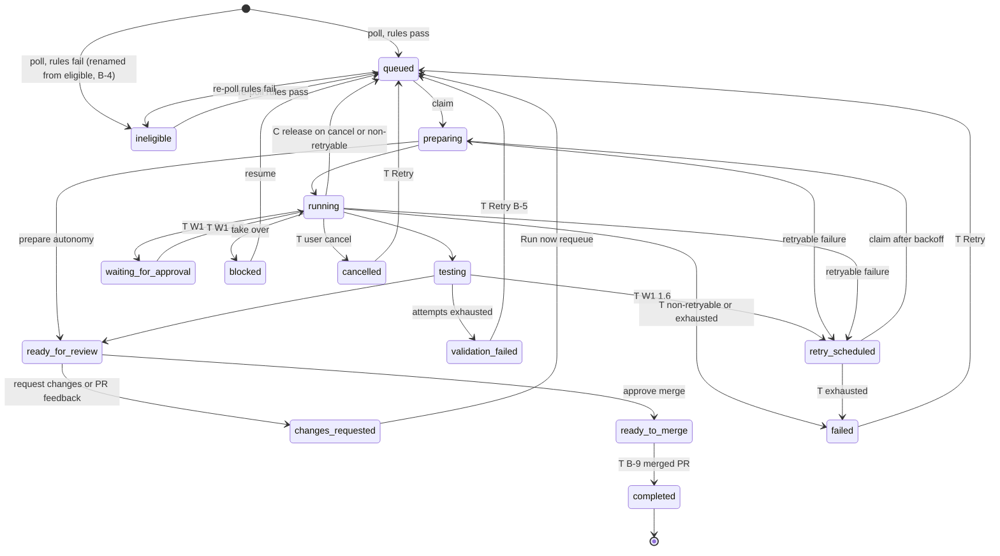
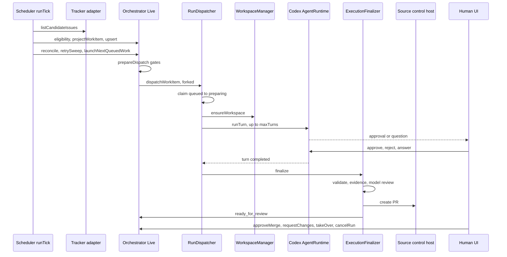

# S4 Symphony operating model and board cards

Base commit da7655bb2, branch fix/symphony-runner-and-config-wip. Sources read: `apps/server/src/symphony/**`, `packages/contracts/src/symphony.ts`, `docs/architecture/symphony.md`, `apps/server/src/ws.ts`, `apps/web/src/components/symphony/`, `plan.md` sections 3, 5, 11.

CURRENT means true at the base commit. TARGET means it needs W1 or W4 work from `plan.md`, or a card in Part 2. Paths are relative to `apps/server/src/symphony/` unless they start with `apps/` or `packages/`. `Live` is `Orchestrator/Layers/SymphonyOrchestratorLive.ts`.

# Part 1: How Symphony works

## 1. Entities and tables

| Entity              | Table                          | Key columns                                                                                                                                                                                                                 | Written by                                                                                                                                                                                                |
| ------------------- | ------------------------------ | --------------------------------------------------------------------------------------------------------------------------------------------------------------------------------------------------------------------------- | --------------------------------------------------------------------------------------------------------------------------------------------------------------------------------------------------------- |
| Project             | `symphony_projects`            | `id`, `repository_path` (unique), `status` active or paused, `setup_state`, `configuration_json`, `revision`                                                                                                                | `Live.createProject`, `Live.updateProject`. Decoded strictly in `Persistence/Layers/SymphonyProjectRepository.ts:decodeProjectConfiguration`; a decode failure nulls the config and forces `needs_setup`. |
| Workflow            | `symphony_workflows`           | `id` (= project id), `workflow_path` (`symphony-project:<id>`), `status`, `effective_config_json`                                                                                                                           | `Live.syncProjectWorkflow` on boot, create, update. Dispatch reads policy from here.                                                                                                                      |
| Work item           | `symphony_work_items`          | `id` = `<projectId>:<trackerKind>:<issueId>`, `lifecycle`, `owner_token`, `generation`, `claimed_at`, `excluded`, `local_priority`, `eligibility_reasons_json`, `workspace_key`, `base_branch`, `labels_json` (always `[]`) | `pollWorkflow` upsert (Live:481), `HandoffService.delegateFromThread`, `WorkItemRepository` claim, transition, releaseClaim, writeOverrides.                                                              |
| Run attempt         | `symphony_run_attempts`        | `id` `run-<uuid>`, `work_item_id`, `attempt_number`, `status`, `started_at`, `finished_at`, `error_json`                                                                                                                    | Dispatcher, ExecutionFinalizer, Reconciler, Recovery.                                                                                                                                                     |
| Run event           | `symphony_run_events`          | `run_attempt_id`, `sequence`, `event_type`, `payload_json`                                                                                                                                                                  | Dispatcher, finalizer, Live, HandoffService, Reconciler, Recovery.                                                                                                                                        |
| Approval            | `symphony_approvals`           | durable `id` `sym-<uuid>`, `request_id` (Codex id), `run_attempt_id`, `action` (`user_input` for questions), `state`                                                                                                        | `Runner/ApprovalService.ts`, called from `AgentRuntime.ts:handleRequest:286`.                                                                                                                             |
| Attention item      | `symphony_attention_items`     | `id`, `work_item_id`, `kind`, `state`                                                                                                                                                                                       | `ExecutionFinalizer` only (`pr_creation_failed`). `Live.listAttention` merges these with pending approvals.                                                                                               |
| Evidence            | `symphony_evidence`            | `work_item_id` is the primary key: one bundle per item, not per attempt (S-09)                                                                                                                                              | Finalizer, `refreshPullRequest`, `approveMerge`.                                                                                                                                                          |
| Workspace ownership | `symphony_workspace_ownership` | `workspace_path`, `owner` symphony or work, `generation`                                                                                                                                                                    | `Workspaces/Live.ts`, `HandoffService`, `Recovery`.                                                                                                                                                       |
| Orchestrator state  | `symphony_orchestrator_state`  | `global_paused`, `lock_token`, `lock_expires_at`, `paused_workflows`, `paused_repositories`                                                                                                                                 | `Live` pause setters, `acquireLock`, `renewLock`.                                                                                                                                                         |
| Retry queue         | `symphony_retry_queue`         | none used                                                                                                                                                                                                                   | No reader or writer. Retry state is lifecycle `retry_scheduled` plus the latest attempt's `finished_at` plus `Orchestrator/Retry.ts:failureBackoffMs`.                                                    |

## 2. WorkItem lifecycle

Values (contracts `symphony.ts:206`): draft, eligible, queued, preparing, running, testing, blocked, waiting_for_approval, retry_scheduled, validation_failed, ready_for_review, changes_requested, ready_to_merge, completed, cancelled, failed. Nothing writes `draft`. Nothing writes `waiting_for_approval`: a pending agent approval leaves the item in `running`.

Legality is `DEFAULT_TRANSITION_SOURCES` (`Persistence/Layers/WorkItemRepository.ts:62`, target to allowed sources); a caller may pass an explicit `from`. Claim (`:298`) and `releaseClaim` (`:510`) are separate SQL.

| Transition                                                                 | Legal in table                                                | Performed by                                                                                            | Who                                                                   | Status                                                           |
| -------------------------------------------------------------------------- | ------------------------------------------------------------- | ------------------------------------------------------------------------------------------------------- | --------------------------------------------------------------------- | ---------------------------------------------------------------- |
| new to queued or eligible                                                  | INSERT; UPDATE CASE `:282` flips draft, eligible, queued only | `pollWorkflow`, `projectWorkItem`, `inferQueuedLifecycle` (`Eligibility.ts:77`)                         | scheduler                                                             | CURRENT                                                          |
| new to eligible (delegated)                                                | n/a                                                           | `HandoffService.delegateFromThread:535`                                                                 | chat user, no UI (H1)                                                 | CURRENT                                                          |
| eligible, queued, retry_scheduled to preparing                             | claim SQL                                                     | `Dispatcher.dispatchWorkItem:231`                                                                       | scheduler or Run now                                                  | CURRENT                                                          |
| changes_requested to queued                                                | yes                                                           | `Live.prepareDispatch:1370`                                                                             | Run now (no UI button)                                                | CURRENT                                                          |
| preparing to running; preparing to ready_for_review (autonomy prepare)     | yes                                                           | `Dispatcher:359`, `:336`                                                                                | system                                                                | CURRENT                                                          |
| running to testing; testing to ready_for_review                            | yes                                                           | `ExecutionFinalizer:90`, `:280`                                                                         | system                                                                | CURRENT                                                          |
| testing to validation_failed (attempts exhausted)                          | yes                                                           | `ExecutionFinalizer:176`                                                                                | system                                                                | CURRENT                                                          |
| testing to retry_scheduled (attempts remain)                               | no (N6)                                                       | `ExecutionFinalizer:169`, error swallowed, item released to queued                                      | system                                                                | CURRENT bug; legal in W1 1.6                                     |
| preparing, running to retry_scheduled                                      | yes                                                           | `Dispatcher.markFailed:208`, `Recovery:231`                                                             | system                                                                | CURRENT                                                          |
| preparing, running, testing to queued                                      | releaseClaim SQL                                              | `Dispatcher:137,530`, `Reconciler:115,141`, `Recovery:150,179` (cancel, non-retryable failure, restart) | system                                                                | CURRENT (N3: the reason failed and cancelled are never written)  |
| running to waiting_for_approval and back                                   | only source is running                                        | nothing                                                                                                 | system, on approval record and decision                               | TARGET (W1 1.3)                                                  |
| ready_for_review to changes_requested                                      | yes                                                           | `Live.requestChanges:1675`; `ingestReviewFeedback:1572` (automatic on PR refresh)                       | human or PR refresh                                                   | CURRENT                                                          |
| ready_for_review to ready_to_merge                                         | yes                                                           | `Live.approveMerge:1700`                                                                                | human, fresh host gate                                                | CURRENT                                                          |
| non-terminal to blocked                                                    | explicit `from`, `requireUnclaimed`                           | `HandoffService.takeOver:337`                                                                           | human, no UI                                                          | CURRENT                                                          |
| blocked, ready_for_review, retry_scheduled, waiting_for_approval to queued | explicit `from`                                               | `HandoffService.resumeAutonomous:473`                                                                   | human, no UI                                                          | CURRENT                                                          |
| validation_failed to queued                                                | yes                                                           | nothing; claim SQL also refuses it                                                                      | human Retry                                                           | TARGET (B-5)                                                     |
| ready_to_merge to completed                                                | yes, the only source                                          | nothing                                                                                                 | merged-PR sweep in `Live.runTick`                                     | TARGET (B-9)                                                     |
| non-terminal to cancelled                                                  | yes                                                           | nothing                                                                                                 | user cancel: `cancelRun` then fenced transition                       | TARGET (W1 1.5 says `blocked`; owner direction is `cancelled`)   |
| running, testing, retry_scheduled to failed                                | yes                                                           | nothing                                                                                                 | `Dispatcher.markFailed` on non-retryable failure or exhausted retries | TARGET (W1 1.5). Exhausted validation stays `validation_failed`. |
| failed, cancelled to queued                                                | explicit `from`                                               | nothing                                                                                                 | human Retry                                                           | TARGET (after W1 1.5)                                            |



### The `eligible` lifecycle (S-11)

`eligible` has two meanings. `inferQueuedLifecycle` gives it to tracker issues that fail the rules (reasons non-empty), and `prepareDispatch:1399` always refuses those. `delegateFromThread` gives it to a dispatchable item (reasons empty). The board shows both as "eligible" with Run now.

Proposal (card B-4): rename the value to `ineligible` for failed-rules items and start delegated items as `queued`. An item with no reasons is claimable, which is what `queued` already means. Migration 042 (next free number; plan 4.7 also wants 042, renumber if that lands first): `UPDATE symphony_work_items SET lifecycle = CASE WHEN eligibility_reasons_json IN ('[]','') THEN 'queued' ELSE 'ineligible' END WHERE lifecycle = 'eligible'`. Every use found by grep: contract `symphony.ts:208`; `Eligibility.ts:77-80`; `ProjectBoard.ts:15`; `HandoffService.ts:340,535`; `WorkItemRepository.ts` `:63,66,76,96,283,313`; `Live:87,896,964`; web `SymphonyProjectView.tsx:139`; `docs/architecture/symphony.md:70`; tests `HandoffService.test.ts:460`, `Live.test.ts:559`, `WorkItemRepository.test.ts:26,50,186`, `ProjectBoard.test.ts:19`.

## 3. Run attempt statuses

Written today: `preparing_workspace`, `building_prompt` (autonomy prepare), `launching_agent`, `streaming_turn`, `succeeded`, `failed`, `validation_failed`, `stalled`, `interrupted`, `user_cancelled`. Never written: `initializing_session`, `finishing`, `timed_out`, `canceled_by_reconciliation`, `tracker_cancelled`, `process_failed`, `workflow_error`, `provider_error`, `retries_exhausted`; `current_stage` is never set. Terminal statuses are immutable, except that a cancel supersedes `interrupted` (`RunAttemptRepository.ts:updateStatus`).

`lifecycleForRun` (`Live:340`) is what Runs and History show. The item lifecycle wins when it is waiting_for_approval, blocked, testing, cancelled, changes_requested, ready_for_review, ready_to_merge, validation_failed, retry_scheduled or failed. Otherwise a `succeeded` attempt reads `ready_for_review`, any other terminal status reads `failed`, else `running`. So the row shows the item, not the attempt (S-08). `completed` is missing from that set, so B-9 must add it.

## 4. One run end to end



1. `Live.scheduler:825` runs `runStartupRecovery` (`Orchestrator/Recovery.ts:101`), then `runTick` (`Live:688`) every 5 s.
2. `pollWorkflow:481`, `evaluateEligibility` (`Eligibility.ts:30`), `projectWorkItem` (`Projection.ts:29`), `WorkItemRepository.upsert`.
3. `reconcileStaleClaims` (`Reconciler.ts:70`), `retrySweep` (`Live:739`), `launchNextQueuedWork` (`Live:1501`: first 100 queued, one dispatch per tick).
4. `prepareDispatch` (`Live:1350`). Manual Run now enters at `ws.ts:1048`, then `Live.dispatchWorkItem:1526`.
5. `Dispatcher.dispatchWorkItem:222`: claim, `ensureWorkspace` (`Workspaces/Manager.ts:164`), create attempt, `runTurn` (`Runner/AgentRuntime.ts:188`).
6. Approvals: `handleRequest` records a pending row and waits on a `LiveRequests` deferred; a human answers via `ApprovalService`; `sweepExpiredApprovals` expires old rows.
7. `ExecutionFinalizer.finalize:85`: testing, `ValidationRunner.runAll`, `EvidenceService.assemble`, `SymphonyModelReviewer.review`, `PullRequestService.create`, attempt `succeeded`, evidence upsert, `ready_for_review`. A PR creation failure raises an attention item and still reaches `ready_for_review`.
8. Human: `requestChanges`, `approveMerge` (re-reads the PR from the host; needs CI success, review not changes_requested, mergeable, zero unresolved comments, model review passed), `takeOver`, `cancelRun`.
9. Retry: `Dispatcher.markFailed:183` sets `retry_scheduled`; `retrySweep` re-dispatches after `min(10000 * 2^(n-1), maxRetryBackoffMs)`.
10. Restart: Recovery marks orphaned attempts `interrupted`, interrupts their approvals, releases the claim to `retry_scheduled` or `queued`.

## 5. Human controls

| Command                                                          | Effect and refusal                                                                                                     | UI today                      | UI target                          |
| ---------------------------------------------------------------- | ---------------------------------------------------------------------------------------------------------------------- | ----------------------------- | ---------------------------------- |
| createProject, updateProject                                     | `symphony_project_revision_conflict`, already exists                                                                   | Projects dialog, Settings tab | same                               |
| startProject, pauseProject                                       | refuses `needs_setup`, Deliver without authenticated remote                                                            | project header                | same                               |
| pauseGlobal, resumeGlobal                                        | global kill switch                                                                                                     | deleted Settings only         | list header (B-10)                 |
| stopAllRuns (`confirm: "stop-all-runs"`)                         | returns `ok: stopped > 0`, so `ok:false` means nothing was running                                                     | deleted Settings only         | list header, confirm dialog (B-10) |
| pauseWorkflow, resumeWorkflow, pauseRepository, resumeRepository | orchestrator-state flag                                                                                                | deleted Settings only         | none; project Pause covers it      |
| validate, activate, get, save, createWorkflow                    | WORKFLOW.md; `Loader.getWorkflowContent:187` reads `symphony-project:<id>` as a file, so project workflows cannot load | deleted Settings only         | removed                            |
| dispatchWorkItem                                                 | `{ok:true}` for every refusal (B1)                                                                                     | card Run now                  | started or refused (B-3)           |
| exclude, include, setLocalPriority                               | persisted overrides                                                                                                    | none                          | card actions, later                |
| cancelRun                                                        | interrupts live run, writes `user_cancelled`                                                                           | run detail, active only       | card, later                        |
| approve, reject, respondToUserInput                              | `approval_request_not_found`; `scope` and `reason` ignored; `{ok:true}` if the service is absent                       | none                          | Attention tab, run detail (B-7)    |
| requestChanges, approveMerge, refreshPullRequest                 | `{ok:false}` without a reason                                                                                          | `PullRequestPanel.tsx`        | same                               |
| takeOver, resumeAutonomous                                       | refuses non-current attempt, bad worktree, live Work session                                                           | none                          | run detail, later                  |
| delegateFromThread                                               | creates a work item                                                                                                    | none (H1)                     | W6                                 |

## 6. Board model

CURRENT: `ProjectBoard.ts:boardColumnForLifecycle` hard-codes five columns (contracts `:934`), grid `grid-cols-5 min-w-[70rem]` (`SymphonyProjectView.tsx:99`). not_started: draft, eligible, queued. in_progress: preparing, running, blocked, waiting_for_approval, retry_scheduled, changes_requested. testing: testing, validation_failed. human_review: ready_for_review, ready_to_merge. done: completed, cancelled, failed.

TARGET: optional `boardLayout` inside the project configuration JSON (no table change): `{ columns: [{ id, label, lifecycles[] }] }`; absent means Default. Validation in `packages/shared`, applied on write and on read: 2 to 8 columns; id matches `^[a-z][a-z0-9_]{0,31}$` and is unique; label 1 to 40 characters, unique ignoring case; every lifecycle in exactly one column; no empty column; completed, cancelled and failed in the last column. An invalid stored layout falls back to Default with a warning and never invalidates the rest of the configuration.

| Preset  | Columns                                                                                                                                                                                                                                                                                                                                |
| ------- | -------------------------------------------------------------------------------------------------------------------------------------------------------------------------------------------------------------------------------------------------------------------------------------------------------------------------------------- |
| Default | not_started "Not Started": draft, ineligible, queued. in_progress "In Progress": preparing, running, blocked, waiting_for_approval, retry_scheduled, changes_requested. testing "Testing": testing, validation_failed. human_review "PR / Human Review": ready_for_review, ready_to_merge. done "Done": completed, cancelled, failed.  |
| Agile   | not_started "Not Started": draft, ineligible, queued. in_progress "In Progress": preparing, running, blocked, waiting_for_approval, retry_scheduled, changes_requested. testing "Testing": testing, validation_failed, ready_for_review. ready_to_deploy "Ready to Deploy": ready_to_merge. done "Done": completed, cancelled, failed. |

Deployment is not modelled. "Ready to Deploy" means merge approved; a human merges on the host and B-9 then moves the item to Done.

## 7. Project view (TARGET)

Route `/symphony/projects/$projectId?tab=board|runs|attention|settings`, default `board`. History merges into Runs.

| Tab       | Shows                                                                                                                          | Supplied by                                                                                                                                                                         |
| --------- | ------------------------------------------------------------------------------------------------------------------------------ | ----------------------------------------------------------------------------------------------------------------------------------------------------------------------------------- |
| Board     | layout columns, cards, truncation and stale banners                                                                            | `symphonyEnvironment.projectBoard` (`apps/web/src/state/symphony.ts`), `BoardTab` in `SymphonyProjectView.tsx:76`                                                                   |
| Runs      | every attempt newest first, filter All, Active, Finished; attempt status, lifecycle, PR badge; row links to `/symphony/$runId` | `symphonyEnvironment.runs({projectId})`; harvest `runAttemptStatusBadgeVariant` (`SymphonyRunningView.logic.ts`), `PrBadge` and `AssessmentBadge` (`SymphonyHistoryView.tsx:58,99`) |
| Attention | approvals with Approve and Reject (reason), questions with an answer box, PR creation failures with a run link                 | `symphonyEnvironment.attention`, `approve`, `reject`; a new `respondToUserInput` atom                                                                                               |
| Settings  | `SymphonyProjectConfigurationForm`, board layout editor                                                                        | `SymphonyProjectConfigurationForm.tsx`, `updateProject`                                                                                                                             |

Card fields: tracker identifier (link to `issueUrl`), title, lifecycle label, ineligibility reasons, priority, Open run link, actions.

| Lifecycle                            | Actions                                                    | Delivered by                              |
| ------------------------------------ | ---------------------------------------------------------- | ----------------------------------------- |
| ineligible                           | reasons, Exclude; no Run now                               | B-4                                       |
| queued, retry_scheduled              | Run now (Exclude later)                                    | exists; B-3 feedback                      |
| changes_requested, validation_failed | Run now (requeue), Open run                                | B-5, B-6                                  |
| preparing, running, testing          | Open run (Cancel, Take over later)                         | B-6                                       |
| waiting_for_approval                 | Approve, Reject, Open run                                  | B-7, needs W1 1.3 and the lifecycle write |
| blocked                              | Open run, Resume                                           | later                                     |
| ready_for_review                     | Approve merge, Request changes (on the run page), Open run | exists; B-6                               |
| ready_to_merge, completed            | Open run                                                   | B-6, B-9                                  |
| failed, cancelled                    | Retry, Open run                                            | after W1 1.5                              |

Global controls after `SymphonySettingsView` is deleted: the list header (`SymphonyProjectsView.tsx:290-312`) shows dispatch state from `symphonyEnvironment.overview().orchestratorPaused`, Pause all or Resume all (`symphonyExtras.pauseGlobal`, `resumeGlobal`) and Stop all runs behind the existing confirm dialog (`symphonyExtras.stopAllRuns`). Start and Pause per project stay in the project header. WORKFLOW.md editing is dropped.

## 8. Failure semantics

Refused dispatch (B-3) returns `{status:"refused", reason}`: `not_leader` (lock lost), `not_found`, `already_running`, `not_dispatchable` (lifecycle not claimable), `paused` (global, workflow or repository flag), `excluded`, `ineligible` (reasons non-empty), `no_workflow`, `observe_only`, `concurrency_cap` (global, repository, workflow), `tracker_refresh_failed`. Project status `paused` does not refuse a manual Run now today; see Open questions.

Read failure: `getProjectBoard` swallows errors into an empty board (`Live:1211-1217`). TARGET (B-1): typed `SymphonyError` `symphony_board_unavailable`; the stream ends, the web keeps the previous board (`AsyncResult.previousSuccess` in `apps/web/src/state/query.ts`) and shows a banner with Retry. Truncation: per-column `totalCount` plus a `truncated` flag (B-2). Stale data: every board carries `generatedAt` and the banner shows its age; there is no offline indicator until S-15.

## 9. Deletion plan

| Item                                                                                                 | Provided                                                          | After                                   | Harvest                                                                             |
| ---------------------------------------------------------------------------------------------------- | ----------------------------------------------------------------- | --------------------------------------- | ----------------------------------------------------------------------------------- |
| `SymphonySettingsView.tsx` (955)                                                                     | global pause and Stop all (`:911-945` dialog), WORKFLOW.md editor | list header controls; editor removed    | `runGlobalAction` (`:662`), Stop all `AlertDialog`                                  |
| `SymphonyQueueView.tsx` (223)                                                                        | queue rows, exclude and include                                   | card actions                            | `LIFECYCLE_LABELS`                                                                  |
| `SymphonyAttentionView.tsx` (184)                                                                    | attention list, Approve and Reject with the wrong id (N1)         | Attention tab (B-7)                     | `SEVERITY_BADGE`                                                                    |
| `SymphonyOverviewView.tsx` (207), `.logic.ts`, `.logic.test.ts`                                      | metric tiles, tracker health                                      | list header; trackers page keeps health | none                                                                                |
| `SymphonyRunningView.tsx` (164)                                                                      | active runs                                                       | Runs tab filter                         | keep `SymphonyRunningView.logic.ts` and test, rename to `runAttemptStatus.logic.ts` |
| `SymphonyHistoryView.tsx` (245)                                                                      | finished runs                                                     | Runs tab                                | `PrBadge`, `AssessmentBadge`, `formatFinishedAt`                                    |
| routes `symphony.attention`, `.history`, `.queue`, `.reviews`, `.running`, `.settings`, `.workflows` | redirects to `/symphony`                                          | deleted, route tree regenerated         | none                                                                                |

Grep of `apps/web/src` shows nothing outside these files imports the six views. Safe order: (1) header controls, (2) `Sidebar.tsx:3006` and the label at `:3021` go to `/settings`, drop the `isOnSymphony` prop, (3) delete the views, logic file and tests, (4) delete the seven route files and regenerate `routeTree.gen.ts`, (5) fix the stale comment at `components/sidebar/SymphonySidebarNav.tsx:34-37`.

# Part 2: Cards

Conventions for every card. Test commands run from the package directory with Node 24 on the PATH, for example `PATH=/var/folders/b6/87d2msqd6fdbtcddcw5k8gbw0000gn/T/opencode/node-v24.21.0-darwin-arm64/bin:$PATH pnpm exec vp test run <relative test file>` (confirmed on `src/symphony/Orchestrator/ProjectBoard.test.ts`, 2 tests pass). Typecheck is `pnpm exec tsgo --noEmit` in each touched package (`apps/server`, `apps/web`, `packages/contracts`, `packages/shared`, `packages/client-runtime`). Finish each card with `vp check` and `vp run typecheck` from the repo root. `Live` is `apps/server/src/symphony/Orchestrator/Layers/SymphonyOrchestratorLive.ts`, `Live.test` is its sibling `SymphonyOrchestratorLive.test.ts`. Line numbers are at the base commit and shift after earlier cards; search by symbol name.

Suggested order: B-1, B-2, B-3, B-4, B-5, B-6, B-9, B-7, B-8a, B-8b, B-10.

### B-1 Typed board read failure and last-good banner (F01, S-14)

- Problem: `getProjectBoard` turns every database error into an empty result: `projects.getById(...).pipe(Effect.catch(() => Effect.succeed(null)))` (`Live:1211-1213`) reports "project not found", and `listByLifecycle(...).pipe(Effect.catch(() => Effect.succeed([])))` (`Live:1215-1217`) reports an empty board. A corrupt row is worse: `rows.map(rowToWorkItem)` in `listByLifecycle` (`Persistence/Layers/WorkItemRepository.ts:454`) throws inside `Effect.map`, which is a defect that `Effect.catch` does not catch, so the request dies with a generic error naming no row. The web view only reads `boardQuery.error` when there is no board (`SymphonyProjectView.tsx:301-306`), so a failed refresh is invisible.
- Files to change:
  - `apps/server/src/symphony/Persistence/Layers/WorkItemRepository.ts` : `listByLifecycle` (line 435), import `SymphonyPersistenceDecodeError` from `../Errors.ts`.
  - `apps/server/src/symphony/Orchestrator/SymphonyOrchestrator.ts` : `getProjectBoard` type (line 82-84).
  - `apps/server/src/symphony/Orchestrator/Layers/SymphonyOrchestratorLive.ts` : `getProjectBoard` (line 1209-1225).
  - `apps/server/src/ws.ts` : `subscribeProjectBoard` handler (line 504-526), `getProjectBoard` handler (line 780-799), new helper next to `projectError` (line 411).
  - `apps/web/src/components/symphony/SymphonyProjectView.tsx` : header block after `actionError` (line 418-422).
  - Tests: `apps/server/src/ws-symphony.test.ts`, `apps/server/src/symphony/Orchestrator/Layers/SymphonyOrchestratorLive.test.ts`.
- Change:
  1. `WorkItemRepository.listByLifecycle`: replace `Effect.map((rows) => rows.map(rowToWorkItem))` with a sequential decode that names the row:
     ```ts
     Effect.flatMap((rows) =>
       Effect.forEach(rows, (row) =>
         Effect.try({
           try: () => rowToWorkItem(row),
           catch: (cause) =>
             new SymphonyPersistenceDecodeError({
               operation: "WorkItemRepository.listByLifecycle",
               issue: `row ${row.id}: ${cause instanceof Error ? cause.message : String(cause)}`,
               workItemId: row.id,
             }),
         }),
       ),
     ),
     ```
     Keep the existing `Effect.mapError(toSqlError(...))` before it. The return type stays `SymphonyPersistenceError`.
  2. `SymphonyOrchestrator.ts`: change `getProjectBoard` to `(projectId: SymphonyProjectId) => Effect.Effect<SymphonyProjectBoard | null, SymphonyPersistenceError>` (the type is already imported in that file).
  3. `Live.getProjectBoard`: remove both `Effect.catch` calls so the effect fails with the repository error:
     ```ts
     const project = yield * projects.getById(projectId);
     if (project === null) return null;
     const workItemsForProject =
       yield * workItems.listByLifecycle(ALL_WORK_LIFECYCLES, { projectId, limit: 1_000 });
     ```
     `resolveProjectSourceControl` already never fails; leave it.
  4. `ws.ts`: add `const boardReadError = (cause: unknown): SymphonyError => isSymphonyError(cause) ? cause : projectError("symphony_board_unavailable", cause instanceof Error ? cause.message : String(cause));`. In both board handlers add `Effect.mapError(boardReadError)` after the `requireProject` flatMap (the RPC error type is `SymphonyError`, `rpc.ts:808`).
  5. Web: when `boardQuery.error !== null` and `board !== null`, render above the tabs a banner using the same classes as `actionError`: text `Live updates stopped. Showing the board from {new Date(board.generatedAt).toLocaleTimeString()}. {boardQuery.error}` and a `Button size="sm" variant="outline"` labelled `Retry` calling `boardQuery.refresh`. `useEnvironmentQuery` already returns the previous success on failure (`apps/web/src/state/query.ts`, `AsyncResult.value` reads `previousSuccess`), so no state change is needed. A typed failure ends the stream; Retry re-subscribes.
- Do not: leave any `Effect.catch(() => Effect.succeed(...))` in `getProjectBoard`; add the new error code to `SymphonyError` as a class (it is a free string `code`); touch `listProjects` or `getProject` (same pattern, see Open questions); change the default 500 limit in `listByLifecycle`.
- Tests:
  - `ws-symphony.test.ts`: add a second `it.layer(Layer.succeed(SymphonyOrchestrator, { getProjectBoard: () => Effect.fail(new SymphonyPersistenceSqlError({ operation: "test", detail: "disk I/O error" })) } as unknown as (typeof SymphonyOrchestrator)["Service"]))` block (import the error from `./symphony/Persistence/Errors.ts`). Test `getProjectBoard maps a read failure to symphony_board_unavailable`: `const exit = yield* Effect.exit(Effect.scoped(handlers[SYMPHONY_WS_METHODS.getProjectBoard]({ projectId: SymphonyProjectId.make("p1") })))`; assert `exit._tag === "Failure"` and the squashed failure has `_tag === "SymphonyError"` and `code === "symphony_board_unavailable"`. Add the same assertion for `subscribeProjectBoard` with `Effect.exit(Stream.runCollect(handler({ projectId })))` (import `Stream` from `effect/Stream`).
  - `Live.test`, inside `layer("SymphonyOrchestrator Observe", ...)`: test `getProjectBoard fails with a typed decode error that names the corrupt row`. Create a project as in the first test of the file (`orchestrator.createProject` with `makeProjectConfiguration()`, a unique id such as `project-board-corrupt`). Upsert one work item with `projectId` set and lifecycle `queued` through `WorkItemRepository`. Then `const sql = yield* SqlClient.SqlClient; yield* sql\`UPDATE symphony_work_items SET acceptance_criteria_json = 'not json' WHERE id = ${id}\``. Run `const result = yield\* Effect.result(orchestrator.getProjectBoard(projectId)).pipe(Effect.ensuring(sql\`UPDATE symphony_work_items SET acceptance_criteria_json = '[]' WHERE id = ${id}\`.pipe(Effect.ignore)))`. Assert `result.\_tag === "Failure"`, `result.failure.\_tag === "SymphonyPersistenceDecodeError"`and`result.failure.message`contains the work item id. The repair in`ensuring` keeps the shared layer clean for later tests.
  - Both tests fail on the base commit: the handler test sees the raw `SymphonyPersistenceSqlError`, the orchestrator test sees a defect instead of a failure.
- Verify: from `apps/server`: `pnpm exec vp test run src/ws-symphony.test.ts src/symphony/Orchestrator/Layers/SymphonyOrchestratorLive.test.ts` all pass; `pnpm exec tsgo --noEmit` in `apps/server` and `apps/web` clean. Manual: stop the server mid-session, the web board stays visible with the banner and Retry.
- Depends on: none. Effort: S. Commit message: `fix(symphony): fail the project board read with a typed error and show a last-good banner`

### B-2 Board coverage: newest terminal items, exact counts, truncated flag (F02, S-12)

- Problem: `getProjectBoard` calls `listByLifecycle(ALL_WORK_LIFECYCLES, { projectId, limit: 1_000 })` (`Live:1216`). That query orders by priority then `created_at ASC` (`Persistence/Layers/WorkItemRepository.ts:447-451`), so past 1,000 items the newest items are cut silently, Done shows the oldest finished work, and column badges show `column.cards.length` (`SymphonyProjectView.tsx:104`).
- Files to change:
  - `packages/contracts/src/symphony.ts` : `SymphonyBoardColumnSchema` (line 957), `SymphonyProjectBoardSchema` (line 980).
  - `apps/server/src/symphony/Persistence/Services/WorkItemRepository.ts` : new `listForBoard` in `WorkItemRepositoryShape`.
  - `apps/server/src/symphony/Persistence/Layers/WorkItemRepository.ts` : implement `listForBoard` next to `listByLifecycle` (line 435), add it to the returned object (line 558).
  - `apps/server/src/symphony/Orchestrator/ProjectBoard.ts` : `projectBoardFromWorkItems` (line 38).
  - `apps/server/src/symphony/Orchestrator/Layers/SymphonyOrchestratorLive.ts` : `getProjectBoard` (line 1215), constants near `ALL_WORK_LIFECYCLES` (line 85).
  - `apps/web/src/components/symphony/SymphonyProjectView.tsx` : `BoardTab` (line 76-160).
  - Tests: `Persistence/Layers/WorkItemRepository.test.ts`, `Orchestrator/ProjectBoard.test.ts`, `Live.test`.
- Change:
  1. Contracts, both additive and optional so older payloads still decode:
     ```ts
     // SymphonyBoardColumnSchema
     totalCount: Schema.optional(NonNegativeInt),
     // SymphonyProjectBoardSchema
     truncated: Schema.optional(Schema.Boolean),
     ```
  2. `Services/WorkItemRepository.ts`:
     ```ts
     readonly listForBoard: (
       projectId: SymphonyProjectId,
       options: { readonly activeLimit: number; readonly terminalLimit: number },
     ) => Effect.Effect<
       { readonly items: WorkItem[]; readonly totalsByLifecycle: Readonly<Record<string, number>> },
       SymphonyPersistenceError
     >;
     ```
  3. `Layers/WorkItemRepository.ts` `listForBoard` runs three queries, all with `WHERE project_id = ${projectId}`: (a) `SELECT lifecycle, COUNT(*) AS count FROM symphony_work_items WHERE project_id = ... GROUP BY lifecycle` typed as `sql<{ readonly lifecycle: string; readonly count: number }>`; (b) active rows: `lifecycle` in the 13 non-terminal values, built as `WorkLifecycleSchema.literals.filter((value) => value !== "completed" && value !== "cancelled" && value !== "failed")` and `sql.in("lifecycle", activeLifecycles)`, `ORDER BY created_at ASC, id ASC LIMIT ${options.activeLimit}`; (c) terminal rows: `sql.in("lifecycle", ["completed", "cancelled", "failed"])`, `ORDER BY updated_at DESC, id DESC LIMIT ${options.terminalLimit}`. Decode rows with the same named-row `Effect.try` pattern as B-1 (extract it into one local helper `decodeRows(operation, rows)` and use it in `listByLifecycle` too). The unique index on `(project_id, tracker_kind, tracker_issue_id)` already serves the `project_id` filter; add no index.
  4. `ProjectBoard.ts`: add optional input `lifecycleTotals?: Readonly<Record<string, number>>`. After building the columns, set each column's `totalCount` to the sum of `lifecycleTotals[lifecycle]` over lifecycles whose `boardColumnForLifecycle` is that column, or to `cards.length` when `lifecycleTotals` is absent. Set `truncated: columns.some((column) => (column.totalCount ?? 0) > column.cards.length)`. Keep the existing sort.
  5. `Live`: add `const BOARD_ACTIVE_LIMIT = 5_000; const BOARD_TERMINAL_LIMIT = 100;` and call `workItems.listForBoard(projectId, { activeLimit: BOARD_ACTIVE_LIMIT, terminalLimit: BOARD_TERMINAL_LIMIT })`; pass `workItems: result.items` and `lifecycleTotals: result.totalsByLifecycle` to `projectBoardFromWorkItems`. Keep B-1's error propagation.
  6. Web: badge shows `column.totalCount ?? column.cards.length`; when `column.totalCount !== undefined && column.totalCount > column.cards.length`, render below the cards `<p className="px-2 pb-2 text-center text-xs text-muted-foreground">Showing {column.cards.length} of {column.totalCount}</p>`; when `board.truncated`, render a one-line notice above the grid: `Some items are hidden. Done shows the newest {n} finished items.`
- Do not: change `listByLifecycle` ordering or default limit (the scheduler's `launchNextQueuedWork` and the concurrency count rely on it); compute `truncated` from the limits instead of from counts; add a required field to the contract.
- Tests:
  - `WorkItemRepository.test.ts`, inside `layer("WorkItemRepository claim authority", ...)`: `listForBoard returns every active item and only the newest terminal items`. Use `makeWorkItem(id, trackerIssueId, lifecycle)` (line 24) and spread an explicit `updatedAt`. Seed 4 `completed` items with `updatedAt` 2026-01-01 to 2026-01-04, 2 `queued`, 1 `running`, all with `PROJECT_ID`; seed 1 `queued` under another project. Call `listForBoard(PROJECT_ID, { activeLimit: 10, terminalLimit: 2 })`. Expect 5 items, the two returned `completed` items are the Jan 4 and Jan 3 ones, `totalsByLifecycle` equals `{ completed: 4, queued: 2, running: 1 }`.
  - `ProjectBoard.test.ts`: `projectBoardFromWorkItems reports column totals and truncated`. Pass 1 `completed` item with `lifecycleTotals: { completed: 5, queued: 2 }` and 2 queued items. Expect done `totalCount` 5, not_started `totalCount` 2, `truncated` true; with totals `{ completed: 1, queued: 2 }` expect `truncated` false.
  - `Live.test`: `getProjectBoard keeps all active items and the newest 100 finished items`. Create a project (`project-board-coverage`), upsert 105 `completed` items (`updatedAt` `2026-03-01T00:00:${index}` style, zero-padded, unique ids) and 3 `queued`. Expect Done `cards.length` 100, `totalCount` 105, `truncated` true, the oldest-updated completed item absent, Not Started `totalCount` 3.
  - All three fail on the base commit (`listForBoard` and `totalCount` do not exist).
- Verify: from `apps/server`: `pnpm exec vp test run src/symphony/Persistence/Layers/WorkItemRepository.test.ts src/symphony/Orchestrator/ProjectBoard.test.ts src/symphony/Orchestrator/Layers/SymphonyOrchestratorLive.test.ts`; typecheck `packages/contracts`, `apps/server`, `apps/web`.
- Depends on: B-1. Effort: M. Commit message: `fix(symphony): show active work in full and the newest finished work on the board, with counts`

### B-3 Dispatch returns started or refused with a reason (B1, S-03)

- Problem: the RPC handler is `orchestrator.dispatchWorkItem(input.workItemId).pipe(Effect.as({ ok: true }))` (`ws.ts:1053`). `prepareDispatch` returns `null` on 12 paths (`Live:1355, 1366, 1372, 1381, 1388, 1396, 1400, 1414, 1422, 1430, 1438, 1443`) and `dispatchWorkItem` maps `null` to `Effect.void` (`Live:1526-1531`). The card's click handler ignores the result (`SymphonyProjectView.tsx:87-96`), so a refusal looks like success and nothing happens. A second defect on the same path: the manual RPC awaits the whole run (`executePreparedDispatch` joins the dispatch fiber), so the answer arrives only when the run ends.
- Files to change:
  - `packages/contracts/src/symphony.ts` : new schemas next to `SymphonyEmptyResult` (line 1300).
  - `packages/contracts/src/rpc.ts` : import (line 142-143) and `WsSymphonyDispatchWorkItemRpc.success` (line 904).
  - `apps/server/src/symphony/Orchestrator/SymphonyOrchestrator.ts` : `dispatchWorkItem` (line 128).
  - `apps/server/src/symphony/Orchestrator/Layers/SymphonyOrchestratorLive.ts` : `PreparedDispatch` area (line 265), `prepareDispatch` (line 1350-1454), `launchNextQueuedWork` (line 1501-1524), `dispatchWorkItem` (line 1526), `retrySweep` call (line 780).
  - `apps/server/src/ws.ts` : `dispatchWorkItem` handler (line 1048-1057).
  - `apps/web/src/components/symphony/dispatchRefusal.logic.ts` (new), `SymphonyProjectView.tsx` : `BoardTab` dispatch handler and card (line 84-96, 139-151).
  - Tests: `Live.test`, `apps/server/src/ws-symphony.test.ts`, `apps/web/src/components/symphony/dispatchRefusal.logic.test.ts` (new).
- Change:
  1. Contracts:
     ```ts
     export const SymphonyDispatchRefusalReasonSchema = Schema.Literals([
       "not_leader",
       "not_found",
       "already_running",
       "not_dispatchable",
       "paused",
       "excluded",
       "ineligible",
       "no_workflow",
       "observe_only",
       "concurrency_cap",
       "tracker_refresh_failed",
     ]);
     export type SymphonyDispatchRefusalReason = typeof SymphonyDispatchRefusalReasonSchema.Type;
     export const SymphonyDispatchResultSchema = Schema.Union([
       Schema.Struct({ status: Schema.Literal("started") }),
       Schema.Struct({
         status: Schema.Literal("refused"),
         reason: SymphonyDispatchRefusalReasonSchema,
         detail: Schema.optional(Schema.String),
       }),
     ]);
     export type SymphonyDispatchResult = typeof SymphonyDispatchResultSchema.Type;
     ```
     In `rpc.ts` set `WsSymphonyDispatchWorkItemRpc` `success: SymphonyDispatchResultSchema` and import it from `./symphony.ts`.
  2. `SymphonyOrchestrator.ts`: `readonly dispatchWorkItem: (workItemId: string) => Effect.Effect<SymphonyDispatchResult>;` (the `Scope` requirement goes away, see step 4).
  3. `Live`: add
     ```ts
     type DispatchRefused = Extract<SymphonyDispatchResult, { readonly status: "refused" }>;
     const refused = (reason: DispatchRefused["reason"], detail?: string): DispatchRefused => ({
       status: "refused",
       reason,
       ...(detail === undefined ? {} : { detail }),
     });
     const isRefused = (value: PreparedDispatch | DispatchRefused): value is DispatchRefused =>
       "status" in value;
     ```
     Change `prepareDispatch` to return `Effect.fn.Return<PreparedDispatch | DispatchRefused>` and replace each `return null` with, in order: `!acquiredLock` to `refused("not_leader")`; `item === null` to `refused("not_found")`; lifecycle `preparing`, `running` or `testing` to `refused("already_running")`; then, directly after the `already_running` check and before the existing `changes_requested` requeue block, add `if (!DISPATCHABLE_LIFECYCLES.has(item.lifecycle)) return refused("not_dispatchable", item.lifecycle);` with `const DISPATCHABLE_LIFECYCLES: ReadonlySet<WorkLifecycle> = new Set(["eligible", "queued", "retry_scheduled", "changes_requested"]);`; the requeue miss in that block becomes `refused("not_dispatchable", "state changed")`; global pause to `refused("paused", "global")`; workflow pause to `refused("paused", "workflow")`; repository pause to `refused("paused", "repository")`; split the `excluded || reasons` condition into `item.excluded === true` to `refused("excluded")` and `item.eligibilityReasons.length > 0` to `refused("ineligible", item.eligibilityReasons.join(", "))`; `workflow === undefined || config == null` to `refused("no_workflow")`; `config.autonomy === "observe"` to `refused("observe_only")`; the three cap checks to `refused("concurrency_cap", "global")`, `"repository"`, `"workflow"`; `issue === null` to `refused("tracker_refresh_failed")`.
  4. `launchNextQueuedWork`: `if (isRefused(prepared)) continue;`. `dispatchWorkItem`:
     ```ts
     const dispatchWorkItem: SymphonyOrchestratorShape["dispatchWorkItem"] = (workItemId) =>
       prepareDispatch(workItemId).pipe(
         Effect.flatMap((prepared) =>
           isRefused(prepared)
             ? Effect.succeed(prepared)
             : executePreparedDispatch(prepared).pipe(
                 Effect.scoped,
                 Effect.forkIn(dispatchScope),
                 Effect.as({ status: "started" } as const),
               ),
         ),
       );
     ```
     The `retrySweep` call keeps working (its result is ignored) and now also stops joining the run inside the tick. If S1 card 1.8 has already forked the manual path, keep its fork and only add the result.
  5. `ws.ts`: `(orchestrator) => orchestrator.dispatchWorkItem(input.workItemId)` with no `Effect.as`.
  6. Web, new `dispatchRefusal.logic.ts` exporting `dispatchRefusalMessage(result: { reason: SymphonyDispatchRefusalReason; detail?: string | undefined }): string` with these exact texts: `not_leader` "Another Neokod server is running Symphony. This server only observes."; `not_found` "This work item no longer exists."; `already_running` "A run is already in progress for this item."; `not_dispatchable` "This item cannot be run from its current state."; `paused` with detail `global` "Dispatch is paused for all projects.", `workflow` "Dispatch is paused for this project.", `repository` "Dispatch is paused for this repository."; `excluded` "This item is excluded. Include it to run it."; `ineligible` `Not eligible: ${detail}.`; `no_workflow` "This project is not set up to run work. Check its settings."; `observe_only` "Autonomy is set to observe. Change it to prepare, execute or deliver to run work."; `concurrency_cap` `The ${detail} concurrency limit is reached. Try again when a run finishes.`; `tracker_refresh_failed` "Could not re-read this issue from the tracker. It may be closed, or the tracker is unreachable.".
  7. Web `BoardTab`: add `const [refusals, setRefusals] = useState<Record<string, string>>({});`. In `dispatch`, read the result: `const result = await dispatchWorkItem(...)`; if `result._tag === "Success" && result.value.status === "refused"` set `refusals[workItemId] = dispatchRefusalMessage(result.value)`, else if `result._tag === "Success"` delete that key, else (transport failure) set `"The request failed. Try again."`. Render under the button `<p role="status" className="mt-2 text-xs text-destructive-foreground">{message}</p>` and change the button label to `Try again` while a message is shown. Keep `onRefresh()`.
- Do not: return `{ ok: true }` anywhere in the new path; await the forked run in the handler; change the `launchNextQueuedWork` ordering; add `claim_lost` (the claim happens inside the forked run and is logged there).
- Tests:
  - `Live.test`: extend the pause tests and add `dispatchWorkItem reports why a dispatch was refused`. Reuse `seedWorkflow(id, repositoryPath, overrides)` (line 415), `makeConfig`, and the pattern of the test at line 1069 (upsert an item with `workflowId`, `trackerIssueId: "1"` which the memory tracker holds, `eligibilityReasons: []`). Cases and expected results: unknown id returns `{status:"refused", reason:"not_found"}`; lifecycle `running` gives `already_running`; lifecycle `ready_for_review` gives `not_dispatchable`; `setWorkflowPaused(id, true)` gives `{reason:"paused", detail:"workflow"}` and `setGlobalPaused(true)` gives `detail:"global"` (reset both with `Effect.ensuring`); `excludeWorkItem(id, true)` gives `excluded`; `eligibilityReasons: ["missing_label:agent-ready"]` gives `ineligible` with detail containing `missing_label`; a workflow seeded with default autonomy (`observe` in `makeConfig`) gives `observe_only`; `workflowId: "no-such-workflow"` gives `no_workflow`; `trackerIssueId: "999"` gives `tracker_refresh_failed`; a workflow seeded with `{ autonomy: "execute", concurrencyGlobal: 1 }` while another item sits in `running` gives `concurrency_cap` with detail `global`; a workflow seeded `{ autonomy: "execute" }` with a `queued` item returns `{ status: "started" }`, then `yield* TestClock.adjust("100 millis"); yield* Effect.yieldNow;` and expect `dispatchedIds` to contain it. Also run the whole file: the retry test at line 916 may need one extra `yield* Effect.yieldNow` because the retry dispatch is now forked.
  - `ws-symphony.test.ts`: change the fake `dispatchWorkItem` (line 107) to return `Effect.succeed({ status: "started" } as const)` and the test at line 128 to expect `{ status: "started" }`; add a case where the fake returns `{ status: "refused", reason: "paused", detail: "global" }` and the handler passes it through unchanged.
  - `dispatchRefusal.logic.test.ts`: one assertion per reason with the exact text above (and the three `paused` details).
  - The `Live.test` cases fail on the base commit (return value is `undefined`).
- Verify: `apps/server`: `pnpm exec vp test run src/symphony/Orchestrator/Layers/SymphonyOrchestratorLive.test.ts src/ws-symphony.test.ts`; `apps/web`: `pnpm exec vp test run src/components/symphony/dispatchRefusal.logic.test.ts`; typecheck `packages/contracts`, `apps/server`, `apps/web`. Manual: pause a project's workflow flag, press Run now, the card shows the paused message and the button reads Try again.
- Depends on: none (overlaps S1 card 1.8, see step 4). Effort: M. Commit message: `feat(symphony): return a typed started or refused result from dispatch and show it on the card`

### B-4 Rename the `eligible` lifecycle to `ineligible` and gate Run now (S-11)

- Problem: `inferQueuedLifecycle` assigns lifecycle `eligible` to issues that fail the rules (`Orchestrator/Eligibility.ts:80`: `result.eligible ? "queued" : "eligible"`, comment "Ineligible issues stay in `eligible` lifecycle"). `prepareDispatch` always refuses them (`Live:1399`), yet the board shows them in Not Started as "eligible" with Run now (`SymphonyProjectView.tsx:139-141`). `delegateFromThread` also uses `eligible` for items that are dispatchable (`HandoffService.ts:535`), so the value has two meanings.
- Files to change:
  - `packages/contracts/src/symphony.ts` : `WorkLifecycleSchema` (line 206-223), `SymphonyBoardCardSchema` (line 943).
  - `apps/server/src/persistence/Migrations/042_SymphonyIneligibleLifecycle.ts` (new), `apps/server/src/persistence/Migrations.ts` (import near line 56, list near line 109).
  - `apps/server/src/symphony/Orchestrator/Eligibility.ts` : `inferQueuedLifecycle` (line 71-80).
  - `apps/server/src/symphony/Persistence/Layers/WorkItemRepository.ts` : `DEFAULT_TRANSITION_SOURCES` (line 62-106), upsert CASE (line 283), `claimRow` (line 313); `Persistence/Services/WorkItemRepository.ts` doc comment (line 11).
  - `apps/server/src/symphony/HandoffService.ts` : lines 340 and 535.
  - `apps/server/src/symphony/Orchestrator/ProjectBoard.ts` : line 15 and card building.
  - `apps/server/src/symphony/Orchestrator/Layers/SymphonyOrchestratorLive.ts` : `ALL_WORK_LIFECYCLES` (line 87), overview queued metric (line 896), `listQueue` default (line 964), `DISPATCHABLE_LIFECYCLES` from B-3.
  - `docs/architecture/symphony.md` : line 70.
  - `apps/web/src/components/symphony/boardCard.logic.ts` (new), `SymphonyProjectView.tsx` : card (line 110-152).
  - Existing tests to update: `HandoffService.test.ts:460`, `Live.test:559`, `WorkItemRepository.test.ts:26,50,186`, `ProjectBoard.test.ts:19`.
- Change:
  1. Contracts: replace `"eligible"` with `"ineligible"` in `WorkLifecycleSchema` (same position). Add to `SymphonyBoardCardSchema`: `eligibilityReasons: Schema.optional(Schema.Array(TrimmedNonEmptyString)),`.
  2. Migration `042_SymphonyIneligibleLifecycle.ts`, same shape as `039_SymphonyPauseScopes.ts` (`export default Effect.gen(function* () { const sql = yield* SqlClient.SqlClient; ... })`):
     ```ts
     yield *
       sql`
       UPDATE symphony_work_items
       SET lifecycle = CASE WHEN eligibility_reasons_json IN ('[]', '') THEN 'queued' ELSE 'ineligible' END
       WHERE lifecycle = 'eligible'
     `;
     ```
     Register it in `Migrations.ts` as `[42, "SymphonyIneligibleLifecycle", Migration0042]`. If plan item 4.7's `local_labels_json` migration already took 042, use the next free number.
  3. `Eligibility.ts`: return type `"queued" | "ineligible"`, body `result.eligible ? "queued" : "ineligible"`, and rewrite the comment (items that fail the rules are stored as `ineligible` with their reasons).
  4. `WorkItemRepository.ts`: `DEFAULT_TRANSITION_SOURCES`: `draft: ["ineligible"]`, key `eligible` becomes `ineligible: ["draft", "queued"]`, in `queued` replace `"eligible"` with `"ineligible"`, `preparing: ["queued"]`, in `cancelled` replace `"eligible"` with `"ineligible"`. Upsert CASE: `lifecycle IN ('draft', 'ineligible', 'queued')`. `claimRow`: `lifecycle IN ('queued', 'retry_scheduled')` (an ineligible item can no longer be claimed). Update both doc comments that quote `('eligible','queued','retry_scheduled')`.
  5. `HandoffService.ts`: the `from` list at line 340 uses `"ineligible"`; `delegateFromThread` sets `lifecycle: "queued"`.
  6. `ProjectBoard.ts`: `case "ineligible":` in the not_started group. When `item.eligibilityReasons.length > 0` add `eligibilityReasons: item.eligibilityReasons` to the card.
  7. `Live`: `ALL_WORK_LIFECYCLES` and the three uses at lines 896, 964 and `DISPATCHABLE_LIFECYCLES`: the overview becomes `listByLifecycle(["queued"])...length` (drop the filter), `listQueue` default becomes `["ineligible", "queued"]`, `DISPATCHABLE_LIFECYCLES` becomes `new Set(["queued", "retry_scheduled", "changes_requested"])`.
  8. `docs/architecture/symphony.md` line 70: list `ineligible` instead of `eligible`.
  9. Web `boardCard.logic.ts`:
     ```ts
     export const RUNNABLE_LIFECYCLES: ReadonlySet<WorkLifecycle> = new Set([
       "queued",
       "retry_scheduled",
     ]);
     export const canRunNow = (
       card: Pick<SymphonyBoardCard, "lifecycle" | "eligibilityReasons">,
     ): boolean =>
       RUNNABLE_LIFECYCLES.has(card.lifecycle) && (card.eligibilityReasons ?? []).length === 0;
     export const formatEligibilityReason = (reason: string): string => {
       /* see below */
     };
     ```
     `formatEligibilityReason`: `missing_label:X` gives `Missing label "X"`; `state_not_active:S` gives `State "S" is not active`; `state_terminal:S` gives `State "S" is closed`; `not_dispatchable` gives `The tracker marks it not dispatchable`; `already_claimed` gives `Already claimed`; `blank_required_label` gives `A required label is blank`; `dispatch_paused` gives `Dispatch is paused`; anything else returns the raw text. In the card, show the Run now button only when `canRunNow(card)`; when `card.lifecycle === "ineligible"` render `Not eligible: {reasons.map(formatEligibilityReason).join("; ")}` as `<p className="mt-2 text-xs text-muted-foreground">`.
- Do not: leave any `"eligible"` lifecycle literal (grep `"eligible"` and `'eligible'` under `apps` and `packages` must only hit the migration and its test); rename the `QueueItem.eligible` boolean or the `evaluateEligibility` result field `eligible` (a different concept); remove `draft`; edit migration 035 or 041.
- Tests:
  - New `apps/server/src/persistence/Migrations/042_SymphonyIneligibleLifecycle.test.ts` mirroring `041_SymphonyProjects.test.ts` (layer `it.layer(Layer.mergeAll(NodeSqliteClient.layerMemory()))`, `runMigrations({ toMigrationInclusive: 41 })`). Insert three `symphony_work_items` rows with raw SQL, giving every NOT NULL column without a default a value (`id, project_id, tracker_kind, tracker_issue_id, objective, lifecycle, source_json, created_at, updated_at`): `eligible` with `eligibility_reasons_json = '[]'`, `eligible` with `'["missing_label:x"]'`, and `queued`. Then `runMigrations({ toMigrationInclusive: 42 })` and assert lifecycles `queued`, `ineligible`, `queued`.
  - `Eligibility.test.ts`: `inferQueuedLifecycle returns ineligible when the rules fail` using `evaluateEligibility` results for a failing and a passing issue.
  - Update the existing tests listed above: `HandoffService.test.ts:460` expects `queued`; `Live.test:559` expects `ineligible`; `WorkItemRepository.test.ts` default lifecycle parameters become `"queued"` and line 186 uses `"queued"`; `ProjectBoard.test.ts:19` key becomes `ineligible`.
  - `WorkItemRepository.test.ts`: `an ineligible item cannot be claimed` (seed `ineligible`, `Effect.result(repo.claim(...))` is a `SymphonyClaimLost` failure).
  - Web `boardCard.logic.test.ts`: `canRunNow` is true for `queued` and `retry_scheduled`, false for `ineligible`, `running`, and for a `queued` card with `eligibilityReasons: ["missing_label:x"]`; `formatEligibilityReason` examples above.
  - The migration, `inferQueuedLifecycle` and claim tests fail on the base commit.
- Verify: `apps/server`: `pnpm exec vp test run src/persistence/Migrations/042_SymphonyIneligibleLifecycle.test.ts src/symphony`; `apps/web`: `pnpm exec vp test run src/components/symphony/boardCard.logic.test.ts`; typecheck `packages/contracts`, `apps/server`, `apps/web`; `git grep -n "\"eligible\"" -- apps packages` shows only the migration files.
- Depends on: B-3 (the `DISPATCHABLE_LIFECYCLES` set). Effort: M. Commit message: `refactor(symphony): rename the eligible lifecycle to ineligible and only offer Run now when dispatch can succeed`

### B-5 Run action for changes_requested and validation_failed (S-06)

- Problem: after Request changes the board offers no action: the button shows only for `eligible`, `queued` and `retry_scheduled` (`SymphonyProjectView.tsx:139-141`), although `prepareDispatch` requeues `changes_requested` on dispatch (`Live:1368-1375`). `validation_failed` has the same gap and worse: `DEFAULT_TRANSITION_SOURCES` allows `validation_failed` to `queued`, the finalizer comment says it "can only be re-dispatched manually" (`ExecutionFinalizer.ts:163-164`), but the claim SQL refuses it (`WorkItemRepository.ts:313`) and nothing requeues it. Also, the requeue happens before the pause, cap and eligibility gates, so a refused dispatch still moves the card from In Progress to Not Started.
- Files to change:
  - `apps/server/src/symphony/Orchestrator/Layers/SymphonyOrchestratorLive.ts` : `prepareDispatch` (line 1368-1375 and the final `return`, line 1447), `DISPATCHABLE_LIFECYCLES` (B-3).
  - `apps/web/src/components/symphony/boardCard.logic.ts` (B-4), `SymphonyProjectView.tsx` button (line 139-151).
  - Tests: `Live.test`, `boardCard.logic.test.ts`.
- Change:
  1. `Live`: add `const REQUEUE_BEFORE_DISPATCH: ReadonlySet<WorkLifecycle> = new Set(["changes_requested", "validation_failed"]);` and add `validation_failed` to `DISPATCHABLE_LIFECYCLES`.
  2. Delete the early requeue block (line 1368-1375). Just before the final `return { item, issue, config, ... }` add:
     ```ts
     if (REQUEUE_BEFORE_DISPATCH.has(item.lifecycle)) {
       const requeued =
         yield *
         workItems
           .transition(item.id, "queued", { from: [item.lifecycle] })
           .pipe(Effect.catch(() => Effect.succeed(false)));
       if (!requeued) return refused("not_dispatchable", "state changed");
     }
     ```
     All gates run first, so a refused dispatch leaves the lifecycle unchanged. `buildReviewFeedback` already reads evidence, not the lifecycle.
  3. `boardCard.logic.ts`: `RUNNABLE_LIFECYCLES` gains `changes_requested` and `validation_failed`; add `export const runActionLabel = (lifecycle: WorkLifecycle): string => lifecycle === "changes_requested" || lifecycle === "validation_failed" ? "Run again" : "Run now";`. The card button uses `runActionLabel(card.lifecycle)` (and `Try again` after a refusal, B-3).
- Do not: add `failed` or `cancelled` here (nothing writes them yet, see Part 1); requeue inside the claim SQL; change `DEFAULT_TRANSITION_SOURCES`.
- Tests:
  - `Live.test` (existing tests at lines 1660 to 1810 already cover a `changes_requested` item dispatching): add `a refused dispatch leaves a changes_requested item where it was`: seed workflow `{ autonomy: "execute" }`, item `changes_requested`, `setWorkflowPaused(id, true)`, dispatch returns `paused`, item still `changes_requested`; resume, dispatch returns `started`, then `yield* TestClock.adjust("100 millis"); yield* Effect.yieldNow;` and the item is `preparing`. Add `dispatch requeues and claims a validation_failed item` with the same shape. Fixtures as in B-3.
  - `boardCard.logic.test.ts`: `canRunNow` true for `changes_requested` and `validation_failed`, `runActionLabel` returns `Run again` for those and `Run now` for `queued`.
  - The first `Live.test` case fails on the base commit (the item is already `queued` after the refusal); the `validation_failed` case fails because the claim is lost.
- Verify: `apps/server`: `pnpm exec vp test run src/symphony/Orchestrator/Layers/SymphonyOrchestratorLive.test.ts`; `apps/web`: `pnpm exec vp test run src/components/symphony/boardCard.logic.test.ts`; typecheck both.
- Depends on: B-3, B-4. Effort: S. Commit message: `fix(symphony): offer Run again for changes_requested and validation_failed and requeue only after the gates pass`

### B-6 Links from cards and Runs rows to the run page, deep-linkable tabs, back link (S-05)

- Problem: board cards and Runs, Attention and History rows have no links (`SymphonyProjectView.tsx:110-152`, `SimpleList` at line 492-529), so evidence and PR review (`/symphony/$runId`, `SymphonyRunDetailView.tsx`) are reachable only by typing the URL. The card does not know its run: `SymphonyBoardCardSchema` (`packages/contracts/src/symphony.ts:943`) has no attempt id. The run page has no way back, and the active tab is local state (`SymphonyProjectView.tsx:259`), so a tab cannot be linked.
- Files to change:
  - `packages/contracts/src/symphony.ts` : `SymphonyBoardCardSchema` (line 943).
  - `apps/server/src/symphony/Persistence/Services/RunAttemptRepository.ts`, `Persistence/Layers/RunAttemptRepository.ts` : new `latestIdsForProject` (after `latestForWorkItem`, line 23 and line 174).
  - `apps/server/src/symphony/Orchestrator/ProjectBoard.ts`, `Orchestrator/Layers/SymphonyOrchestratorLive.ts` : `getProjectBoard` (line 1209).
  - `apps/web/src/components/symphony/symphonyProjectTabs.ts` (new), `symphonyRuns.logic.ts` (new), `SymphonyProjectView.tsx`, `SymphonyRunDetailView.tsx` (line 14-21 and header at line 160-176), `apps/web/src/routes/symphony.projects.$projectId.tsx`.
  - Tests: `Persistence/Layers/RunAttemptRepository.test.ts`, `Orchestrator/ProjectBoard.test.ts`, `Live.test`, `symphonyProjectTabs.test.ts` (new), `symphonyRuns.logic.test.ts` (new).
- Change:
  1. Contracts: add `latestRunAttemptId: Schema.optional(RunAttemptId),` to `SymphonyBoardCardSchema` (`RunAttemptId` is defined at line 108).
  2. `RunAttemptRepositoryShape.latestIdsForProject: (projectId: SymphonyProjectId) => Effect.Effect<ReadonlyArray<{ readonly workItemId: WorkItemId; readonly runAttemptId: RunAttemptId }>, SymphonyPersistenceError>`. Implementation (one query, no per-item reads):
     ```ts
     sql<{ readonly workItemId: string; readonly runAttemptId: string }>`
       SELECT attempt.work_item_id AS "workItemId", attempt.id AS "runAttemptId"
       FROM symphony_run_attempts AS attempt
       JOIN symphony_work_items AS item ON item.id = attempt.work_item_id
       WHERE item.project_id = ${projectId}
         AND attempt.attempt_number = (
           SELECT MAX(newest.attempt_number) FROM symphony_run_attempts AS newest
           WHERE newest.work_item_id = attempt.work_item_id)
     `;
     ```
     mapped with `Effect.mapError(toSqlError("RunAttemptRepository.latestIdsForProject"))` and `WorkItemId.make` / `RunAttemptId.make`. `UNIQUE(work_item_id, attempt_number)` guarantees one row per item.
  3. `ProjectBoard.ts`: new optional input `latestRunAttemptIds?: ReadonlyMap<string, RunAttemptId>`; when present for a card's item, add `latestRunAttemptId`. `Live.getProjectBoard`: `const latest = yield* runAttempts.latestIdsForProject(projectId);` build `new Map(latest.map((entry) => [String(entry.workItemId), entry.runAttemptId]))` and pass it (errors propagate as in B-1).
  4. `symphonyProjectTabs.ts`:
     ```ts
     export const PROJECT_TABS = ["board", "runs", "attention", "settings"] as const;
     export type ProjectTab = (typeof PROJECT_TABS)[number];
     export const parseProjectTab = (value: unknown): ProjectTab | undefined =>
       PROJECT_TABS.find((tab) => tab === value);
     ```
  5. `symphonyRuns.logic.ts`: `export const ACTIVE_RUN_STATUSES: ReadonlySet<RunAttemptStatus> = new Set(["preparing_workspace","building_prompt","launching_agent","initializing_session","streaming_turn","finishing"]);` and `export type RunFilter = "all" | "active" | "finished"; export const filterRuns = <T extends { readonly status: RunAttemptStatus }>(runs: ReadonlyArray<T>, filter: RunFilter): T[]` (active keeps statuses in the set, finished keeps the rest). Replace the private `RUNNING_STATUSES` in `SymphonyRunDetailView.tsx:14-21` with `ACTIVE_RUN_STATUSES`.
  6. Route `symphony.projects.$projectId.tsx`: add `validateSearch: (search: Record<string, unknown>): { tab?: ProjectTab } => { const tab = parseProjectTab(search.tab); return tab === undefined ? {} : { tab }; }`; in `ProjectRoute` read `const { tab } = Route.useSearch(); const navigate = Route.useNavigate();` and render `<SymphonyProjectView projectId={...} tab={tab ?? "board"} onTabChange={(next) => void navigate({ search: { tab: next }, replace: true })} />`.
  7. `SymphonyProjectView`: take `tab` and `onTabChange` props instead of `useState<ProjectTab>`; `TABS` becomes Board, Runs, Attention, Settings (delete the History entry, the `historyQuery`, the History panel, and the `symphonyExtras` import). The Runs panel renders three filter buttons (`All`, `Active`, `Finished`, local state, default `all`) and `filterRuns(runsQuery.data ?? [], filter)`. Each row becomes a TanStack `Link to="/symphony/$runId" params={{ runId: run.runAttemptId }}` showing the title, a `Badge` with `runAttemptStatusBadgeVariant(run.status)` (import from `./SymphonyRunningView.logic`, renamed in B-10) and the text `${run.status.replaceAll("_", " ")} · item ${run.lifecycle.replaceAll("_", " ")} · attempt ${run.attemptNumber}`. Extend `SimpleList` rows with an optional `to?: { runId: string }` and render a `Link` when present. Attention rows get the same link when `item.runAttemptId` is defined. On each board card with `card.latestRunAttemptId`, add `<Link to="/symphony/$runId" params={{ runId: card.latestRunAttemptId }} className="mt-2 inline-block text-xs text-muted-foreground underline">Open run</Link>`.
  8. `SymphonyRunDetailView`: in the header, above the title, render a back link: when `details?.workItem.projectId !== undefined` `<Link to="/symphony/projects/$projectId" params={{ projectId: details.workItem.projectId }} search={{ tab: "runs" }}>` with an `ArrowLeftIcon` and the text `Runs`; otherwise a link to `/symphony` with the text `Projects`.
- Do not: query attempts per card (use the one join query); keep the History tab or the `symphonyExtras.history` call in the project view; hand-edit `routeTree.gen.ts` (this card adds no route file); put the run id in the card as a required field.
- Tests:
  - `RunAttemptRepository.test.ts` (fixtures `seedWorkItem`, `makeAttempt`, project `run-attempt-project`): `latestIdsForProject returns the newest attempt of each item in one project`. Seed `wi-lp-a` with attempts 1 and 2 (`run-lp-a1`, `run-lp-a2`), `wi-lp-b` with attempt 1 (`run-lp-b1`), and one item under `SymphonyProjectId.make("other-project")` with an attempt. Expect exactly `[{ wi-lp-a, run-lp-a2 }, { wi-lp-b, run-lp-b1 }]` in any order.
  - `ProjectBoard.test.ts`: cards carry `latestRunAttemptId` only for items present in the map.
  - `Live.test`: `getProjectBoard cards link to the latest run attempt` (create a project, upsert a `queued` item with `projectId`, create attempts 1 and 2 through `RunAttemptRepository.create` as in the test at line 671, expect the card's `latestRunAttemptId` is attempt 2's id).
  - `symphonyProjectTabs.test.ts`: `parseProjectTab("runs")` is `"runs"`, `"history"`, `"nope"`, `undefined` and `3` are `undefined`. `symphonyRuns.logic.test.ts`: `filterRuns` splits `streaming_turn`, `preparing_workspace` (active) from `succeeded`, `failed`, `user_cancelled`, `interrupted` (finished).
  - The repository and board tests fail on the base commit (no such method or field).
- Verify: `apps/server`: `pnpm exec vp test run src/symphony/Persistence/Layers/RunAttemptRepository.test.ts src/symphony/Orchestrator/ProjectBoard.test.ts src/symphony/Orchestrator/Layers/SymphonyOrchestratorLive.test.ts`; `apps/web`: `pnpm exec vp test run src/components/symphony`; typecheck `packages/contracts`, `apps/server`, `apps/web`. Manual: open `/symphony/projects/<id>?tab=runs`, click a row, use the back link and land on the Runs tab.
- Depends on: B-1, B-2 (same function). Effort: M. Commit message: `feat(symphony): link board cards and run rows to run details, add deep-linkable project tabs`

### B-9 Merged-PR detector: ready_to_merge to completed (B3, W1 1.5, W4 4.1)

- Problem: no code writes `completed` (Part 1). `approveMerge` moves an item to `ready_to_merge` and stops (`Live:1803`); nothing merges, and nothing ever looks at the pull request again unless a person presses refresh. `refreshPullRequest` already fetches the PR with state `merged` or `closed` (`Evidence/PullRequest.ts:278` maps `found.state`) and stores it, but never changes the item (`Live:1655-1672`). So the Done column stays empty and Agile's "Ready to Deploy" never empties. Two more gaps: `refreshPullRequest` returns `false` when `item.baseBranch` is undefined (`Live:1634-1642`, finding N9: the projection stores `baseBranch` from `issue.branchName`, null for most trackers), and `lifecycleForRun` would show a completed item as `ready_for_review` because `completed` is missing from its set (`Live:351-362`).
- Files to change:
  - `apps/server/src/symphony/Orchestrator/Layers/SymphonyOrchestratorLive.ts` : `refreshPullRequest` (line 1618-1673), new `settlePullRequestOutcome` and `mergedPullRequestSweep` near `retrySweep` (line 739), `runTick` (line 688-733), `lifecycleForRun` (line 351).
  - Tests: `Live.test`.
- Change:
  1. `lifecycleForRun`: add `"completed"` to the `reviewLifecycles` set (line 351-362).
  2. `refreshPullRequest`: read the stored bundle first and fall back to its PR for the identity fields, so the call works without a persisted base branch:
     ```ts
     const bundleBefore =
       yield * evidenceRepository.getByWorkItem(id).pipe(Effect.catch(() => Effect.succeed(null)));
     const baseBranch = item.baseBranch ?? bundleBefore?.pullRequest?.baseBranch;
     const branch =
       bundleBefore?.pullRequest?.branch ??
       (workspaceKey === undefined ? undefined : deriveWorkingBranch(workspaceKey));
     ```
     Return `false` when `config`, `baseBranch` or `branch` is undefined; reuse `bundleBefore` as `bundle` (delete the second read at line 1655-1657). Keep the rest, then after `ingestReviewFeedback(id, previousPullRequest, refreshed)` call `yield* settlePullRequestOutcome(id, previousPullRequest, refreshed);`.
  3. New in `Live`:
     ```ts
     const MERGE_DETECTION_SOURCES: ReadonlyArray<WorkLifecycle> = ["ready_to_merge"];
     const settlePullRequestOutcome = (
       id: WorkItemId,
       previous: PullRequestEvidence | null,
       fresh: PullRequestEvidence,
     ) =>
       Effect.gen(function* () {
         if (fresh.status === "merged") {
           const completed = yield* workItems
             .transition(id, "completed", { from: MERGE_DETECTION_SOURCES })
             .pipe(Effect.catch(() => Effect.succeed(false)));
           if (completed) {
             /* append run event "pull_request_merged" { workItemId, number, url } on latestForWorkItem; auditRepository.record eventType "pull_request_merged" */
           }
           return;
         }
         if (fresh.status === "closed" && previous?.status !== "closed") {
           /* append run event "pull_request_closed_unmerged" { workItemId, number, url }; no lifecycle change */
         }
       });
     ```
     Event and audit writes copy the `merge_approved` block (`Live:1806-1820`), each wrapped in `Effect.catch(() => Effect.void)`. Idempotency: the `from` guard makes a second merged refresh return `false`, and the closed event fires only on the first observation of `closed` because it compares with the stored previous evidence.
  4. `mergedPullRequestSweep(workflowId)`: `listByLifecycle(MERGE_DETECTION_SOURCES, { workflowId: String(workflowId) })`, then `refreshPullRequest(String(item.id))` for each, ignoring failures. Call it in `runTick` inside the per-workflow loop, directly after the `pollWorkflow` call and the `lastPollByWorkflowRef` update (line 710-721), so it follows the workflow's own poll interval (30 s default) and never hits the host every 5 s.
- Do not: merge the PR yourself (Symphony never merges; a human does, `approveMerge` only approves); widen `DEFAULT_TRANSITION_SOURCES.completed` (the explicit `from` already equals it); move a closed-unmerged item (see Open questions); poll the host from the 5-second scan.
- Tests: in `Live.test`, copy the evidence fixture and workflow seeding from `approveMerge requires positive host-enriched evidence` (line 1299-1396), with an item in `ready_to_merge`, `workspaceKey: "issue-merge-9"` and a stored bundle.
  - `refreshPullRequest completes a ready_to_merge item whose PR was merged`: `setPullRequestRefresh({ ...open PR, status: "merged" })`, call `orchestrator.refreshPullRequest("merge-9")`, expect lifecycle `completed` and a `pull_request_merged` run event (seed one run attempt via `RunAttemptRepository.create` so there is an attempt to hang the event on); a second call leaves exactly one `pull_request_merged` event.
  - `a closed unmerged PR leaves the item in ready_to_merge and records one event`: status `"closed"`, two refreshes, lifecycle unchanged, one `pull_request_closed_unmerged` event.
  - `refreshPullRequest works without a stored base branch`: seed the item without `baseBranch`, evidence PR with `baseBranch: "main"`, expect the call returns `true`.
  - `the scheduler completes merged PRs on its own`: seed the active workflow with `seedWorkflow`, item in `ready_to_merge` as above, `setPullRequestRefresh` merged, `yield* TestClock.adjust("5 seconds"); yield* Effect.yieldNow;`, expect `completed`.
  - `listRuns reports completed for a completed item`: attempt `succeeded` plus item `completed`, `listRuns` summary lifecycle is `completed`.
  - All five fail on the base commit.
- Verify: `apps/server`: `pnpm exec vp test run src/symphony/Orchestrator/Layers/SymphonyOrchestratorLive.test.ts`; typecheck `apps/server`. Manual: approve a merge, merge the PR on the host, within about 30 s the card moves to Done.
- Depends on: none (S1 card 1.11 also persists `baseBranch`; this card works with or without it). Effort: M. Commit message: `feat(symphony): move ready_to_merge items to completed when their pull request is merged`

### B-7 Answer approvals and agent questions from the Attention tab and the run page (S-04)

- Problem: a pending agent approval or question cannot be answered from the UI. The only caller of `approve` and `reject` is the orphaned `SymphonyAttentionView.tsx:30-45`, which sends the attention item id; `respondToUserInput` has no client atom and no caller. The run page lists approvals read-only (`SymphonyRunDetailView.tsx:266-292`), and the project Attention tab is a plain list (`SymphonyProjectView.tsx:463-474`). On the server, `approvalToAttentionItem` labels every pending row `command_approval` with actions approve and reject (`Live:435-457`), so a question cannot be told apart, and the question text is never stored: `AgentRuntime.ts:333-338` records the user-input request with no prompt, while the live registry holds it only in memory.
- Files to change:
  - `apps/server/src/symphony/Runner/AgentRuntime.ts` : `recordRequest` type (line 113) and the user-input branch (line 328-338).
  - `apps/server/src/symphony/Runner/Live.ts` : `recordRequest` forwarding (line 45-58).
  - `apps/server/src/symphony/Orchestrator/Layers/SymphonyOrchestratorLive.ts` : `approvalToAttentionItem` (line 435-457).
  - `packages/client-runtime/src/state/symphony.ts` : new `respondToUserInput` atom after `reject` (line 118).
  - `apps/web/src/components/symphony/attention.logic.ts` (new), `SymphonyApprovalActions.tsx` (new), `SymphonyAttentionList.tsx` (new), `SymphonyProjectView.tsx` (Attention tab), `SymphonyRunDetailView.tsx` (Approvals section).
  - Tests: `Live.test` (test `listAttention maps pending approval requests to attention items`, line 790), `attention.logic.test.ts` (new).
- Change:
  1. Persist the question text. `recordRequest` input gains `readonly reason?: string`. In the user-input branch pass `reason: promptText` (the variable defined at line 328-331). In `Runner/Live.ts` forward it: `...(input.reason !== undefined ? { reason: input.reason } : {})` into `approvalService.recordPending` (it already accepts `reason`, `ApprovalService.ts:36-50`).
  2. `approvalToAttentionItem`: add `readonly reason?: string | undefined` to its parameter type and
     ```ts
     const isQuestion = request.action === "user_input";
     kind: isQuestion ? "agent_question" : "command_approval",
     whatHappened: isQuestion ? (request.reason ?? "The agent asked a question.") : (request.command ?? `The agent requests ${request.action}.`),
     whyHuman: isQuestion ? "The agent is waiting for your answer." : "This action is gated by the workflow approval policy.",
     availableActions: isQuestion ? ["answer"] : ["approve", "reject"],
     ```
     Keep `recommendedResponse` only for the approval case. The call site (line 1100) already passes the full request, which has `reason`.
  3. `client-runtime`: `respondToUserInput: createEnvironmentRpcCommand(runtime, { label: "environment-command:symphony:respondToUserInput", tag: SYMPHONY_WS_METHODS.respondToUserInput })` (the RPC exists, `rpc.ts:956`).
  4. `attention.logic.ts`: `export type AttentionMode = "approval" | "question" | "info"; export const attentionMode = (item: Pick<AttentionItem, "availableActions">): AttentionMode => item.availableActions.includes("answer") ? "question" : item.availableActions.includes("approve") ? "approval" : "info"; export const approvalRequestMode = (request: Pick<ApprovalRequest, "action">): "approval" | "question" => String(request.action) === "user_input" ? "question" : "approval";` (the `String(...)` cast is needed because the persisted value `user_input` is outside `ApprovalActionSchema`).
  5. `SymphonyApprovalActions.tsx`: props `{ environmentId: EnvironmentId; requestId: string; mode: "approval" | "question"; onDone: () => void }`. For `approval`: an `Approve` button calling `symphonyEnvironment.approve` with `{ requestId, scope: "once" }`, an optional `Input` (placeholder `Optional note`) and a `Reject` button calling `reject` with `{ requestId, reason }` (omit `reason` when empty). For `question`: a `Textarea` (from `../ui/textarea`) and a `Send answer` button calling `respondToUserInput` with `{ requestId, text }`, disabled while the text is blank. Use `useAtomCommand(..., { reportFailure: false })`; on `result._tag === "Failure"` show `That request is no longer pending. Refresh and check the run.` under the controls; on success call `onDone`. Disable all controls while a call is in flight. The `requestId` sent is the durable approval id (`ApprovalRequest.id`, which is also `AttentionItem.id` for approval-derived items); see Depends on.
  6. `SymphonyAttentionList.tsx`: renders each `AttentionItem` as a bordered row with the severity badge (harvest the `SEVERITY_BADGE` map from the orphaned view), `whatHappened`, `whyHuman`, an `Open run` `Link to="/symphony/$runId"` when `runAttemptId` is set, and, by `attentionMode(item)`, `<SymphonyApprovalActions requestId={item.id} ... />` for `approval` and `question`; `info` items show no controls. Props `{ items, environmentId, onChanged }`.
  7. `SymphonyProjectView.tsx`: the Attention tab renders `SymphonyAttentionList` (keep the loading, error and empty states of `SimpleList`), with `onChanged={attentionQuery.refresh}`. `SymphonyRunDetailView.tsx`: for each `request` with `request.state === "pending"` render `SymphonyApprovalActions` with `requestId={request.id}`, `mode={approvalRequestMode(request)}`, `onDone={detail.refresh}`; show `request.reason` for questions.
- Do not: send `item.id` for items that are not approval-derived (only `info` items such as `pr_creation_failed` exist today and they get no controls); add a `scope` picker (the server ignores `scope`); promise that the reject note reaches the agent or is stored (`ApprovalService.decide` drops `reason`, see Open questions); delete the orphaned `SymphonyAttentionView.tsx` here (B-10).
- Tests:
  - `Live.test`, extend the test at line 790 (it records pending approvals through the mock approvals layer, `recordPending`, line 807): add a pending row with `action: "user_input"` and `reason: "Which branch should I target?"` and assert the mapped item has `kind: "agent_question"`, `availableActions` equal to `["answer"]` and `whatHappened` equal to the reason; the existing command row still maps to `command_approval` with `["approve", "reject"]`. Fails on the base commit.
  - `attention.logic.test.ts`: `attentionMode` returns `question` for `["answer"]`, `approval` for `["approve", "reject"]`, `info` for `["re-dispatch", "take-over", "abandon"]`; `approvalRequestMode({ action: "user_input" as never })` is `question`, `command_execution` is `approval`.
  - The `AgentRuntime.ts` and `Runner/Live.ts` pass-through has no direct test (the existing `AgentRuntime.scrub.test.ts` does not exercise requests); the S1 fake-Codex harness (plan 0.4) should add one. Typecheck covers the plumbing.
- Verify: `apps/server`: `pnpm exec vp test run src/symphony/Orchestrator/Layers/SymphonyOrchestratorLive.test.ts`; `apps/web`: `pnpm exec vp test run src/components/symphony/attention.logic.test.ts`; typecheck `packages/client-runtime`, `apps/server`, `apps/web`. Manual with the S1 harness: a pending approval appears in the Attention tab, Approve lets the run continue.
- Depends on: S1 card 1.3 (the live registry must resolve the durable approval id, otherwise the RPC answers `approval_request_not_found`; today `ApprovalService.decide` also calls `repository.decide` with the live id, which never matches the durable `id`), B-6 (Attention list links). Effort: M. Commit message: `feat(symphony): answer agent approvals and questions from the Attention tab and run page`

### B-8a Board layout: contract, validator, server board and config storage (W4 4.2, 4.3)

- Problem: the five board columns are hard-coded in three places: `boardColumnForLifecycle` and the column literals (`ProjectBoard.ts:12-50`), `SymphonyBoardColumnIdSchema` (`packages/contracts/src/symphony.ts:934-941`) and the grid (`SymphonyProjectView.tsx:99`). A project cannot rename a column or use the Agile grouping. Storing a new optional key in `configuration_json` is safe for old rows, but a bad stored value would fail the strict decode in `decodeProjectConfiguration` (`SymphonyProjectRepository.ts:101-113`), which nulls the whole configuration and marks the project `needs_setup`.
- Files to change:
  - `packages/contracts/src/symphony.ts` : new `SymphonyBoardLayoutSchema`, `SymphonyProjectConfigurationSchema` (line 669), `SymphonyBoardColumnIdSchema` (line 934), `SymphonyBoardColumnSchema` (line 957).
  - `packages/shared/src/symphonyBoardLayout.ts` (new), `packages/shared/src/symphonyBoardLayout.test.ts` (new), `packages/shared/package.json` (exports).
  - `apps/server/src/symphony/Orchestrator/ProjectBoard.ts`; `Orchestrator/Layers/SymphonyOrchestratorLive.ts` call (line 1219; unchanged apart from reading the project).
  - `apps/server/src/symphony/Persistence/Layers/SymphonyProjectRepository.ts` : `decodeProjectConfiguration` (line 98-113), `rowToProject` (line 163), `decodeProjectRow` (line 185).
  - `apps/server/src/ws.ts` : `createProject` (line 590) and `updateProject` (line 643) handlers.
  - Tests: `Persistence/Layers/SymphonyProjectRepository.test.ts`, `Orchestrator/ProjectBoard.test.ts`, `apps/server/src/ws-symphony.test.ts`.
- Change:
  1. Contracts (schema only, no logic):
     ```ts
     export const SymphonyBoardLayoutSchema = Schema.Struct({
       columns: Schema.Array(
         Schema.Struct({
           id: TrimmedNonEmptyString,
           label: TrimmedNonEmptyString,
           lifecycles: Schema.Array(WorkLifecycleSchema),
         }),
       ),
     });
     export type SymphonyBoardLayout = typeof SymphonyBoardLayoutSchema.Type;
     ```
     Add `boardLayout: Schema.optional(SymphonyBoardLayoutSchema),` to `SymphonyProjectConfigurationSchema`. Change `SymphonyBoardColumnIdSchema` to `TrimmedNonEmptyString` (a plain string, not a brand, so existing tests that compare with string literals still typecheck); keep the exported name and type.
  2. `packages/shared/package.json`: add under `exports`, in the same shape as its neighbours: `"./symphonyBoardLayout": { "types": "./src/symphonyBoardLayout.ts", "import": "./src/symphonyBoardLayout.ts" }`. Consumers import `@neokod/shared/symphonyBoardLayout`.
  3. `symphonyBoardLayout.ts` exports, using `WorkLifecycleSchema.literals` from `@neokod/contracts` as the lifecycle universe: `DEFAULT_BOARD_LAYOUT` and `AGILE_BOARD_LAYOUT` with exactly the mappings in Part 1 section 6 (ids `not_started`, `in_progress`, `testing`, `human_review`, `done` and `not_started`, `in_progress`, `testing`, `ready_to_deploy`, `done`; Default labels `Not Started`, `In Progress`, `Testing`, `PR / Human Review`, `Done`; Agile labels `Not Started`, `In Progress`, `Testing`, `Ready to Deploy`, `Done`), `BOARD_LAYOUT_PRESETS = [{ id: "default", label: "Default", layout }, { id: "agile", label: "Agile", layout }]`, `validateBoardLayout(layout: SymphonyBoardLayout): ReadonlyArray<string>` and `resolveBoardLayout(layout: SymphonyBoardLayout | undefined): { layout: SymphonyBoardLayout; issues: ReadonlyArray<string> }` (valid layout returned as is; invalid or undefined returns `DEFAULT_BOARD_LAYOUT` with the issues). `validateBoardLayout` returns one message per violation: fewer than 2 or more than 8 columns; id not matching `^[a-z][a-z0-9_]{0,31}$`; duplicate id; label empty after trim or longer than 40; duplicate label ignoring case and surrounding space; a lifecycle in no column; a lifecycle in more than one column; a column with no lifecycle; any of `completed`, `cancelled`, `failed` outside the last column. An empty array means valid.
  4. `ProjectBoard.ts`: delete the `switch` and the hard-coded column literals. Build the column list from `resolveBoardLayout(input.project.configuration?.boardLayout).layout` (one empty `cards` array per column, `title: column.label`) and a `Map<WorkLifecycle, string>` from lifecycle to column id. Keep `export const boardColumnForLifecycle = (lifecycle) => ...` computed from `DEFAULT_BOARD_LAYOUT` so the existing test and B-2 keep working. Card `columnId` comes from the map. Keep outcome and sorting logic unchanged.
  5. `SymphonyProjectRepository.decodeProjectConfiguration`: when the first decode of `configuration_json` fails and the parsed value is an object with a `boardLayout` key, retry once with that key removed. If the retry decodes, return `{ state: "decoded", configuration, warning: "boardLayout is invalid and was ignored" }` (add an optional `warning` to the `decoded` variant); `rowToProject` passes it through and `decodeProjectRow` logs it with `Effect.logWarning("symphony.project.board_layout.invalid", { projectId, issue })` and still returns the project. A failure without a `boardLayout` key is unchanged.
  6. `ws.ts`: before calling `orchestrator.createProject` / `orchestrator.updateProject`, when `input.configuration?.boardLayout !== undefined` run `validateBoardLayout`; on issues fail with `projectError("symphony_board_layout_invalid", issues.join("; "))`.
- Do not: add a database column or migration; change `SymphonyProjectRepository`'s write path (`projectToRow` already encodes the whole configuration); put the validator in `packages/contracts`; make the board fail on a bad stored layout (it falls back to Default and logs).
- Tests:
  - `symphonyBoardLayout.test.ts` (in `packages/shared`, run with `pnpm exec vp test run src/symphonyBoardLayout.test.ts`): both presets validate with no issues; each violation above is reported (build one failing layout per rule from `DEFAULT_BOARD_LAYOUT`, for example moving `completed` into the first column, duplicating a label as `done` and `DONE`, dropping `failed`); `resolveBoardLayout(undefined)` returns Default with no issues; an invalid layout returns Default plus issues; the Agile preset puts `ready_for_review` in `testing` and `ready_to_merge` in `ready_to_deploy`.
  - `SymphonyProjectRepository.test.ts` (fixture `project(id, codeProjectId)`): `round-trips a board layout` creates a project whose configuration has `boardLayout: AGILE_BOARD_LAYOUT` and reads it back equal; `ignores an invalid stored board layout and keeps the rest of the configuration` creates a project, then `UPDATE symphony_projects SET configuration_json = ${encodeJson({ ...configuration, boardLayout: { columns: "bad" } })}` through `SqlClient`, and expects `configuration` non-null with the same tracker and `boardLayout` undefined.
  - `ProjectBoard.test.ts`: with `boardLayout: AGILE_BOARD_LAYOUT` the board has the Agile column ids and titles, a `ready_for_review` item lands in `testing`, a `ready_to_merge` item in `ready_to_deploy`; without `boardLayout` the five default ids come back (existing test).
  - `ws-symphony.test.ts`: `updateProject rejects an invalid board layout` calls the `updateProject` handler with a full configuration whose `boardLayout.columns` has one column and expects a failure with `code: "symphony_board_layout_invalid"` before the orchestrator is called (the fake orchestrator needs no `updateProject`).
  - The round-trip, board and handler tests fail on the base commit.
- Verify: `packages/shared`: `pnpm exec vp test run src/symphonyBoardLayout.test.ts`; `apps/server`: `pnpm exec vp test run src/symphony/Persistence/Layers/SymphonyProjectRepository.test.ts src/symphony/Orchestrator/ProjectBoard.test.ts src/ws-symphony.test.ts`; typecheck `packages/contracts`, `packages/shared`, `apps/server`, `apps/web`.
- Depends on: B-2, B-4 (the lifecycle name `ineligible` appears in the presets). Effort: M. Commit message: `feat(symphony): per-project board layout with Default and Agile presets`

### B-8b Board layout: dynamic grid and settings editor (W4 4.3, 4.4)

- Problem: `BoardTab` renders `grid-cols-5 min-w-[70rem]` (`SymphonyProjectView.tsx:99`), so any other column count breaks the layout, and the settings tab has no way to choose a preset or rename columns.
- Files to change:
  - `apps/web/src/components/symphony/SymphonyProjectView.tsx` : `BoardTab` grid (line 99), `SettingsTab` (line 162-254).
  - `apps/web/src/components/symphony/SymphonyBoardLayoutEditor.tsx` (new), `apps/web/src/components/symphony/boardLayout.logic.ts` (new).
  - Tests: `apps/web/src/components/symphony/boardLayout.logic.test.ts` (new).
- Change:
  1. Grid: replace the class and fixed width with
     ```tsx
     <div
       className="grid min-h-full gap-4 p-6 sm:p-8"
       style={{ gridTemplateColumns: `repeat(${board.columns.length}, minmax(14rem, 1fr))`, minWidth: `${board.columns.length * 14}rem` }}
     >
     ```
     (14 rem per column reproduces today's `70rem` for five).
  2. `boardLayout.logic.ts`: `export const presetIdForLayout = (layout: SymphonyBoardLayout | undefined): "default" | "agile" | "custom"` (compare lifecycles per column id with the two presets, ignoring labels, so a renamed preset still reads as that preset); `export const renameColumn = (layout, columnId, label): SymphonyBoardLayout` (returns a new layout with only that label changed); `export const layoutIssues = (layout | undefined): ReadonlyArray<string>` (empty for `undefined`, otherwise `validateBoardLayout`). Import presets and validator from `@neokod/shared/symphonyBoardLayout`.
  3. `SymphonyBoardLayoutEditor.tsx`: props `{ value: SymphonyBoardLayout | undefined; onChange: (next: SymphonyBoardLayout | undefined) => void }`. Show two preset buttons (`Default`, `Agile`; `variant="default"` for the active one, `outline` otherwise). Choosing Default calls `onChange(undefined)`; choosing Agile calls `onChange(AGILE_BOARD_LAYOUT)`. Below, one labelled `Input` per column of `value ?? DEFAULT_BOARD_LAYOUT` (label `Column {n} name`, `htmlFor` and `id` paired) calling `onChange(renameColumn(...))`; under each input a muted line listing its lifecycles. Show `layoutIssues(value)` as a red list. Adding, removing and reordering columns is out of scope here (Open questions).
  4. `SettingsTab`: render the editor under `SymphonyProjectConfigurationForm` with `value={configuration.boardLayout}` and `onChange={(boardLayout) => setConfiguration(boardLayout === undefined ? omitBoardLayout(configuration) : { ...configuration, boardLayout })}`, where `omitBoardLayout` is a local `const { boardLayout: _unused, ...rest } = configuration; return rest;` so Default is stored as an absent key. Disable `Save settings` while `layoutIssues(configuration.boardLayout).length > 0`. `SymphonyProjectConfigurationForm` already preserves unknown keys (`update = (patch) => onChange({ ...value, ...patch })`, line 267).
- Do not: edit the server; fetch layout separately (the board payload already carries the columns); store labels on the client; show the layout editor when `configuration === null` (the `SettingsTab` early return at line 214 already covers it).
- Tests: `boardLayout.logic.test.ts`: `presetIdForLayout(undefined)` is `default`; `presetIdForLayout(AGILE_BOARD_LAYOUT)` is `agile`; after `renameColumn(AGILE_BOARD_LAYOUT, "testing", "QA")` it is still `agile`; moving one lifecycle between columns makes it `custom`; `renameColumn` changes exactly one label and leaves lifecycles untouched; `layoutIssues` returns an issue for a layout with an empty label. These fail on the base commit (module missing).
- Verify: `apps/web`: `pnpm exec vp test run src/components/symphony/boardLayout.logic.test.ts`; `pnpm exec tsgo --noEmit`. Manual: choose Agile, save, the board shows five columns with "Ready to Deploy"; rename "Testing" to "QA", save, the header changes and the layout stays five columns wide.
- Depends on: B-8a. Effort: M. Commit message: `feat(web): Symphony board grid follows the layout and settings can pick a preset and rename columns`

### B-10 Delete the orphaned Symphony views and redirects, move global controls to the project list header (S-07, S-25)

- Problem: `SymphonySettingsView` (955 lines), `SymphonyQueueView`, `SymphonyAttentionView`, `SymphonyOverviewView`, `SymphonyRunningView` and `SymphonyHistoryView` are imported by nothing (grep of `apps/web/src`; each route file is a redirect to `/symphony`). The sidebar "Symphony settings" button navigates to `/symphony/settings` (`Sidebar.tsx:3006`), which redirects to the project list, so global Pause, Resume and Stop all runs are unreachable. The settings view cannot edit project workflows anyway: `Workflow/Loader.ts:getWorkflowContent` (line 187) reads `record.workflowPath` as a file, and project workflows use the path `symphony-project:<id>`.
- Files to change:
  - Delete: `apps/web/src/components/symphony/SymphonySettingsView.tsx`, `SymphonyQueueView.tsx`, `SymphonyAttentionView.tsx`, `SymphonyOverviewView.tsx`, `SymphonyOverviewView.logic.ts`, `SymphonyOverviewView.logic.test.ts`, `SymphonyRunningView.tsx`, `SymphonyHistoryView.tsx`.
  - Rename: `SymphonyRunningView.logic.ts` to `runAttemptStatus.logic.ts` and `SymphonyRunningView.logic.test.ts` to `runAttemptStatus.logic.test.ts`; update the import in `SymphonyProjectView.tsx` (from B-6).
  - Delete routes: `apps/web/src/routes/symphony.attention.tsx`, `symphony.history.tsx`, `symphony.queue.tsx`, `symphony.reviews.tsx`, `symphony.running.tsx`, `symphony.settings.tsx`, `symphony.workflows.tsx`; regenerate `apps/web/src/routeTree.gen.ts`.
  - Add: `apps/web/src/components/symphony/SymphonyGlobalControls.tsx`, `globalControls.logic.ts`, `globalControls.logic.test.ts`.
  - Edit: `apps/web/src/components/symphony/SymphonyProjectsView.tsx` (header, line 290-312), `apps/web/src/components/Sidebar.tsx` (line 2990-3025 and line 4112), `apps/web/src/components/sidebar/SymphonySidebarNav.tsx` (comment at line 34-37), `apps/web/src/state/symphonyExtras.ts`.
- Change:
  1. `globalControls.logic.ts`: `export const dispatchStateLabel = (paused: boolean | null): string` returning `"Dispatch state is unknown."` for `null`, `"Dispatch is paused. No new work will be picked up."` for `true`, `"Dispatch is active. Eligible work is picked up automatically."` for `false` (the texts in the deleted view, `SymphonySettingsView.tsx:747-750`); `export const stopAllMessage = (ok: boolean): string` returning `"Stopped the running work."` for `true` and `"No runs were running."` for `false` (`stopAllRuns` answers `ok: stopped > 0`, `ws.ts:1140`).
  2. `SymphonyGlobalControls.tsx`: reads `symphonyEnvironment.overview({ environmentId, input: {} })` for `orchestratorPaused`, and `symphonyExtras.pauseGlobal`, `resumeGlobal`, `stopAllRuns` through `useAtomCommand`. Renders the dispatch label, a `Pause all` or `Resume all` button (by `orchestratorPaused`), and a `Stop all runs` destructive button that opens the `AlertDialog` from the deleted view (copy it: title `Stop all runs?`, description `This cancels every in-flight Symphony run across every project right now. It cannot be undone.`, confirm calls `stopAllRuns({ environmentId, input: { confirm: "stop-all-runs" } })`) and shows `stopAllMessage(result.value.ok)` afterwards. Refresh the overview query after each action. Copy the pending-action handling of `runGlobalAction` (`SymphonySettingsView.tsx:662`). Disable buttons when `environmentId === null` or an action is pending.
  3. `SymphonyProjectsView.tsx`: render `<SymphonyGlobalControls environmentId={environmentId} />` in the header block, between the title block and the Refresh and Create buttons.
  4. `Sidebar.tsx`: in `SidebarChromeFooter` remove the `isOnSymphony` prop, make `handleSettingsClick` navigate to `/settings`, render the label `Settings`, and change `<SidebarChromeFooter isOnSymphony />` (line 4112) to `<SidebarChromeFooter />`. Keep the `isOnSymphony` variable at line 3480 (still used at 4108).
  5. `symphonyExtras.ts`: remove the atoms whose only callers were the deleted views: `history`, `validateWorkflow`, `getWorkflowContent`, `saveWorkflowContent`, `createWorkflow`, `activateWorkflow`, `pauseWorkflow`, `resumeWorkflow`. Keep `trackers`, `pauseGlobal`, `resumeGlobal`, `stopAllRuns`. Update the file's leading comment.
  6. `SymphonySidebarNav.tsx` comment: describe `ACTIVE_RUN_LIFECYCLES` as mirroring the orchestrator's in-flight lifecycles without the reference to a "Running row".
  7. Delete the files, then regenerate the route tree: from `apps/web` start `pnpm exec vp dev` once (the `tanstackRouter()` plugin in `vite.config.ts:100` rewrites `src/routeTree.gen.ts` on startup), stop it, and check `git diff --stat src/routeTree.gen.ts` shows only removed route entries and imports for the seven deleted routes.
- Do not: delete or change server RPCs (`validateWorkflow`, `getWorkflowContent` and the rest stay; they just have no UI); delete `SymphonyEmptyState.tsx` or `SymphonyTrackersView.tsx`; touch `packages/client-runtime/src/state/symphony.ts` (the exclude, include, priority and queue atoms are used by later card actions); delete before the header controls are in place and building.
- Tests: `globalControls.logic.test.ts`: the three `dispatchStateLabel` texts and both `stopAllMessage` texts. Run the whole web unit project to prove nothing else imported the deleted files. The renamed `runAttemptStatus.logic.test.ts` keeps its existing assertions. `git grep -n "SymphonySettingsView\|SymphonyQueueView\|SymphonyAttentionView\|SymphonyOverviewView\|SymphonyRunningView\|SymphonyHistoryView\|/symphony/settings\|/symphony/queue" -- apps` must return nothing. Because this card mostly deletes code, "fails on the base commit" applies to the new logic test only (module missing).
- Verify: `apps/web`: `pnpm exec vp test run --project unit` (the package `test` script) and `pnpm exec tsgo --noEmit`; root: `vp check`, `vp run typecheck`. Manual: in Symphony mode the footer button opens app settings; the project list header shows the dispatch state, Pause all toggles it, Stop all runs asks for confirmation.
- Depends on: B-6 (imports `runAttemptStatusBadgeVariant`), B-7 (replaces the orphaned Attention view). Effort: M. Commit message: `refactor(web): remove orphaned Symphony views and redirects, move global dispatch controls to the project list`

## Open questions

1. Cancel semantics. The owner direction is user cancel to `cancelled`; `plan.md` W1 card 1.5 says "Cancel sets `blocked`". Part 1 follows the owner. Confirm before S1 card 1.5 lands.
2. Retry from `failed` and `cancelled`. Once W1 writes those states, they are terminal with no way out except an explicit `from`. Part 1 proposes Retry as a requeue in `prepareDispatch`; B-5 covers only `changes_requested` and `validation_failed`. Confirm that a manual retry may exceed `maxAttempts`.
3. Closed-unmerged PRs. B-9 records an event and leaves a `ready_to_merge` item as it is. Alternatives: move it to `changes_requested`, or `cancelled`. Which does the owner want? Also whether a PR merged while the item is still `ready_for_review` should complete the item (needs `ready_for_review` added to `MERGE_DETECTION_SOURCES` and to the `completed` sources).
4. Project `paused` and manual Run now. Today `prepareDispatch` ignores the project's `paused` status (only the scheduler skips inactive workflows). Should Run now on a paused project be refused with `paused`? B-3 keeps today's behaviour.
5. WORKFLOW.md prompt body. After B-10 nothing in the UI edits the prompt template that `Live.prepareDispatch` appends as `workflowInstructions`. Do project workflows keep a prompt body, and where is it edited?
6. Reject reason. `ApprovalService.decide` drops `reason`, so the UI note in B-7 is sent but not stored or shown to the agent. Persist it (a `payload_json` key plus a contract field) or remove the field.
7. `draft` lifecycle has no writer. Remove it from `WorkLifecycleSchema` in a later migration, or keep it reserved?
8. Board layout editing beyond rename (add, remove, reorder columns) and sorting of the Done column (newest first) are not in these cards.
9. `listProjects` and `getProject` swallow errors the same way as the board (`Live:1124-1128`). B-1 deliberately leaves them.
10. Card actions Cancel, Exclude, Include, Take over, Resume (Part 1 section 7) have no card in S4.

## Unverified

- No test other than `ProjectBoard.test.ts` was run; every new test name and fixture is derived from reading the existing tests, and none was executed. The `Effect.yieldNow` and `TestClock.adjust("100 millis")` pattern for forked dispatches follows the existing tests at `Live.test:576` and `:916` but was not run.
- B-1 handler stream test (`Effect.exit(Stream.runCollect(handler(...)))`) assumes `instrumentRpcStream` runs without extra context in `ws-symphony.test.ts`; the unary handler pattern there is confirmed.
- TanStack Router typing for `validateSearch` returning `{ tab?: ProjectTab }` and for `Link search={{ tab: "runs" }}` (B-6) is from memory of the router API; there is no existing `validateSearch` in `apps/web/src/routes`. Check with `tsgo`.
- B-7 assumes S1 card 1.3 makes the approval RPCs accept the durable approval id. S1 files were still empty at the time of writing (`S1-w1-runner-1.md` has a header only).
- The route tree regeneration method in B-10 (starting `vp dev`) is inferred from `vite.config.ts:100` and the tracked `routeTree.gen.ts`; it was not run. Editing `routeTree.gen.ts` by hand is the fallback.
- Whether `sql.in` accepts the filtered `WorkLifecycleSchema.literals` array (B-2) is assumed from the existing `sql.in("lifecycle", lifecycles)` call in `listByLifecycle`.
- The migration number 042 collides with plan item 4.7 (`local_labels_json`); whichever lands second must renumber.
