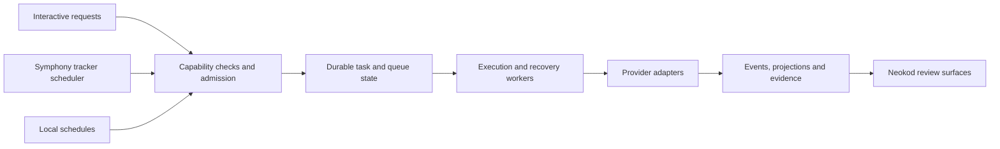

# Neokod: upstream nightlies and the next product direction

Research started 3 October 2026 and expanded 4 October. Decision status: recommendation, with implementation outstanding. The canonical execution direction remains [Plan 20](../../.plans/20-orchestration-direction.md).

## Recommendation

Build orchestration into the conversation: a chat should support direct work, queued continuation, delegation, schedules and PR follow-through without requiring a mode change. Retain Symphony as an optional tracker-led workstream, including an explicit "Send to Symphony" path for governed Jira and other tracker work. Keep Neokod and develop its orchestration core in bounded steps as the default. Upstream demonstrates much of this product direction. Its replacement engine is valuable reference material, but adopting it would still be a migration across Neokod's commands, history, providers and lifecycle.

Prioritise safe filesystem rewind, command-receipt identity, terminal-event persistence recovery, process signalling guards, Claude result/config-directory ownership and bounded database/history/logging work. Then build a server-owned queue, connection reliability and explicit cross-provider handoff within chat. Prove the existing Symphony execution path before extending its autonomy. Reconsider a replacement core if a bounded comparison shows that one coherent chat/task lifecycle would otherwise require duplicated or contradictory state across Code and Symphony. A complete app rewrite has not earned that decision yet.

This is a source-grounded assessment. No port, dependency upgrade, migration, live Neokod provider/session or tracker experiment, commit or publication was performed. Two bounded Claude consultations supplied architecture critiques. A separate temporary Node SQLite probe establishes one failure mechanism, not Neokod runtime behaviour. The [competitor comparison](competitor-codebase-review-2026-10-04.md) extends the research to Synara and every B-and-above app, including 49 additional frontend/desktop/performance/product patterns and generic delivery-app intake. Its [T3/Synara addendum](competitor-t3-synara-performance-2026-10-04.md) traces incremental rendering, terminal bounds, cache lifetime, search, navigation, startup and related proposals. These patterns can inform Neokod-owned components; upstream UI ports remain excluded.

## What actually shipped

The live GitHub API was used because search results still surfaced September releases. These are pinned observations, rather than moving branch names:

| Evidence                                          | Version / commit                                                                                                                  | Timing and implication                                                                                                                                                                                                   |
| ------------------------------------------------- | --------------------------------------------------------------------------------------------------------------------------------- | ------------------------------------------------------------------------------------------------------------------------------------------------------------------------------------------------------------------------ |
| Neokod checkout                                   | `80334a4c8`, branch `feat/clone-parent-destination`                                                                               | Existing Symphony and command-palette changes were already dirty. They were preserved. This is source state, not a claim about the running desktop version.                                                              |
| Latest stable upstream at the snapshot            | [`v0.0.45`](https://github.com/pingdotgg/t3code/releases/tag/v0.0.45), `6c8fed35dded`                                             | Published 2 October at 20:17 SAST. It precedes V2.                                                                                                                                                                       |
| V2 merge                                          | [PR #2829](https://github.com/pingdotgg/t3code/pull/2829), `de343914273e`                                                         | Merged 2 October at 21:22 SAST. V2 is no longer merely branch work.                                                                                                                                                      |
| First V2 nightly                                  | [`v0.0.46-nightly.20261003.2610`](https://github.com/pingdotgg/t3code/releases/tag/v0.0.46-nightly.20261003.2610), `8ed276c246b6` | Published 3 October at 03:10 SAST.                                                                                                                                                                                       |
| Previous review's nightly                         | [`v0.0.46-nightly.20261003.2623`](https://github.com/pingdotgg/t3code/releases/tag/v0.0.46-nightly.20261003.2623), `fed41fa88bb2` | Published 3 October at 09:43 SAST. This was the first review's cutoff.                                                                                                                                                   |
| Latest published nightly at the expanded snapshot | [`v0.0.46-nightly.20261004.2644`](https://github.com/pingdotgg/t3code/releases/tag/v0.0.46-nightly.20261004.2644), `737993303d36` | Published 4 October at 05:41:53 SAST. Includes further restart, stop, native-resume and transcript recovery work.                                                                                                        |
| Expanded main inventory cutoff                    | [`ee7b49d638e4`](https://github.com/pingdotgg/t3code/commit/ee7b49d638e412590b09b415cc48399d51644b60)                             | Main at 07:27:19 SAST. Runtime source refresh used the preceding `c5a0c78b7c0f`; the final delta is a UI correction and test fixture. The initial architectural source pin `31a9da179ed0` remains identified where used. |

V2 brings app-owned cross-provider delegation, provider-native child tracking, durable queues, native forks, provider switching, quota wakeups and scheduled tasks. Its release notes explicitly describe provider switching as a budgeted, lossy conversation transfer. They also describe a one-way copy into a new history database, with V1 and V2 diverging afterwards. Those are material limitations for a Neokod port, rather than details to hide behind a provider picker. [First V2 nightly](https://github.com/pingdotgg/t3code/releases/tag/v0.0.46-nightly.20261003.2610).

The upstream merge is large: GitHub reports 1,912 changed files, 380,729 additions and 203,651 deletions. These numbers describe scope, not code quality or migration effort. The following nightly and subsequent main changes contain additional fixes for wake transitions, working timestamps, release cleanup, ordered effects and delegated review semantics. A merge and release establish availability; they do not establish mature behaviour under every provider and failure mode. [PR #2829](https://github.com/pingdotgg/t3code/pull/2829), [PR #15048](https://github.com/pingdotgg/t3code/pull/15048), [PR #15115](https://github.com/pingdotgg/t3code/pull/15115).

V2 remains event-sourced: it adds a different command/projection contract, provider session manager, durable effect outbox and recovery workers. The useful comparison is contract and failure behaviour, not event sourcing versus a new paradigm. Four ideas remain worth adapting: execution-node trees, coalesced child-completion cohorts, immutable result pins, and explicit replay-safe versus process-bound effect classes. The last distinction prevents assuming a lost provider start or response can be replayed like metadata work. [Pinned Orchestrator](https://github.com/pingdotgg/t3code/blob/31a9da179ed0763335f05681c577474aec5d2309/apps/server/src/orchestration-v2/Orchestrator.ts), [pinned EffectOutbox](https://github.com/pingdotgg/t3code/blob/31a9da179ed0763335f05681c577474aec5d2309/apps/server/src/orchestration-v2/EffectOutbox.ts).

## What Neokod already owns

The [README](../../README.md) distinguishes shipped interactive Code mode from implemented but not production-proven Symphony, and design-only governed delegation and capability graphs. The historical [HANDOFF](../../HANDOFF.md) is dated August and does not describe this checkout's current branch or revision.

Code mode already has provider instances, local threads, worktrees, terminals, git and PR actions, diffs, notifications, and native subagent observation. Its engine processes commands through one worker and writes events, projections and receipts transactionally. That gives us an existing place to strengthen admission. It also means a fix for concurrent V2 event writers is not automatically a defect in Neokod. [OrchestrationEngine](../../apps/server/src/orchestration/Layers/OrchestrationEngine.ts).

The follow-up queue is a concrete gap. [composerDraftStore](../../apps/web/src/composerDraftStore.ts) persists queued text on the client, and [ChatView](../../apps/web/src/components/ChatView.tsx) drains it after the active turn settles. This does not provide a server-owned queue that can progress independently of the mounted conversation. Build that behaviour against Neokod's commands and persistence, with its own UI.

Symphony owns its own dispatch and reconciliation path. Its [AgentRuntime](../../apps/server/src/symphony/Runner/AgentRuntime.ts) directly spawns Codex app-server; it does not become provider-neutral just because Code mode supports several providers. A common governance boundary must cover both execution paths, or explicitly record that it covers only one. Native child observation likewise does not grant the app authority over provider-native delegation.

The current [Symphony architecture](../architecture/symphony.md) also identifies parsed-only approval/protected-path policy and some limits, distinct from enforced Codex approvals, dispatch caps and merge checks. The first live proof must check the effective controls it relies on; a valid `WORKFLOW.md` is not itself enforcement evidence. Its existing [smoke procedure](../../SMOKE.md) requires the tracker, workspace, agent turn, validation, evidence, pushed branch and PR URL to agree, without merging the PR.

The inspected V2 built-in provider list has Codex, Claude, Cursor, Grok, OpenCode, Pi and ACP Registry. It has no dedicated Copilot or Kiro adapter. A replacement would therefore need explicit coverage of Neokod's providers; generic ACP support is not proof that those CLIs are compatible. [Pinned provider list](https://github.com/pingdotgg/t3code/blob/31a9da179ed0763335f05681c577474aec5d2309/apps/server/src/orchestration-v2/builtInProviderAdapterDrivers.ts).

## Port and investigation shortlist

The default is exclusion. Upstream UI, mobile, cloud, hosted/remote management, relay and auth control-plane work stay out. A mixed PR must be reduced to independently justified local backend intent. New Neokod interfaces can be designed deliberately when a chosen feature needs them.

| Upstream work                                                                                           | Observed status                                 | Neokod action and reason                                                                                                                                                                                                                                                                                                                                                                                                                                             | Required acceptance evidence                                                                                                                                                                                                            |
| ------------------------------------------------------------------------------------------------------- | ----------------------------------------------- | -------------------------------------------------------------------------------------------------------------------------------------------------------------------------------------------------------------------------------------------------------------------------------------------------------------------------------------------------------------------------------------------------------------------------------------------------------------------- | --------------------------------------------------------------------------------------------------------------------------------------------------------------------------------------------------------------------------------------- |
| [#14497](https://github.com/pingdotgg/t3code/pull/14497): unrelated Claude result ends `/compact` early | In stable `.45` and current nightlies           | First provider port candidate. Local [ClaudeAdapter](../../apps/server/src/provider/Layers/ClaudeAdapter.ts) completes the active turn without checking the result's echoed prompt UUIDs or non-human origin. Adapt the result-to-turn guard, with compatibility for older CLI results lacking those fields.                                                                                                                                                         | A background-notification result does not settle a queued human turn; compaction boundary and actual compact result settle it once; ordinary, synthetic and older-shape results remain compatible.                                      |
| [#13295](https://github.com/pingdotgg/t3code/pull/13295): a second server resends Claude turns          | In V2 nightly `.2610`; absent from stable `.45` | Conditional port candidate. Neokod's failure reconciliation also republishes every recovered event since its starting sequence, including events written by another server. If shared-store multi-process use is supported, track this dispatch's appended events while still projecting all recovered events. This is an existing-engine fix, separate from V2's EventSink issue. Shared-store deployment and a duplicate live provider turn were not demonstrated. | Two engines sharing one database: a failed stale command does not republish the other engine's turn-start; the existing persisted-append/projection-failure recovery still delivers its own event.                                      |
| [#13812](https://github.com/pingdotgg/t3code/pull/13812): background fetch triggers failed repacks      | Merged; in stable `.45` and current nightlies   | Narrow port. Local [GitVcsDriverCore](../../apps/server/src/vcs/GitVcsDriverCore.ts) runs background status fetch with `--quiet --no-tags` and allows git auto-maintenance. Add `--no-auto-gc` on that background path. Preserve normal user-requested git maintenance.                                                                                                                                                                                              | Existing git-driver regression with auto-GC due proves the background fetch does not repack; fetched refs still update. Upstream's reported disk consumption is not a local measurement.                                                |
| [#7232](https://github.com/pingdotgg/t3code/pull/7232): probe timeout marks a provider broken           | Open at inspection                              | Strong local correctness candidate. Probe deadlines should remain distinct from confirmed breakage; [makeManagedServerProvider](../../apps/server/src/provider/makeManagedServerProvider.ts) currently replaces snapshots with the probe result. Preserve a prior usable snapshot on timeout, with a fresh timeout observation, while retaining first-probe and definite failures.                                                                                   | Timeout after success retains known version/models/auth with stale-evidence wording; first timeout is explicit; missing binary and definite auth failures remain errors; cached evidence never masquerades as a successful fresh probe. |
| [#12889](https://github.com/pingdotgg/t3code/pull/12889): Codex JSONL frame limit                       | Open at inspection                              | Bounded-input candidate. Local [protocol](../../packages/effect-codex-app-server/src/protocol.ts) accumulates an unbounded remainder before decoding. Cap UTF-8 bytes before concatenation/parse and use the existing transport-failure path. Evaluate the upstream limit rather than guessing a smaller one.                                                                                                                                                        | Fragmented oversized frame fails without dispatching callbacks; valid large diff and multibyte/boundary cases pass; the session closes meaningfully rather than truncating JSON.                                                        |
| [#14864](https://github.com/pingdotgg/t3code/pull/14864): failed version lookup cached for an hour      | Open at inspection                              | Small local cache fix. [providerMaintenance](../../apps/server/src/provider/providerMaintenance.ts) also gives a null version lookup the successful one-hour TTL. Give failures a short retry TTL.                                                                                                                                                                                                                                                                   | Clock-driven regression verifies negative-cache expiry and preserves successful-cache TTL and request coalescing.                                                                                                                       |
| [#14903](https://github.com/pingdotgg/t3code/pull/14903): API-key Codex auth warning                    | In V2 nightly `.2610`; absent from stable `.45` | Small local telemetry fix. [Identify](../../apps/server/src/telemetry/Identify.ts) requires `tokens.account_id`, although supported API-key auth has no tokens object. Treat absent tokens as the normal identity fallback.                                                                                                                                                                                                                                          | API-key fixture emits no malformed-auth warning or secret; genuinely malformed/read failures retain appropriate warnings.                                                                                                               |
| [#14897](https://github.com/pingdotgg/t3code/pull/14897): reconnect backoff and healthy sockets         | In nightly `.2623`                              | Strong candidate. The local [supervisor](../../packages/client-runtime/src/connection/supervisor.ts) has fixed 1/2/4/8/16-second retry delays, without jitter. Adapt bounded jitter and preserve healthy local leases. Retain the supervisor as the sole retry owner.                                                                                                                                                                                                | Deterministic clock/random coverage for backoff, healthy wake, offline interruption and explicit retry; no second retry loop in RPC code.                                                                                               |
| [#14518](https://github.com/pingdotgg/t3code/pull/14518): slow initial configuration                    | Open at inspection                              | Investigate alongside reconnect policy. Neokod also gives the entire establishment attempt one 15-second budget. The upstream proposal separates setup from synchronisation; its exact timeout values are a tradeoff, not a requirement to copy.                                                                                                                                                                                                                     | A delayed first snapshot retains a working socket; a dead setup still fails promptly; cancellation and generation changes dispose the old attempt.                                                                                      |
| [#15048](https://github.com/pingdotgg/t3code/pull/15048): effect ordering and failure recovery          | Now in `.2644`; merged after `.2623`            | Harvest invariants, rather than the V2 outbox implementation. An earlier rollback retry must block later workspace work; state-read errors must remain errors; failed provider cleanup must remain observable and retryable. Neokod's command publication is already serialised.                                                                                                                                                                                     | Focused regressions at the actual affected local seam. Do not add a second event-publish lock just because V2 needed one.                                                                                                               |
| [#15057](https://github.com/pingdotgg/t3code/pull/15057): server-owned PR watching                      | Now in `.2644`; merged after `.2623`            | High-value Neokod feature after queue and wake semantics. Reuse existing PR/source-control services, add a server-owned watch cursor and poll lifecycle, and notify on meaningful checks, reviews or conflicts. Port backend intent only.                                                                                                                                                                                                                            | Change and wake recorded atomically; duplicate polling emits one wake; stopped/settled watches stay stopped; unreadable hosts and excessive bot feedback end visibly. A wake never grants merge permission.                             |
| [#15115](https://github.com/pingdotgg/t3code/pull/15115): delegated review rounds                       | Merged; now in nightly `.2644`                  | Design rule for future delegation: every review round is a new task with a retry-stable request ID. Messaging a completed child is not automatically another run owned by the completed task.                                                                                                                                                                                                                                                                        | Cancellation scope, original result preservation and result delivery remain unambiguous.                                                                                                                                                |
| [#15004](https://github.com/pingdotgg/t3code/pull/15004): delegated follow-up results                   | Open at inspection                              | Watch rather than copy. It proposes versioned delivery and authorised parent linkage for subsequent child runs. This is a future execution-tree concern, not a patch for Neokod's observed native-subagent panel.                                                                                                                                                                                                                                                    | Read the final merged semantics together with #15115; avoid claiming cancellation applies to unrelated later child turns.                                                                                                               |
| [#15150](https://github.com/pingdotgg/t3code/pull/15150): terminal-status worktree cleanup              | Open at inspection                              | Carry the lifecycle rule into worktree retention design. Never translate foreign status names mechanically or clean a worktree solely because its foreground turn ended.                                                                                                                                                                                                                                                                                             | Retain workspaces with queued turns, live requests, background work or ownership claims; preserve uncommitted work and exact git identity.                                                                                              |
| [#15149](https://github.com/pingdotgg/t3code/pull/15149): usage scan cost                               | Merged 3 October; previously open               | Reference only unless Neokod implements the same transcript aggregation. The reported speedups belong to upstream's measured dataset and are not Neokod performance evidence.                                                                                                                                                                                                                                                                                        | Establish a local baseline and exact aggregation equivalence before choosing a cache or concurrency change.                                                                                                                             |
| [#15021](https://github.com/pingdotgg/t3code/pull/15021): Claude Windows executable resolution          | In nightly `.2623`; absent from stable `.45`    | Conditional adapter investigation. Neokod passes the configured executable path into Claude SDK too; a successful direct health probe does not prove the SDK can resolve a Windows npm shim.                                                                                                                                                                                                                                                                         | Reproduce bare `claude` and explicit paths on Windows before prioritising a port, with unchanged macOS behaviour. No native Windows validation was performed here.                                                                      |

Several tempting nightly fixes have no matching local implementation: [#14726](https://github.com/pingdotgg/t3code/pull/14726) changes V2's Claude process-replacement behaviour, while Neokod uses the live query's `setModel`; [#14893](https://github.com/pingdotgg/t3code/pull/14893) changes V2 shell enrichment; and [#14673](https://github.com/pingdotgg/t3code/pull/14673) batches a recurring PR-link poller absent from Neokod's corresponding source-control path. Treat them as reference until a local failure/caller is established. Neokod does independently refresh providers on each server-config subscription; evaluate that churn with fresh reconnect/request-frequency evidence rather than attributing it to #14893.

Provider-specific fixes deserve a separate compatibility pass against installed protocols, not a blanket SDK bump. [#14311](https://github.com/pingdotgg/t3code/pull/14311) regenerates Codex bindings from 0.156 to 0.159; Neokod's generator is still pinned to 0.145, so a real regeneration and full protocol-delta review are required rather than that patch alone. V2's OpenCode 2 support and Cursor SDK adapter are substantial adapter projects for providers Neokod already supports through other versions/transports. The release warns that OpenCode 2 changes its shared database and should not run beside 1.x. Adopting these protocol versions/adapters needs migration and rollback work, capability checks and local sessions. Generic registry support is eligible only after a deliberate local capability/installation design; upstream remote-device and sign-in management stays excluded. [First V2 nightly](https://github.com/pingdotgg/t3code/releases/tag/v0.0.46-nightly.20261003.2610).

## Expanded review since Neokod's last published release

The latest non-draft Neokod GitHub release is [v3.6.0](https://github.com/kamo62/neokod/releases/tag/v3.6.0), published **10 August 2026 at 06:42:36 UTC**. Newer-looking draft entries have no publication date and were excluded. This is a verified release baseline, not proof of which build was last installed or deployed on another machine. No Neokod installation was found in the standard local Applications directories. The closed-PR window ends **4 October at 05:27:33 UTC**. The paginated open inventory was captured from **05:27:36.763 to 05:27:56.923 UTC**; it is a capture interval, not a single atomic snapshot. Metadata/file retrieval and selected proposal diffs happened later. Seven open records changed metadata during file retrieval (#15328, #15462, #15477, #15493, #15495, #15496 and #15499); later revisions of #15450 and #15297 are assessed as dated proposals rather than assigned to the frozen nightly.

The [PR ledger](upstream-pr-ledger-2026-10-04.csv) accounts for **3,233 closed PRs: 2,562 merged and 671 closed without merging**, plus **1,059 open PRs, including 26 drafts**. Closed searches were split into non-overlapping time intervals below GitHub's 1,000-result search cap, and checked against the aggregate count. Open PRs were paginated directly without an update-date floor. Thus old open proposals are included too. Raw API responses were preserved before classification in `/tmp/neokod-comprehensive-20261004/`.

Every record received metadata and mechanical changed-file scope triage. Runtime-path matches are inputs to semantic review, not proof that a feature satisfies the local-first/UI filters or deserves a port. Sol validation identified shared relay/connect files, test fixtures and native composer IPC that a first path heuristic misclassified; the path rules and explicit composer disposition were corrected. Selected changes received deeper diff/local-source comparisons, described here and labelled separately in the ledger. This is not a line-by-line audit of all 4,292 diffs. Eight records have capped, missing or inconsistent file evidence: #4179, #5199, #6248, #7171, #8183, #10653, #10654 and #12327. They remain explicitly deferred. GitHub's file endpoint caps very large PRs at 3,000 files. Unmerged closures remain proposals, not shipped fixes; a merge into a development branch does not itself establish nightly inclusion.

The wider pass adds these concrete priorities to the earlier shortlist:

| Change                                                                                                                              | Local finding and decision                                                                                                                                                                                                                                                                                                                                                                                                                                                                                                                                                           | Acceptance evidence before implementation is complete                                                                                                                                                                                                                 |
| ----------------------------------------------------------------------------------------------------------------------------------- | ------------------------------------------------------------------------------------------------------------------------------------------------------------------------------------------------------------------------------------------------------------------------------------------------------------------------------------------------------------------------------------------------------------------------------------------------------------------------------------------------------------------------------------------------------------------------------------ | --------------------------------------------------------------------------------------------------------------------------------------------------------------------------------------------------------------------------------------------------------------------- |
| [#15442](https://github.com/pingdotgg/t3code/pull/15442), open: recovery after disk-space stalls                                    | Highest new reliability candidate. [ProviderRuntimeIngestion](../../apps/server/src/orchestration/Layers/ProviderRuntimeIngestion.ts) logs non-interrupt processing failures and returns success; [DrainableWorker](../../packages/shared/src/DrainableWorker.ts) then removes the queued input. A failed terminal persistence operation has no visible per-event retry at this boundary. Adapt reliable terminal writes and recovery, not V2's implementation. This is source evidence, not a reproduced local disk-full incident.                                                  | Inject storage-full at terminal writes, restore storage and persist the same outcome once without restarting provider work. Preserve newer attempts, pending-request closure and truthful partial output. Bound buffering/backpressure and expose exhausted recovery. |
| [#14461](https://github.com/pingdotgg/t3code/pull/14461): safe process-group signalling                                             | Local [opencodeRuntime](../../apps/server/src/provider/opencodeRuntime.ts) directly negates `child.pid`; the existing shared [processGroup](../../packages/shared/src/processGroup.ts) validates positive IDs but admits 1 and does not independently guard the signaller. Reuse that module and reject non-safe integers and IDs at or below 1 before signalling. The guard exists in `.2644`'s pinned source; the original branch merge SHA has divergent ancestry, so ancestry alone was not used as inclusion proof. No malformed production PID or broad signal was reproduced. | Stub signalling and prove 0, 1, negative, fractional, non-finite and oversized IDs never reach `process.kill`; valid owned groups retain escalation/liveness semantics. An isolated POSIX integration check must only target a spawned group.                         |
| [#12624](https://github.com/pingdotgg/t3code/pull/12624): Claude configuration identity                                             | Strong provider candidate, in stable `.45`. Local [ClaudeHome](../../apps/server/src/provider/Drivers/ClaudeHome.ts) keys an empty setting as the home directory and ignores inherited `CLAUDE_CONFIG_DIR`; the CLI uses its config directory. Resolve the effective directory once for environment, continuation identity and capability keys.                                                                                                                                                                                                                                      | Empty and explicit `~/.claude` share continuation; inherited directories remain distinct; an explicit setting wins. Preserve keychain/HOME behaviour and literal inherited tilde semantics.                                                                           |
| [#13763](https://github.com/pingdotgg/t3code/pull/13763): bounded trace diagnostics                                                 | Strong performance candidate, in stable `.45`. Local [TraceDiagnostics](../../apps/server/src/diagnostics/TraceDiagnostics.ts) retains full rotated files as strings and splits lines before aggregation. Adapt streaming records and bounded summaries while preserving partial-file evidence.                                                                                                                                                                                                                                                                                      | Equivalent diagnostics on a frozen fixture, malformed/truncated records and rotation/read failures remain visible. Measure peak memory on the same local dataset; upstream measurements are not Neokod results.                                                       |
| [#13684](https://github.com/pingdotgg/t3code/pull/13684): WAL retention                                                             | Small storage candidate, in stable `.45`. Local [SQLite setup](../../apps/server/src/persistence/Layers/Sqlite.ts) enables WAL without a journal size limit. Bound retained WAL after reset. This pragma is not a hard ceiling on an active WAL held by readers.                                                                                                                                                                                                                                                                                                                     | Exercise actual Node/Bun clients, checkpoint/reset, restart and a long reader; preserve durability and busy-timeout behaviour. Do not delete WAL files to reclaim space.                                                                                              |
| [#12763](https://github.com/pingdotgg/t3code/pull/12763): legacy message history                                                    | Conditional compatibility candidate, in stable `.45`. Local [ThreadMessageSentPayload](../../packages/contracts/src/orchestration.ts) requires `turnId`, and persisted events use that schema. Decide against actual supported historical inputs rather than fabricate a migration need.                                                                                                                                                                                                                                                                                             | A retained pre-field fixture replays without losing event identity/order; current null and explicit turn IDs remain intact.                                                                                                                                           |
| [#15450](https://github.com/pingdotgg/t3code/pull/15450), open: orphan Claude processes after server crash                          | High-value investigation. Local SDK query creation has no custom spawn hook or durable PID ledger. Verify hard-kill/restart behaviour and the installed SDK's capabilities before adapting the proposal. Its spawn-to-ledger race and broader adapter coverage still deserve review.                                                                                                                                                                                                                                                                                                 | Isolated macOS/Linux hard-kill test; orphan cleanup precedes recovery; PID reuse/identity are checked; MCP tokens never enter argv logs or plaintext ledgers. Normal exit, background descendants and ledger-write failure remain bounded and observable.             |
| [#13748](https://github.com/pingdotgg/t3code/pull/13748) with [#13927](https://github.com/pingdotgg/t3code/pull/13927): PTY upgrade | Dependency bundle, not an immediate local defect. Neokod still uses `node-pty` 1.1.0. A beta upgrade for Linux arm64 prebuilds also changes Windows PID readiness and early-exit handling. Both upstream changes are in stable `.45`.                                                                                                                                                                                                                                                                                                                                                | Upgrade only with the readiness/cancellation companion changes and packaged native terminal proof on affected platforms. No Windows/native validation was performed here.                                                                                             |

Several new apparent matches were rejected after tracing: #13786's missing Claude auto-edit permission callback is already covered by Neokod's callback policy; #12003 depends on an OpenCode admission Deferred absent locally; #12846 optimises an attachment-cleanup replay sweep absent here; #12523 targets a PR diff cache Neokod does not have. Independent Sol validation corrected the initial exclusion of [#12847](https://github.com/pingdotgg/t3code/pull/12847): it removes indexes that Neokod does create in migrations 005/008. Later migrations cover some prefixes, but turn-query coverage still needs a local query-plan check. Treat it as conditional V1 index review; do not remove indexes wholesale.

### Earlier closed PRs add safety and performance work

The 10 August to 18 September portion contains 2,305 closures, including 436 unmerged proposals. Looking only at the newest nightlies would have missed these current local paths:

| Upstream reference                                                                                                                                                                                                                                           | Current local finding                                                                                                                                                                                                                                                                                                                                                                                                                                                                                   | Decision and acceptance gate                                                                                                                                                                                                                                                                                                                                                                                      |
| ------------------------------------------------------------------------------------------------------------------------------------------------------------------------------------------------------------------------------------------------------------ | ------------------------------------------------------------------------------------------------------------------------------------------------------------------------------------------------------------------------------------------------------------------------------------------------------------------------------------------------------------------------------------------------------------------------------------------------------------------------------------------------------- | ----------------------------------------------------------------------------------------------------------------------------------------------------------------------------------------------------------------------------------------------------------------------------------------------------------------------------------------------------------------------------------------------------------------- |
| [#12306](https://github.com/pingdotgg/t3code/pull/12306): isolate filesystem rewind                                                                                                                                                                          | [CheckpointReactor](../../apps/server/src/orchestration/Layers/CheckpointReactor.ts) resolves the session cwd and restores a checkpoint without proving that it is an isolated worktree. [GitVcsDriver](../../apps/server/src/vcs/GitVcsDriver.ts) then runs `git restore` and `git clean -fd`. Its separate shared-worktree check protects branch metadata adoption, not this rewind path. Current local rewind has no `restoreFiles` selector and always restores files before conversation rollback. | Highest safety priority. Establish exclusive isolation before any filesystem mutation. A conversation-only alternative needs a deliberate contract/action addition; it is not existing local behaviour. Prove root/shared-checkout refusal, sibling thread protection and isolated rewind, including the intended treatment of untracked files. No destructive reproduction was attempted in the user's checkout. |
| [#5246](https://github.com/pingdotgg/t3code/pull/5246): receipt aggregate identity                                                                                                                                                                           | [OrchestrationEngine](../../apps/server/src/orchestration/Layers/OrchestrationEngine.ts) returns an accepted receipt for a reused command ID without comparing its stored aggregate to the requested aggregate. The receipt already stores aggregate kind and ID.                                                                                                                                                                                                                                       | Narrow correctness port with no new schema. Reuse within the same aggregate remains idempotent; reuse for another aggregate must conflict. This does not solve same-aggregate, different-payload reuse. Test through the production SQLite receipt path.                                                                                                                                                          |
| [#12305](https://github.com/pingdotgg/t3code/pull/12305): bound individual log events                                                                                                                                                                        | [EventNdjsonLogger](../../apps/server/src/provider/Layers/EventNdjsonLogger.ts) serialises the entire unknown event before the rotating sink sees it. Rotation bounds retained files, not allocation/CPU for one large history or diff frame.                                                                                                                                                                                                                                                           | Project or bound values before serialisation; omit transient raw frames while retaining diagnostic identity and truncation evidence. Compare payload bytes and peak memory on a frozen fixture.                                                                                                                                                                                                                   |
| [#9032](https://github.com/pingdotgg/t3code/pull/9032): streaming message append                                                                                                                                                                             | [ProjectionPipeline](../../apps/server/src/orchestration/Layers/ProjectionPipeline.ts) reads the previous full text, concatenates a delta and upserts the growing message for each chunk.                                                                                                                                                                                                                                                                                                               | Adapt a dedicated database append operation; preserve attachment, completion and replay semantics. Measure actual reads/writes and copying before claiming a speed-up.                                                                                                                                                                                                                                            |
| [#9000](https://github.com/pingdotgg/t3code/pull/9000): snapshot payload bounds                                                                                                                                                                              | [ProjectionSnapshotQuery](../../apps/server/src/orchestration/Layers/ProjectionSnapshotQuery.ts) loads full histories and activity `payload_json` into thread detail. The upstream fix bounds client projection/snapshot materialisation while explicitly retaining raw detail behaviour.                                                                                                                                                                                                               | Adapt the relevant client snapshot boundary, preserving raw detail access, readable summaries, requested details and unknown evidence. Use a large-history fixture and actual SQLite client.                                                                                                                                                                                                                      |
| [#9662](https://github.com/pingdotgg/t3code/pull/9662), [#9758](https://github.com/pingdotgg/t3code/pull/9758), [#10108](https://github.com/pingdotgg/t3code/pull/10108), [#10120](https://github.com/pingdotgg/t3code/pull/10120): focused projection reads | Shell-summary refresh and provider start/finalisation repeatedly fetch history for keyed or aggregate queries.                                                                                                                                                                                                                                                                                                                                                                                          | Introduce only the specific latest-message, pending-count and keyed-finalisation reads justified by callers. Avoid replacing every detail lookup. Benchmark each changed operation against equivalent history.                                                                                                                                                                                                    |
| [#9726](https://github.com/pingdotgg/t3code/pull/9726): aggregate-filtered replay                                                                                                                                                                            | [WebSocket resume](../../apps/server/src/ws.ts) reads globally sequenced events then filters by thread. Neokod already caps the gap and falls back to a snapshot.                                                                                                                                                                                                                                                                                                                                       | Conditional query optimisation, not an unbounded replay defect. Preserve the global head/cursor and deletion/recreation/snapshot semantics.                                                                                                                                                                                                                                                                       |

Earlier closed proposals for sibling messages (#6567), generated handoff recaps (#8492) and native QuickJS execution (#11853) are feature references. They do not justify importing new transports or a native execution layer. Neokod's transient serial command queue and durable event/receipt transaction provide an admission seam, but do not yet make child launch and result delivery a durable workflow. Busy timeout (#5134) and runtime-item closure (#4759) already have local coverage; V2 outbox compensation (#5150) has no matching local state machine.

### Open PRs with additional local matches

All entries below are proposals. A matching code path earns investigation and an acceptance gate, not an automatic port.

| Proposal                                                                                                                                                       | Current local path and useful intent                                                                                                                                                                                                                                                                                                                                                                                                                    | Required proof                                                                                                                                                                                                                                                                                                                                                                 |
| -------------------------------------------------------------------------------------------------------------------------------------------------------------- | ------------------------------------------------------------------------------------------------------------------------------------------------------------------------------------------------------------------------------------------------------------------------------------------------------------------------------------------------------------------------------------------------------------------------------------------------------- | ------------------------------------------------------------------------------------------------------------------------------------------------------------------------------------------------------------------------------------------------------------------------------------------------------------------------------------------------------------------------------ |
| [#15400](https://github.com/pingdotgg/t3code/pull/15400): checkpoint object quarantine                                                                         | [GitVcsDriver](../../apps/server/src/vcs/GitVcsDriver.ts) uses a private index but `git add -A` still writes to shared object storage. Isolate capture objects, then publish a completed checkpoint. Prefer this to #15297's large-untracked-file skip, which changes recovery contents.                                                                                                                                                                | Interrupt a large capture; index, references and usable history remain intact, abandoned temporary objects are bounded, successful publication passes `git fsck`, and concurrent captures do not overwrite one another. No local disk-growth measurement was performed.                                                                                                        |
| [#14718](https://github.com/pingdotgg/t3code/pull/14718): read-only git status                                                                                 | [GitVcsDriverCore](../../apps/server/src/vcs/GitVcsDriverCore.ts) runs status and diff polling without disabling optional locks.                                                                                                                                                                                                                                                                                                                        | Apply read-only environment/plumbing only where supported; prove concurrent status with staging/commit, renames and an unborn repository. Do not change mutation commands.                                                                                                                                                                                                     |
| [#15488](https://github.com/pingdotgg/t3code/pull/15488): SQLite transaction and error handling                                                                | [NodeSqliteClient](../../apps/server/src/persistence/NodeSqliteClient.ts) uses Effect's deferred `BEGIN`; the [project CLI](../../apps/server/src/cli/project.ts) normally tries live RPC but can directly open the same `state.sqlite` as a fallback. Concurrent writers are possible, not established as typical operation. The exact published Effect beta.78 classifier reads `code`/`errno`, while Node exposes `ERR_SQLITE_ERROR` plus `errcode`. | Use `BEGIN IMMEDIATE` for writable clients and retain deferred transactions for read-only clients; prove competing writers, existing-lock timeout, retry and rollback semantics using independent connections. Map native extended errors carefully. Node error 13 still becomes `UnknownError` under the upstream classifier, so disk-full recovery needs an explicit policy. |
| [#12777](https://github.com/pingdotgg/t3code/pull/12777): Codex stdout EOF                                                                                     | [protocol](../../packages/effect-codex-app-server/src/protocol.ts) awaits a potentially pending child-exit diagnostic before failing outstanding requests after input ends.                                                                                                                                                                                                                                                                             | Pending and future RPCs fail promptly on EOF even when exit diagnostics never resolve; preserve an already available process error.                                                                                                                                                                                                                                            |
| [#15374](https://github.com/pingdotgg/t3code/pull/15374): ACP numeric request IDs                                                                              | [ACP client](../../packages/effect-acp/src/client.ts) and [agent](../../packages/effect-acp/src/agent.ts) start IDs above signed 32-bit range. Some peers may reject them.                                                                                                                                                                                                                                                                              | Establish a supported-peer compatibility failure before changing IDs. Preserve bounded, disjoint bidirectional ID ranges and collision safety. The standard's numeric representation alone does not establish a universal signed-32-bit limit.                                                                                                                                 |
| [#15459](https://github.com/pingdotgg/t3code/pull/15459), with alternative [#7691](https://github.com/pingdotgg/t3code/pull/7691): Claude authentication truth | [Claude capability probe](../../apps/server/src/provider/Layers/ClaudeProvider.ts) can report authenticated after completion even when observed account token source is `none`.                                                                                                                                                                                                                                                                         | Choose one effective authentication policy; preserve unknown for older CLI shapes and valid API-key/Bedrock/Vertex configurations. A successful protocol exchange is not account-auth evidence.                                                                                                                                                                                |
| [#14987](https://github.com/pingdotgg/t3code/pull/14987): atomic file permissions                                                                              | [atomicWrite](../../apps/server/src/atomicWrite.ts) replaces an existing inode with a temporary file whose mode comes from the umask. Shared callers include settings and persisted state.                                                                                                                                                                                                                                                              | Preserve restrictive existing POSIX permissions, use an explicit policy for new sensitive state, and retain atomic replacement. Windows behaviour needs its own check. No credential file was read.                                                                                                                                                                            |
| [#11773](https://github.com/pingdotgg/t3code/pull/11773): optional worktree metadata                                                                           | [worktree creation](../../apps/server/src/vcs/GitVcsDriverCore.ts) completes before an optional branch config write that can fail on a held config lock, leaving a checkout reported as failed.                                                                                                                                                                                                                                                         | Make only the optional metadata step best-effort with a diagnostic; retain fatal creation/cancellation errors and existing base-resolution fallback.                                                                                                                                                                                                                           |

The isolated probe used Node **v26.10.0** and temporary databases. A deferred WAL transaction read, a second connection committed, and the first connection's write returned `errcode=517` (`SQLITE_BUSY_SNAPSHOT`) despite a busy timeout. A duplicate unique value returned 2067. An in-memory database with a small `max_page_count` returned 13 for storage-full; the disk was not filled. Exact published beta.78 source confirms the classifier/default-transaction mismatch. This establishes the SQLite mechanism and error representation, not a reproduced Neokod workflow failure or successful adapter patch. [Saved probe result](sqlite-mechanism-2026-10-04.json).

Lower-priority conditional proposals include Codex shadow-home maintenance-lock compatibility (#15361), macOS checkpoint durability pragma (#14457), Windows executable-discovery caching (#12600), and a broad git metadata reader (#12602). Require the installed version, native proof or measured local hot path respectively. Apparent matches for fast mode (#15473), usage probes (#14456), workflow YAML parsing (#15452) and ACP/MCP bridge work (#14419/#14431/#14432) do not establish a current local defect.

The latest nightly also provides new acceptance scenarios for the proposed common task lifecycle: [#15323](https://github.com/pingdotgg/t3code/pull/15323) preserves delegated tasks, queue state and stops across restart; [#15355](https://github.com/pingdotgg/t3code/pull/15355) reaches background work left by a previous provider; [#15388](https://github.com/pingdotgg/t3code/pull/15388) settles against the last human message; [#15389](https://github.com/pingdotgg/t3code/pull/15389) retries archived native Codex resumes; and [#14104](https://github.com/pingdotgg/t3code/pull/14104) restores older transcript pages. These are implemented upstream scenarios, not proof of the corresponding Neokod failures or automatic local ports. [Nightly `.2644`](https://github.com/pingdotgg/t3code/releases/tag/v0.0.46-nightly.20261004.2644).

## Chat orchestration and optional Symphony workstreams

The user's 4 October steering changes the product comparison: orchestration should live within chat, without requiring a separate mode, while Symphony retains value for specific governed workstreams such as Jira. A conversation should be able to delegate research/review, queue an implementation step, wait for a PR, schedule continuation and receive its results in the same durable history. "Send to Symphony" should explicitly route a bounded objective into a configured tracker/workflow and link its progress and evidence back to the originating conversation. The Symphony board remains useful for project-wide dispatch, evidence and approval. Approval, sandbox and unattended-execution policy remain explicit per action; enabling a schedule or delegation never raises permissions by itself.

Neokod currently has separate execution paths and a [cross-mode HandoffService](../../apps/server/src/symphony/HandoffService.ts) that cancels a Symphony attempt and binds a Code thread to its workspace, and can delegate from a thread. This is useful existing ownership machinery, but it is a transfer between models of work, not proof that both already share one conversation/run lifecycle. Preserve its exclusive-workspace checks while designing common accepted-intent and outcome semantics. A linked briefing may be needed when moving from a provider-neutral Code thread into today's Codex-only Symphony executor; do not claim native session continuity. Link autonomous attempts to the originating conversation and let the server own progress, cancellation, results and recovery.

The requested flow now covers **any supported work-delivery application**: in normal chat, say "Send this task to Symphony" through an existing configured connection. Jira ABC-123 is one example; Linear, GitHub Issues/Projects, Azure DevOps Boards, GitLab and Asana already have registered adapters in local source. Resolve display references/URLs to the selected adapter's canonical native ID, verify scope/state and supported dependency/workflow policy, then claim or reuse the existing work item through the normal dispatch gate. Authentication is not proof that the task is dispatchable or that write-back is supported. Future delivery applications need their own proved adapter capabilities. The [seven-adapter intake assessment](work-delivery-intake-review-2026-10-04.md) records native-ID differences, custom-state/item-type limitations and direct scope-validation gaps. Tracker and repository source control remain independent.

The [WorkItemRepository](../../apps/server/src/symphony/Persistence/Layers/WorkItemRepository.ts) already has a unique `(project_id, tracker_kind, tracker_issue_id)` identity and fenced claims. Tracker polling and chat intake should converge on that same item.

The existing [delegate input](../../packages/contracts/src/symphony.ts) carries an objective and thread ID, but has no tracker task-ID field. `delegateFromThread` validates the thread and creates a new manual work item with a generated `delegated-...` tracker ID; it does not persist the source thread in that new item's source. Extend the existing flow with explicit tracker-backed identity and durable conversation linkage. Persist a request ID so retries and polling cannot dispatch it twice. Keep credentials server-side, link the attempt/evidence/PR back to the chat and Symphony board, and require an explicit exclusive workspace transfer if continuing the current checkout. These are proposed additions; no authenticated dispatch or live tracker run was performed.

The first incremental prototype should prove one conversation from prompt to queued/delegated work to reviewable result, including stop and restart, followed by a linked "Send to Symphony" tracker path. Share the upstream patterns that address actual recurring lifecycle problems across both paths; separate schedulers or views can retain their focused responsibilities. A fresh core gains value if coherent ownership, cancellation and results would otherwise need mirrored authoritative state or repeated unsafe handoffs. Compare that prototype fairly against an evolution of Neokod, with the same providers, workload and copied-history gates. Upstream UI remains excluded; any chat/workstream interface must be designed against Neokod's own components.

| Upstream pattern                                       | Chat application                                                                                         | Symphony application                                                                                                                                                                          |
| ------------------------------------------------------ | -------------------------------------------------------------------------------------------------------- | --------------------------------------------------------------------------------------------------------------------------------------------------------------------------------------------- |
| Durable tasks and replay-safe/process-bound effects    | Persist queue/delegation intent and distinguish accepted from provider-started.                          | Retain tracker claim, attempt and retry identity; recover metadata without blindly launching the agent again. Reuse existing persistence where it already supplies the semantics.             |
| Explicit parent/result delivery and cancellation scope | Deliver a pinned child result to its authorised parent; each later review round is a new task.           | Link root objective, attempts, review and evidence; a cancelled attempt cannot cancel a newer retry or reclaim its workspace.                                                                 |
| Background-work and restart truth                      | Stop reaches work left by an earlier provider; lost terminal writes cannot silently settle or disappear. | Verify worker/process exit before releasing ownership or reporting a stop; keep reconciliation/evidence failures visible. Matching defects must be established independently in this path.    |
| Shared authority and workspace ownership               | Check provider capabilities and reserve the workspace at admission.                                      | Apply configured tracker/workflow policy at dispatch and handoff; close parsed-only policy gaps before relying on them. Preserve merge gating and current Codex-only execution truth.         |
| Server-owned watches and schedules                     | A PR or due task can wake the conversation under its continuation policy.                                | Reuse source-control/tracker services for project workstreams; write observation/cursor and accepted wake atomically. A wake grants neither merge authority nor broader provider permissions. |

## Features I would build

The core experience should be: give a conversation a bounded objective, see which agent owns each part, leave it running, then return to changes and evidence in that conversation. The following are proposals, not shipped capabilities.

1. **A durable queue and honest recovery.** Store queue items, provider/model selection, attachments and idempotency keys on the server. Distinguish queued, accepted, actually started and terminal outcomes. Hold work after a restart until its resume policy permits continuation. Editing or cancelling a queue entry must be safe against dispatch races.
2. **Cross-provider handoff with an explicit briefing.** Start with a manual `/throw` into a fresh thread. Include the objective, decisions, outstanding work, verification, file/diff references and source lineage. Bound the briefing and disclose omissions. Use a separate worktree or an explicit exclusive ownership transfer. This offers a useful escape from exhausted quotas without pretending native reasoning or tool history transferred losslessly.
3. **Bounded app-owned delegation.** Begin with one parent and read-only research or review children. Add worktree-backed implementation children after cancellation, restart recovery, result pinning and integration work. Every child needs server-derived lineage and authority, depth/concurrency reservations, a wall-clock bound, and a cost policy that preserves unknown spend. A provider's native children remain a separately observed class.
4. **Schedules and quota-aware continuation.** Support one-shot work as well as recurring schedules. Persist timezone, due time, missed/deferred state and the execution outcome. Avoid silently steering an active human conversation. A dispatch receipt is not a successful task; a sleeping machine is not a reliable scheduler until wake/missed-run policy is explicit. Reuse durable queue semantics rather than introducing another execution engine.
5. **PR follow-through.** Let the local server watch work it already knows about and wake the owner for actionable changes. Keep validation, review and merge decisions under repository/workflow policy. This is a natural complement to Symphony's issue-to-PR flow.

Capability discovery and governed admission support these features. Describe effective approval, sandbox, network, resume, fork, background work, child visibility and unattended execution per provider/version. Preserve unknown values and Kiro's supervised-only restriction. For app-owned agent actions, policy evaluation and provenance must commit with command acceptance; reads, messages, waits, interrupts and later mode changes need the same authority model. Optional organisational governance can share local visibility and routing without claiming it controls arbitrary provider-native activity or a non-cooperating local developer.

A current upstream source check preserves an earlier admission concern with a qualification. Its MCP delegation helper narrows a requested child runtime mode against the parent. Its authenticated WebSocket operate route stamps creation provenance, but the raw delegated-task command reaches the orchestrator without the same visible parent-ceiling comparison. This is a source-level mismatch between admission surfaces. No unauthenticated access, child credential possession or exploit was demonstrated. Neokod should enforce agent authority at its common accepted-command boundary rather than rely solely on MCP helpers. [Pinned MCP service](https://github.com/pingdotgg/t3code/blob/31a9da179ed0763335f05681c577474aec5d2309/apps/server/src/mcp/OrchestratorMcpService.ts), [pinned WS route](https://github.com/pingdotgg/t3code/blob/31a9da179ed0763335f05681c577474aec5d2309/apps/server/src/ws.ts), [pinned orchestrator](https://github.com/pingdotgg/t3code/blob/31a9da179ed0763335f05681c577474aec5d2309/apps/server/src/orchestration-v2/Orchestrator.ts).

## Starting from scratch, fairly considered

| Approach                                     | Best argument for it                                                                                                                      | Main cost                                                                                                                             | Evidence that would make it the better choice                                                                                                                                    |
| -------------------------------------------- | ----------------------------------------------------------------------------------------------------------------------------------------- | ------------------------------------------------------------------------------------------------------------------------------------- | -------------------------------------------------------------------------------------------------------------------------------------------------------------------------------- |
| Evolve the current core                      | Keep working provider integration, history, local transport, UI and recovery behaviour. Add only the missing semantics.                   | Continued ownership of a divergent engine and two execution paths.                                                                    | Durable queue and admission can be added locally, with preserved replay/history and measured acceptable latency.                                                                 |
| Replace the orchestration core behind Neokod | Use V2's implemented primitives and reduce future provider/lifecycle backport effort while retaining Neokod's product.                    | Commands, persistence, client projections and provider contracts cross the boundary together. Symphony still needs integration.       | A pinned prototype can separate the core, support representative providers and migrate/roll back a copy of Neokod data without rebuilding upstream UI or removed infrastructure. |
| Clean-slate Neokod                           | Design capability/admission, durable tasks and evidence together. Reduce inherited concepts and remove the Code/Symphony authority split. | Re-prove provider behaviour, worktrees, approvals, restart, packaging and data migration. A tidy design does not supply those proofs. | The current core demonstrably obstructs the required features, and a small alternative passes the same behavioural and migration gates at lower measured maintenance cost.       |

A fresh-start minimum would contain one local daemon, SQLite-backed durable intents and events, one execution/admission contract, provider adapters, exclusive workspace ownership, a review/evidence path, and a deliberate Neokod desktop interface. Use the established TypeScript/Effect toolchain initially; changing the engine and language or desktop framework simultaneously would make the comparison harder to interpret.

Proposed authority shape, for either an evolved or replacement core:

The first usable Code-workbench prototype should prove Codex plus Claude in one repository: start/resume, history, approvals, stop, queue, worktree and diff. A tracker/Symphony end-to-end path is a later parity gate before a replacement release, rather than a dependency of that first prototype. Retaining access to legacy data is a release requirement; migrating every existing provider into the first prototype is not. Keep broad registry installation, arbitrary recursive fleets, automatic provider failover and a new organisational gateway out of the first slice. Add providers only when their particular capabilities and failure paths are proven.

This alternative is worth a bounded feasibility comparison, not a parallel production app. Use a frozen local dataset and the same workloads for both paths: cold start, large history, stream throughput, reconnect, stop/background work, a queued turn, worktree ownership and crash recovery. Record latency and peak memory locally before defining performance targets. No timings or savings are assumed here.

## Claude Sonnet 5.5's independent critique

The installed Claude Code CLI successfully answered with canonical model `claude-sonnet-5-5`. Tools, MCP loading, customisations and session persistence were disabled for the request. Claude received a bounded architecture summary, not repository credentials or a live session. Its feedback is a context-based critique, not an independent source audit or runtime test.

Sonnet recommended keeping the current engine and harvesting intent, while insisting the prior V2 rejection be checked against the merged implementation. It identified three useful challenges: whether the new core really cannot be separated, whether every dispatch path can share atomic admission, and whether provider capabilities are reliably knowable. It also stressed that Symphony cannot remain outside a claimed common governance boundary.

I accept those challenges. I would narrow one of its proposals: manual handoff need not wait for the entire fleet-governance design. It does need explicit workspace ownership and truthful capability/permission handling. Agent-initiated handoff and delegated execution must use governed admission. A clean-slate decision should follow a comparable prototype and migration proof, rather than source size alone.

A second bounded call to the same confirmed model critiqued the updated chat/Symphony/Jira direction. Its strongest point was that durable source linkage and result delivery can fail between the two execution paths even if both work independently. The smallest shared contract should be a delegation request and durable delivery receipt: originating chat/message/request ID, target kind and canonical tracker identity, server-derived provider-aware authority, workspace ownership or separate allocation, cancellation/result references and idempotent delivery. Keep each path's existing attempt state authoritative rather than copying it into a second run record. Retain focused tracker adapters, scheduler and review responsibilities.

Its proposed gates fit this product: one successful existing-Jira-task path; duplicate display-key/numeric-ID requests and a second chat resolving to one claimed item; restart between acceptance, launch and result delivery; refusals for out-of-scope, blocked or unauthorised work; and cancellation/workspace recovery without an orphan. A durable receipt supports safe retries, not a claim of exactly-once distributed execution. Its source-gap comments came from the supplied summary and do not establish a local exploit. Merge authority remains the repository's configured workflow policy. Replacement becomes credible if a comparable prototype cannot achieve coherent authority without mirrored state or repeatedly unsafe handoffs, or demonstrates a materially simpler migration against the same gates.

## Delivery sequence and gates

Implementation status is tracked in [Plan 20](../../.plans/20-orchestration-direction.md), rather than a second backlog.

| Slice                         | Deliverable                                                                                                                                                                                                                                                                                                                                          | Completion gate                                                                                                                                                                                                                                                                                                                                                                |
| ----------------------------- | ---------------------------------------------------------------------------------------------------------------------------------------------------------------------------------------------------------------------------------------------------------------------------------------------------------------------------------------------------- | ------------------------------------------------------------------------------------------------------------------------------------------------------------------------------------------------------------------------------------------------------------------------------------------------------------------------------------------------------------------------------ |
| 1: establish the foundation   | Address rewind isolation and receipt aggregate identity first, then terminal-write recovery, process guards and writable SQLite/error semantics. Adapt Claude ownership/config identity, background git and measured bounded-history/logging work. Integrate existing Symphony work through its owner's review and prove one live tracker-to-PR run. | Relevant checks pass; shared/root rewinds cannot mutate unrelated files; command-ID collisions conflict; storage failures recover terminal evidence without replaying provider work; EOF settles pending RPCs; unrelated Claude results do not settle human turns. Record measurements and an actual Symphony evidence bundle separately from source findings.                 |
| 2: useful cross-provider work | Ship durable queue/resume policy and manual `/throw`; version provider capabilities and inventory all admission callers, including Symphony.                                                                                                                                                                                                         | Restart retains queue order and content without duplicate starts; source lineage and briefing omissions are explicit; one writer owns each workspace; provider-native session identity is not falsely preserved across providers.                                                                                                                                              |
| 3: bounded autonomy           | Admit one-level research/review delegation inside chat with immutable results and cancellation. Add existing-delivery-task "Send to Symphony" through shared request/result linkage and capability-aware adapters, then PR watches and schedules.                                                                                                    | Parent/child and tracker crash/cancellation cases settle correctly; equivalent reference/native IDs reuse one canonical scoped item; different project memberships remain distinct; results return idempotently to the source chat; unknown spend stays visible; permissions do not expand; stopped watches stay stopped; schedule outcomes represent execution, not dispatch. |

Run a replacement-core feasibility exercise only if slice 1/2 source and measurements expose a concrete architectural obstacle, or if the reduced V2 integration proves substantially simpler against the same gates. Before any history migration, require a backup, migration rehearsal on a copy, retained legacy data, rollback procedure and canary. Never open the production database with an experimental importer.

Migration parity must cover project/thread/message/event identity, event sequence and replay, pending approvals/questions, settings and provider-instance selections, attachments, native resume cursors, Symphony work items/attempts/evidence/audit, and worktree paths/branches/ownership. Compare stable identifiers and meaningful state before and after import, and demonstrate rollback rather than assume the old and new databases remain interchangeable. Keep provider credentials with their owning CLI or secure store; never export them in plaintext to an experimental history database.

## Independent Sol validation

GPT 6.1 Sol at high independently checked all 100 substantive PR findings and 17 broader coverage/architecture claims. The [validation report](t3-sol-validation-2026-10-04.md), [corrected narrative appendix](t3-corrected-findings-2026-10-04.md) and [per-finding record](evidence/t3-sol-per-finding-validation.json) retain evidence and qualifications. For PR claims, 39 were confirmed, 60 qualified and one exclusion rationale rejected; the rejected #12847 rationale has been replaced above. Coverage assertions about a missing early audit and policy-complete mechanical filtering were also corrected. The ledger was regenerated with explicit override precedence, all 21 early records applied, later open review retained, and the selected Sol findings attached. This validates finding scope, not every stacked hunk or live behaviour.

## Coverage and verification

The initial 3 October release/candidate pass saved evidence in `/tmp/neokod-upstream-review-20261003/` and `/tmp/neokod-ports-research-20261003/`. The expanded `/tmp/neokod-comprehensive-20261004/` capture supersedes their limited-window enumeration: all 3,233 closures since the published-release proxy and all 1,059 paginated open PRs are accounted for, with eight incomplete file inventories deferred. Selected diff/source comparisons and the 59-PR main/nightly delta are distinguished from automated file-scope triage in the durable ledger. The open capture interval and later metadata/diff observations are dated above. Enumeration does not certify each proposal or every issue V2 claims to resolve.

The existing 27 dirty files were recorded before report edits. Application implementation, existing Symphony changes and provider credentials were outside the write scope. Documentation links, diff whitespace and preservation of those files are checked separately from application verification.

`vp check` and `vp run typecheck` were attempted. Both exited 127 because `vp` is unavailable, and `node_modules/.bin/vp` is absent. No dependency installation, application suite, desktop build or live Neokod provider/session or tracker run was performed. Two bounded Claude calls returned the confirmed requested model. The isolated Node SQLite probe is qualified above. No version or changelog bump is required for this research/documentation change. Application implementation and its required gates remain outstanding.
