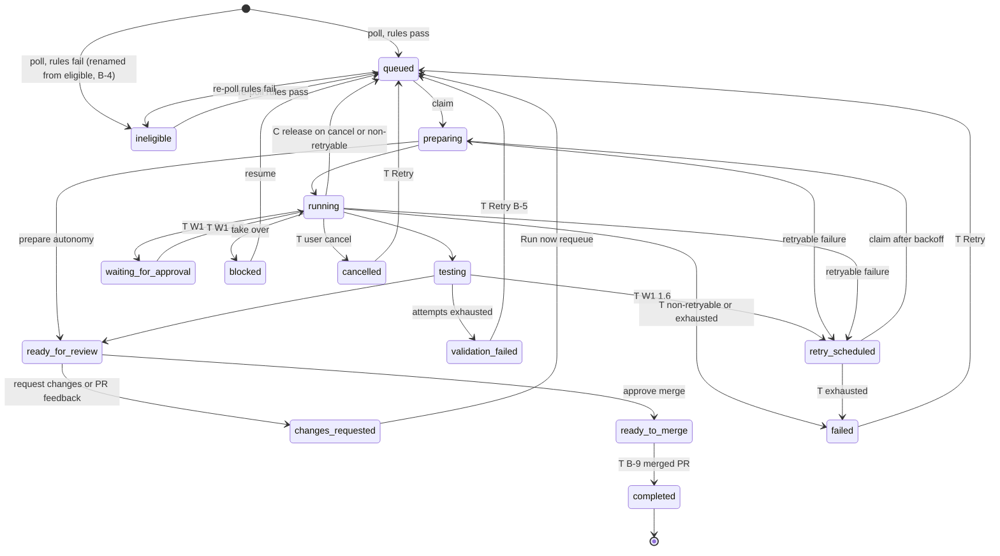
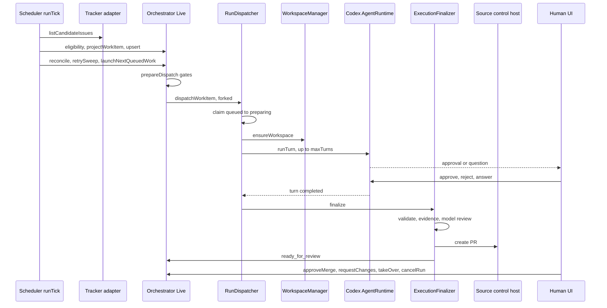

# Neokod plan, 4 October 2026 (revision 8)

Status: implementation roadmap remains open. The owner has committed Symphony handler/settings/type fixes; expanded browser audit W9 is partially complete, with confirmed defects and explicit blockers. This audit delivered documentation and evidence, not application fixes. This is the canonical plan. It replaces the first version (kept for provenance at `docs/research/plan-codex-original-2026-10-04.md`) and replaces `.plans/22-neokod-action-plan.md`, which was folded in here. [Plan 20](.plans/20-orchestration-direction.md) keeps the architecture rationale. Update this file instead of creating another roadmap.

Current revision: 8 (5 October 2026, Phase 1 locked). Revision 7 added section 0 and 66 cards. Revision 8 adds a second audit round (providers, file and project APIs, terminal, git, competitor comparison), 16 more cards (X-1 to X-16, files 06 and 07), and section 14, which locks Phase 1. Everything not in Phase 1 is Phase 2 (carded, deferred) or goes to `HANDOFF.md` as items to investigate later.

Revision 5 (4 October 2026, afternoon) merges a second session's W9 browser audit with: the owner's decisions, the multi-machine design based on T3's implementation, the development-database migration drift, and a consolidated UI task register (section 11) built from two read-only Codex reviews (69 findings) and two Playwright runs against isolated instances (27 defects).

Evidence labels. **READ** means the code was read and the control flow traced. **RUN** means a command, test or process was executed and its output observed. Where a result is RUN it says what was run. Nothing is claimed beyond that label.

Effort: S under half a day, M one to two days, L three days or more.

## 0. Implementation guide

This section is for the person implementing (a smaller model is expected) and for the reviewer. Read it fully before starting any card.

### 0.1 Where things are

- This file is the roadmap and the decisions. The implementation specifications are 82 cards in `docs/plan-cards/` (seven files, indexed in 0.4). Section 14 says which are in Phase 1. One card is one commit.
- A card gives the problem with proof, the files and functions to change with line numbers, numbered change steps, pitfalls, the tests to write, the verify commands, dependencies, effort and the commit message. Line numbers are at base commit `da7655bb2` and drift after earlier cards. Search by symbol name.
- Every card ends with unverified items. The card authors read the code but did not compile or run any new snippet. Treat snippets as strong suggestions. If a snippet does not typecheck, fix it using the surrounding code. Do not change the design the card describes without asking.

### 0.2 Rules for the implementer

1. Work on a branch per wave from `main`, never on `main`. Stage explicit paths (`git add path`), never `git add -A`, `git add .` or `git commit -a`. Never push to `main`. Open a pull request.
2. Write the test first and confirm it fails on the base code. Then make the change. A card whose test passes before the change is wrong, so stop and report.
3. One card, one commit, using the commit message in the card. Do not combine cards. Do not fix other things you notice. Add them to the list in 0.7.
4. Do not add abstractions, options, libraries or files that the card does not name. Reuse existing code. `packages/contracts` stays schema-only. Shared runtime code goes in `packages/shared` with an explicit subpath export.
5. Effect code follows the patterns already nearby (`Effect.gen`, `Layer`, `Context.Service`, `Schema`). The reference for idioms is `.repos/effect-smol` (read `LLMS.md` first). Do not edit `.repos/`.
6. Writing style for any comment, doc or UI text: plain direct English, no em dashes.
7. If a card is blocked (an anchor does not exist, an API differs, a test cannot fail first), stop that card, write what you found under the card's heading in 0.7, and move to the next independent card.
8. Do not run `pnpm install` with changes to the lockfile. Do not edit `pnpm-workspace.yaml` release-age settings.
9. Never run a test or experiment against `~/.neokod`, `~/.neokod-review` or your real project directories. Tests that touch git or files use a temporary directory. The development database `~/.neokod/dev.archived-2026-10-04` is an archive, so do not open it for writing.

### 0.3 Environment and commands

| Need                       | Command                                                                                                                                                                                                                                                           |
| -------------------------- | ----------------------------------------------------------------------------------------------------------------------------------------------------------------------------------------------------------------------------------------------------------------- |
| Node                       | Node 24 (`^24.13.1`). This machine has 26.10 by default, so put a Node 24 on `PATH` first. A copy is at `/var/folders/b6/87d2msqd6fdbtcddcw5k8gbw0000gn/T/opencode/node-v24.21.0-darwin-arm64/bin` for this session, and `.node-version` (task W0.1) will pin it. |
| Install                    | `pnpm install --frozen-lockfile` from the repo root (7 to 8 minutes the first time).                                                                                                                                                                              |
| One server test            | from `apps/server`: `pnpm exec vp test run src/path/File.test.ts`                                                                                                                                                                                                 |
| One web unit test          | from `apps/web`: `pnpm exec vp test run --project unit src/path/File.test.ts` (without `--project unit` the run starts the browser project and is killed; about 40 s)                                                                                             |
| One web browser test       | from `apps/web`: `pnpm exec vp test run --project browser src/path/File.browser.tsx`. Needs Chromium: `pnpm exec playwright install chromium` once.                                                                                                               |
| Typecheck one package      | from the package directory: `pnpm exec tsgo --noEmit`                                                                                                                                                                                                             |
| Final gates for every card | from the repo root: `pnpm exec vp check`, `pnpm exec vp lint`, `pnpm run typecheck`. Existing warnings are acceptable, new errors are not.                                                                                                                        |
| Format                     | The pre-commit hook runs `vp fmt` on staged files. Do not bypass hooks.                                                                                                                                                                                           |
| Run the app                | `NEOKOD_HOME=$HOME/.neokod-review pnpm dev` (web 5733, server 13773). Never point tests at your real data.                                                                                                                                                        |
| Orchestrator tests         | The Symphony orchestrator tests share one in-memory database. Isolate new tests with their own `projectId` and early timestamps, as the cards describe.                                                                                                           |

### 0.4 Card library and order

Branches that exist: `fix/symphony-runner-and-config-wip` (3 commits: runtime handlers, settings form and Run now, typing fixes) and `feat/clone-parent-destination` (3 commits: clone destination, sidebar fix, clone fixes U-22). Both are independent of each other. Merge both to `main` through pull requests first, then branch each wave from `main`.

Recommended order. Track A is correctness, B is remote access, C is the task flow. A and B can run in parallel by different implementers. Within a track, go top to bottom. Cards that edit the same function are noted in the card, so apply them in this order.

| Step | Cards                                                                   | Purpose                                                                                                                       |
| ---- | ----------------------------------------------------------------------- | ----------------------------------------------------------------------------------------------------------------------------- |
| A0   | 0.5, 1.13, 1.15, 2.4, 2.5, 2.6a, 2.6b-i, 2.6b-ii, 2.6c                  | Small independent fixes, including the migration identity guard that protects against the database problem found on 4 October |
| A1   | H0, 1.1, 1.2, 1.3, 1.4, 1.6, 1.5, 1.7, 1.8, 1.10, 1.12, 1.9, 1.11, 1.14 | Symphony run correctness (W1). H0 is the fake Codex harness every later test uses.                                            |
| A2   | 2.2, 2.3                                                                | Rewind safety and crash recovery                                                                                              |
| A3   | U-01, U-02, U-02b, U-03, U-04, S-01, S-02, U-06, U-07, U-11             | UI data loss and wrong results (W2b)                                                                                          |
| B1   | A1, A1b, A1c, A2, B1, B4                                                | Access token, then token-gated non-loopback bind, then Tailscale documentation                                                |
| B2   | B2, B2b, B3, B3b                                                        | Saved machines, the Machines list, the "Run on" picker                                                                        |
| C1   | B-1, B-2, B-3, B-4, B-5, B-6, B-9, B-7, B-8a, B-8b, B-10                | Honest board, links, approvals in the UI, Agile layout, then delete the orphaned views                                        |
| C2   | H-0, H-1, H-3, H-2, H-4, H-5a, H-5b, H-5c, H-6a, H-6b                   | Chat to Symphony handoff for GitHub Issues with the result returned to the chat                                               |

Migration numbers are assigned when a card merges. Check the highest number in `apps/server/src/persistence/Migrations/` and use the next one. Never reuse or renumber a merged migration. B-4 plans 042, and the handoff table (H-1) takes the next free number after it.

| Card    | Title                                                                                                                                                               | Depends on                                       | Effort | File                                                          |
| ------- | ------------------------------------------------------------------------------------------------------------------------------------------------------------------- | ------------------------------------------------ | ------ | ------------------------------------------------------------- |
| H0      | (W0.4) Shared fake-Codex stdio harness for tests                                                                                                                    | none                                             | L      | [01](docs/plan-cards/01-symphony-runner-w1.md)                |
| 1.1     | (N0b, S10) `rawStreams` option on the Codex client                                                                                                                  | H0                                               | M      | [01](docs/plan-cards/01-symphony-runner-w1.md)                |
| 1.2     | (N2) Map Symphony approval decisions and user-input answers to Codex wire values                                                                                    | H0, 1.1                                          | S      | [01](docs/plan-cards/01-symphony-runner-w1.md)                |
| 1.3     | (N1) Key live requests by run and request id, resolve the durable row first                                                                                         | 1.2                                              | S      | [01](docs/plan-cards/01-symphony-runner-w1.md)                |
| 1.4     | (N10, S04) Pin the turn wait to thread and turn, honour `turn.status`, bound EOF and fail late requests                                                             | H0, 1.1, 1.2                                     | M      | [01](docs/plan-cards/01-symphony-runner-w1.md)                |
| 1.6     | (N6) Allow `testing` to `retry_scheduled` and stop swallowing refused transitions                                                                                   | none                                             | S      | [01](docs/plan-cards/01-symphony-runner-w1.md)                |
| 1.5     | (N3, B3) Cancel ends `cancelled`, exhaustion ends `failed`, the scheduler never relaunches a terminal-failed item                                                   | 1.6, 1.4, H0                                     | M      | [01](docs/plan-cards/01-symphony-runner-w1.md)                |
| 1.7     | (N4) A failure before the attempt row exists records a failed attempt and leaves the queue                                                                          | 1.5                                              | M      | [01](docs/plan-cards/01-symphony-runner-w1.md)                |
| 1.8     | (N5) Fork dispatches into the dispatch scope from both retrySweep and the manual RPC                                                                                | 1.5, 1.7                                         | S      | [01](docs/plan-cards/01-symphony-runner-w1.md)                |
| 0.5     | (M1) Refuse to start when the recorded migration history does not match the repo                                                                                    | none                                             | S      | [02](docs/plan-cards/02-w0-w1-w2-containment.md)              |
| 1.9     | (N8) Never store the server pid on a claim; record the child pid after spawn; skip the kill for the server's own pid                                                | none                                             | S      | [02](docs/plan-cards/02-w0-w1-w2-containment.md)              |
| 1.10    | (N7) Gate recovery, reconcile and polling on holding the lock; retry the lock; show the role                                                                        | 1.8                                              | M      | [02](docs/plan-cards/02-w0-w1-w2-containment.md)              |
| 1.11    | (N9) Persist the workspace base branch on the work item and stop taking it from the tracker                                                                         | none                                             | M      | [02](docs/plan-cards/02-w0-w1-w2-containment.md)              |
| 1.12    | (N11) Re-evaluate eligibility on the fresh issue before dispatch                                                                                                    | 1.5, 1.10                                        | S      | [02](docs/plan-cards/02-w0-w1-w2-containment.md)              |
| 1.13    | (N12) An unrecognised heading must not erase the collected summary                                                                                                  | none                                             | S      | [02](docs/plan-cards/02-w0-w1-w2-containment.md)              |
| 1.14    | (S08) Agent child environment: no `extendEnv`, and fail closed when the secret list is unknown                                                                      | 1.1, 1.2                                         | S      | [02](docs/plan-cards/02-w0-w1-w2-containment.md)              |
| 1.15    | Model review timeout and a warning for a configured `app-server` command                                                                                            | none                                             | S      | [02](docs/plan-cards/02-w0-w1-w2-containment.md)              |
| 2.2     | (S05) Checkpoint revert: honest copy, a recovery ref before restoring, refuse a busy shared folder                                                                  | none                                             | M      | [02](docs/plan-cards/02-w0-w1-w2-containment.md)              |
| 2.3     | (S02 crash) Settle a thread whose provider binding was left `running` by a hard crash                                                                               | none                                             | M      | [02](docs/plan-cards/02-w0-w1-w2-containment.md)              |
| 2.4     | (S10) Boot reconciliation reads the command read model, not the full snapshot                                                                                       | none                                             | S      | [02](docs/plan-cards/02-w0-w1-w2-containment.md)              |
| 2.5     | (B2, S07) Remove the three approval checkboxes that no code reads                                                                                                   | none                                             | S      | [02](docs/plan-cards/02-w0-w1-w2-containment.md)              |
| 2.6a    | (S01) A reused command id must not return another aggregate's receipt                                                                                               | none                                             | S      | [02](docs/plan-cards/02-w0-w1-w2-containment.md)              |
| 2.6b-i  | (S03, part 1) KeyedCoalescingWorker keeps a value whose processing failed                                                                                           | none                                             | S      | [02](docs/plan-cards/02-w0-w1-w2-containment.md)              |
| 2.6b-ii | (S03, part 2) Terminal history: atomic write, bounded retry, retry on flush, compare the process object                                                             | 2.6b-i                                           | M      | [02](docs/plan-cards/02-w0-w1-w2-containment.md)              |
| 2.6c    | (F06) Cap terminal history by bytes so one newline-free line cannot grow without bound                                                                              | none                                             | S      | [02](docs/plan-cards/02-w0-w1-w2-containment.md)              |
| A1      | Stable access token for every web-mode launch, explicit CORS origins                                                                                                | none                                             | M      | [03](docs/plan-cards/03-access-token-and-machines.md)         |
| A1b     | Project CLI sends the access token to a running server                                                                                                              | A1                                               | S      | [03](docs/plan-cards/03-access-token-and-machines.md)         |
| A1c     | Docs: one account of the access token                                                                                                                               | A1                                               | S      | [03](docs/plan-cards/03-access-token-and-machines.md)         |
| A2      | Web client: access token prompt, storage and bearer on HTTP and WebSocket ticket                                                                                    | A1                                               | M      | [03](docs/plan-cards/03-access-token-and-machines.md)         |
| B1      | Server: `--host`, token-gated non-loopback bind, multi-value public origins, optional Tailscale login allowlist                                                     | A1, A1c                                          | M      | [03](docs/plan-cards/03-access-token-and-machines.md)         |
| B2      | Client runtime core: `RemoteConnectionTarget`, catalog v3, registry register, setEnabled, remove, setToken                                                          | A1, B1 for a reachable remote                    | L      | [03](docs/plan-cards/03-access-token-and-machines.md)         |
| B2b     | Persistence adapters and atom commands for remote machines                                                                                                          | B2, and A2                                       | M      | [03](docs/plan-cards/03-access-token-and-machines.md)         |
| B3      | Settings > Connections "Machines": add, enable switch, remove, status, last error                                                                                   | B2, B2b                                          | M      | [03](docs/plan-cards/03-access-token-and-machines.md)         |
| B3b     | "Run on" picker, reconnect banner and add-project for a remote machine                                                                                              | B3                                               | M      | [03](docs/plan-cards/03-access-token-and-machines.md)         |
| B4      | Tailscale helper: do not revive the package, document the commands                                                                                                  | B1                                               | S      | [03](docs/plan-cards/03-access-token-and-machines.md)         |
| B-1     | Typed board read failure and last-good banner (F01, S-14)                                                                                                           | none                                             | S      | [04](docs/plan-cards/04-symphony-model-and-board.md)          |
| B-2     | Board coverage: newest terminal items, exact counts, truncated flag (F02, S-12)                                                                                     | B-1                                              | M      | [04](docs/plan-cards/04-symphony-model-and-board.md)          |
| B-3     | Dispatch returns started or refused with a reason (B1, S-03)                                                                                                        | none                                             | M      | [04](docs/plan-cards/04-symphony-model-and-board.md)          |
| B-4     | Rename the `eligible` lifecycle to `ineligible` and gate Run now (S-11)                                                                                             | B-3                                              | M      | [04](docs/plan-cards/04-symphony-model-and-board.md)          |
| B-5     | Run action for changes_requested and validation_failed (S-06)                                                                                                       | B-3, B-4                                         | S      | [04](docs/plan-cards/04-symphony-model-and-board.md)          |
| B-6     | Links from cards and Runs rows to the run page, deep-linkable tabs, back link (S-05)                                                                                | B-1, B-2                                         | M      | [04](docs/plan-cards/04-symphony-model-and-board.md)          |
| B-9     | Merged-PR detector: ready_to_merge to completed (B3, W1 1.5, W4 4.1)                                                                                                | none                                             | M      | [04](docs/plan-cards/04-symphony-model-and-board.md)          |
| B-7     | Answer approvals and agent questions from the Attention tab and the run page (S-04)                                                                                 | S1 card 1.3, B-6                                 | M      | [04](docs/plan-cards/04-symphony-model-and-board.md)          |
| B-8a    | Board layout: contract, validator, server board and config storage (W4 4.2, 4.3)                                                                                    | B-2, B-4                                         | M      | [04](docs/plan-cards/04-symphony-model-and-board.md)          |
| B-8b    | Board layout: dynamic grid and settings editor (W4 4.3, 4.4)                                                                                                        | B-8a                                             | M      | [04](docs/plan-cards/04-symphony-model-and-board.md)          |
| B-10    | Delete the orphaned Symphony views and redirects, move global controls to the project list header (S-07, S-25)                                                      | B-6, B-7                                         | M      | [04](docs/plan-cards/04-symphony-model-and-board.md)          |
| U-01    | Rendered Markdown over 1 MB must not save the truncated prefix                                                                                                      | none                                             | S      | [05](docs/plan-cards/05-ui-data-loss-and-handoff.md)          |
| U-02    | Closing a saved file must not rewrite the old buffer (client)                                                                                                       | U-01                                             | S      | [05](docs/plan-cards/05-ui-data-loss-and-handoff.md)          |
| U-02b   | Conditional file write with a content hash, conflict state in the editor                                                                                            | U-02                                             | M      | [05](docs/plan-cards/05-ui-data-loss-and-handoff.md)          |
| U-03    | Diff panel: allow registered project roots in the review service, remove the server-cwd fallback                                                                    | none                                             | M      | [05](docs/plan-cards/05-ui-data-loss-and-handoff.md)          |
| U-04    | Environment variable rows: unchecking Sensitive or renaming a stored secret must not delete it                                                                      | none                                             | M      | [05](docs/plan-cards/05-ui-data-loss-and-handoff.md)          |
| S-01    | Symphony settings list fields: buffer the text, parse on blur                                                                                                       | none                                             | S      | [05](docs/plan-cards/05-ui-data-loss-and-handoff.md)          |
| S-02    | Symphony settings form: keep one draft per project with its base revision                                                                                           | none                                             | M      | [05](docs/plan-cards/05-ui-data-loss-and-handoff.md)          |
| U-06    | Queued message: keep the queue entry until the send is accepted (verified, holds)                                                                                   | none                                             | S      | [05](docs/plan-cards/05-ui-data-loss-and-handoff.md)          |
| U-07    | Failed plan follow-up must restore the composer draft (verified, holds)                                                                                             | U-06                                             | S      | [05](docs/plan-cards/05-ui-data-loss-and-handoff.md)          |
| U-11    | Sidebar "Copy Path" in All threads copies the first project's root (verified, holds)                                                                                | none                                             | S      | [05](docs/plan-cards/05-ui-data-loss-and-handoff.md)          |
| H-0     | Record positive turn-start evidence as a run event                                                                                                                  | S1 1.4                                           | S      | [05](docs/plan-cards/05-ui-data-loss-and-handoff.md)          |
| H-1     | Delegation request table, migration and repository                                                                                                                  | B-4 and the labels card for the migration number | M      | [05](docs/plan-cards/05-ui-data-loss-and-handoff.md)          |
| H-3     | Resolve a GitHub issue reference through the project's tracker, and let an explicit request pass the label rules                                                    | H-1, B-4                                         | M      | [05](docs/plan-cards/05-ui-data-loss-and-handoff.md)          |
| H-2     | Atomic accept, replay and conflict, and the delegateFromThread RPC                                                                                                  | H-1, H-3, B-4                                    | L      | [05](docs/plan-cards/05-ui-data-loss-and-handoff.md)          |
| H-4     | State reconciler and result delivery to the originating chat                                                                                                        | H-0, H-1, H-2                                    | L      | [05](docs/plan-cards/05-ui-data-loss-and-handoff.md)          |
| H-5a    | Read model RPC for a thread's handoffs and client-runtime atoms                                                                                                     | H-2, H-4                                         | M      | [05](docs/plan-cards/05-ui-data-loss-and-handoff.md)          |
| H-5b    | Link a board card back to the chat that sent it                                                                                                                     | H-1, H-2                                         | S      | [05](docs/plan-cards/05-ui-data-loss-and-handoff.md)          |
| H-5c    | Send to Symphony in the chat header and a workstream summary                                                                                                        | H-5a                                             | M      | [05](docs/plan-cards/05-ui-data-loss-and-handoff.md)          |
| H-6a    | Stop from the chat, and stops from the board show in the chat                                                                                                       | H-4, H-5c, S1 1.5                                | M      | [05](docs/plan-cards/05-ui-data-loss-and-handoff.md)          |
| H-6b    | Restart behaviour tests and the owner acceptance script                                                                                                             | H-1 to H-6a                                      | M      | [05](docs/plan-cards/05-ui-data-loss-and-handoff.md)          |
| X-1     | readFile on a FIFO must not block a worker thread                                                                                                                   | none                                             | S      | [06](docs/plan-cards/06-providers-files-and-api-hardening.md) |
| X-2     | writeFile: contain symlinks, write atomically, bound size, no encoding loss                                                                                         | X-1                                              | L      | [06](docs/plan-cards/06-providers-files-and-api-hardening.md) |
| X-3     | Claude usage limits and API errors end the turn as failed and show on the provider card                                                                             | none                                             | L      | [06](docs/plan-cards/06-providers-files-and-api-hardening.md) |
| X-4     | Copilot runtime death must settle the running turn and recover without a restart                                                                                    | none                                             | M      | [06](docs/plan-cards/06-providers-files-and-api-hardening.md) |
| X-5     | Stop on an OpenCode turn must end the turn as interrupted, not failed                                                                                               | none                                             | M      | [06](docs/plan-cards/06-providers-files-and-api-hardening.md) |
| X-6     | Spawned `opencode serve` children: random password, scrubbed environment, orphan ledger                                                                             | none                                             | L      | [06](docs/plan-cards/06-providers-files-and-api-hardening.md) |
| X-7     | Stop and approval responses on a binding with no resume state settle the thread and expire approvals; provider error text is sanitised (amendment to plan card 2.3) | 2.3                                              | L      | [06](docs/plan-cards/06-providers-files-and-api-hardening.md) |
| X-8     | OTLP traces proxy: 1 MiB body limit with 413, no body logging, keep browser tracing working (FA-09)                                                                 | none                                             | S      | [06](docs/plan-cards/06-providers-files-and-api-hardening.md) |
| X-9     | Worktree removal on thread delete: inspect first, never force dirty work silently, reclaim the branch, fix bulk delete (TG-04, U-05)                                | none                                             | L      | [07](docs/plan-cards/07-git-terminal-and-web-hardening.md)    |
| X-10    | Refuse commit and push during unresolved merge conflicts, and report merge or rebase in progress (TG-13)                                                            | none                                             | M      | [07](docs/plan-cards/07-git-terminal-and-web-hardening.md)    |
| X-11    | Option injection in git argv: one shared name validator, `--` ordering and `--end-of-options` at every call site (TG-06, CP-12)                                     | apply after X-9                                  | M      | [07](docs/plan-cards/07-git-terminal-and-web-hardening.md)    |
| X-12    | Chat markdown: block automatic remote image loads and remove the Google favicon request (FA-06, CP-05)                                                              | none                                             | M      | [07](docs/plan-cards/07-git-terminal-and-web-hardening.md)    |
| X-13    | Security headers: app-shell CSP, nosniff and Referrer-Policy on static files, sandboxed attachment-only asset responses (FA-05, CP-04)                              | none                                             | M      | [07](docs/plan-cards/07-git-terminal-and-web-hardening.md)    |
| X-14    | Closing a terminal, deleting a thread or stopping the server must stop the background jobs started in the terminal (TG-01)                                          | none                                             | M      | [07](docs/plan-cards/07-git-terminal-and-web-hardening.md)    |
| X-15    | Terminal paste over 64 KiB: send it in ordered chunks, and stop echoing the whole paste in the error text (TG-09)                                                   | none                                             | S      | [07](docs/plan-cards/07-git-terminal-and-web-hardening.md)    |
| X-16    | Carry a bounded, sanitised git stderr tail in `GitCommandError` and show it in error toasts (TG-07)                                                                 | none                                             | M      | [07](docs/plan-cards/07-git-terminal-and-web-hardening.md)    |

### 0.5 Symphony operating model

This is the target design the cards implement. CURRENT means true at the base commit, TARGET needs a card. It exists so the owner can judge the deletion of the orphaned views (card B-10) against a defined way of working. Source: card file 04, Part 1.

### 0.5.1 Entities and tables

| Entity              | Table                          | Key columns                                                                                                                                                                                                                 | Written by                                                                                                                                                                                                |
| ------------------- | ------------------------------ | --------------------------------------------------------------------------------------------------------------------------------------------------------------------------------------------------------------------------- | --------------------------------------------------------------------------------------------------------------------------------------------------------------------------------------------------------- |
| Project             | `symphony_projects`            | `id`, `repository_path` (unique), `status` active or paused, `setup_state`, `configuration_json`, `revision`                                                                                                                | `Live.createProject`, `Live.updateProject`. Decoded strictly in `Persistence/Layers/SymphonyProjectRepository.ts:decodeProjectConfiguration`; a decode failure nulls the config and forces `needs_setup`. |
| Workflow            | `symphony_workflows`           | `id` (= project id), `workflow_path` (`symphony-project:<id>`), `status`, `effective_config_json`                                                                                                                           | `Live.syncProjectWorkflow` on boot, create, update. Dispatch reads policy from here.                                                                                                                      |
| Work item           | `symphony_work_items`          | `id` = `<projectId>:<trackerKind>:<issueId>`, `lifecycle`, `owner_token`, `generation`, `claimed_at`, `excluded`, `local_priority`, `eligibility_reasons_json`, `workspace_key`, `base_branch`, `labels_json` (always `[]`) | `pollWorkflow` upsert (Live:481), `HandoffService.delegateFromThread`, `WorkItemRepository` claim, transition, releaseClaim, writeOverrides.                                                              |
| Run attempt         | `symphony_run_attempts`        | `id` `run-<uuid>`, `work_item_id`, `attempt_number`, `status`, `started_at`, `finished_at`, `error_json`                                                                                                                    | Dispatcher, ExecutionFinalizer, Reconciler, Recovery.                                                                                                                                                     |
| Run event           | `symphony_run_events`          | `run_attempt_id`, `sequence`, `event_type`, `payload_json`                                                                                                                                                                  | Dispatcher, finalizer, Live, HandoffService, Reconciler, Recovery.                                                                                                                                        |
| Approval            | `symphony_approvals`           | durable `id` `sym-<uuid>`, `request_id` (Codex id), `run_attempt_id`, `action` (`user_input` for questions), `state`                                                                                                        | `Runner/ApprovalService.ts`, called from `AgentRuntime.ts:handleRequest:286`.                                                                                                                             |
| Attention item      | `symphony_attention_items`     | `id`, `work_item_id`, `kind`, `state`                                                                                                                                                                                       | `ExecutionFinalizer` only (`pr_creation_failed`). `Live.listAttention` merges these with pending approvals.                                                                                               |
| Evidence            | `symphony_evidence`            | `work_item_id` is the primary key: one bundle per item, not per attempt (S-09)                                                                                                                                              | Finalizer, `refreshPullRequest`, `approveMerge`.                                                                                                                                                          |
| Workspace ownership | `symphony_workspace_ownership` | `workspace_path`, `owner` symphony or work, `generation`                                                                                                                                                                    | `Workspaces/Live.ts`, `HandoffService`, `Recovery`.                                                                                                                                                       |
| Orchestrator state  | `symphony_orchestrator_state`  | `global_paused`, `lock_token`, `lock_expires_at`, `paused_workflows`, `paused_repositories`                                                                                                                                 | `Live` pause setters, `acquireLock`, `renewLock`.                                                                                                                                                         |
| Retry queue         | `symphony_retry_queue`         | none used                                                                                                                                                                                                                   | No reader or writer. Retry state is lifecycle `retry_scheduled` plus the latest attempt's `finished_at` plus `Orchestrator/Retry.ts:failureBackoffMs`.                                                    |

### 0.5.2 WorkItem lifecycle

Values (contracts `symphony.ts:206`): draft, eligible, queued, preparing, running, testing, blocked, waiting_for_approval, retry_scheduled, validation_failed, ready_for_review, changes_requested, ready_to_merge, completed, cancelled, failed. Nothing writes `draft`. Nothing writes `waiting_for_approval`: a pending agent approval leaves the item in `running`.

Legality is `DEFAULT_TRANSITION_SOURCES` (`Persistence/Layers/WorkItemRepository.ts:62`, target to allowed sources); a caller may pass an explicit `from`. Claim (`:298`) and `releaseClaim` (`:510`) are separate SQL.

| Transition                                                                 | Legal in table                                                | Performed by                                                                                            | Who                                                                   | Status                                                           |
| -------------------------------------------------------------------------- | ------------------------------------------------------------- | ------------------------------------------------------------------------------------------------------- | --------------------------------------------------------------------- | ---------------------------------------------------------------- |
| new to queued or eligible                                                  | INSERT; UPDATE CASE `:282` flips draft, eligible, queued only | `pollWorkflow`, `projectWorkItem`, `inferQueuedLifecycle` (`Eligibility.ts:77`)                         | scheduler                                                             | CURRENT                                                          |
| new to eligible (delegated)                                                | n/a                                                           | `HandoffService.delegateFromThread:535`                                                                 | chat user, no UI (H1)                                                 | CURRENT                                                          |
| eligible, queued, retry_scheduled to preparing                             | claim SQL                                                     | `Dispatcher.dispatchWorkItem:231`                                                                       | scheduler or Run now                                                  | CURRENT                                                          |
| changes_requested to queued                                                | yes                                                           | `Live.prepareDispatch:1370`                                                                             | Run now (no UI button)                                                | CURRENT                                                          |
| preparing to running; preparing to ready_for_review (autonomy prepare)     | yes                                                           | `Dispatcher:359`, `:336`                                                                                | system                                                                | CURRENT                                                          |
| running to testing; testing to ready_for_review                            | yes                                                           | `ExecutionFinalizer:90`, `:280`                                                                         | system                                                                | CURRENT                                                          |
| testing to validation_failed (attempts exhausted)                          | yes                                                           | `ExecutionFinalizer:176`                                                                                | system                                                                | CURRENT                                                          |
| testing to retry_scheduled (attempts remain)                               | no (N6)                                                       | `ExecutionFinalizer:169`, error swallowed, item released to queued                                      | system                                                                | CURRENT bug; legal in W1 1.6                                     |
| preparing, running to retry_scheduled                                      | yes                                                           | `Dispatcher.markFailed:208`, `Recovery:231`                                                             | system                                                                | CURRENT                                                          |
| preparing, running, testing to queued                                      | releaseClaim SQL                                              | `Dispatcher:137,530`, `Reconciler:115,141`, `Recovery:150,179` (cancel, non-retryable failure, restart) | system                                                                | CURRENT (N3: the reason failed and cancelled are never written)  |
| running to waiting_for_approval and back                                   | only source is running                                        | nothing                                                                                                 | system, on approval record and decision                               | TARGET (W1 1.3)                                                  |
| ready_for_review to changes_requested                                      | yes                                                           | `Live.requestChanges:1675`; `ingestReviewFeedback:1572` (automatic on PR refresh)                       | human or PR refresh                                                   | CURRENT                                                          |
| ready_for_review to ready_to_merge                                         | yes                                                           | `Live.approveMerge:1700`                                                                                | human, fresh host gate                                                | CURRENT                                                          |
| non-terminal to blocked                                                    | explicit `from`, `requireUnclaimed`                           | `HandoffService.takeOver:337`                                                                           | human, no UI                                                          | CURRENT                                                          |
| blocked, ready_for_review, retry_scheduled, waiting_for_approval to queued | explicit `from`                                               | `HandoffService.resumeAutonomous:473`                                                                   | human, no UI                                                          | CURRENT                                                          |
| validation_failed to queued                                                | yes                                                           | nothing; claim SQL also refuses it                                                                      | human Retry                                                           | TARGET (B-5)                                                     |
| ready_to_merge to completed                                                | yes, the only source                                          | nothing                                                                                                 | merged-PR sweep in `Live.runTick`                                     | TARGET (B-9)                                                     |
| non-terminal to cancelled                                                  | yes                                                           | nothing                                                                                                 | user cancel: `cancelRun` then fenced transition                       | TARGET (W1 1.5 says `blocked`; owner direction is `cancelled`)   |
| running, testing, retry_scheduled to failed                                | yes                                                           | nothing                                                                                                 | `Dispatcher.markFailed` on non-retryable failure or exhausted retries | TARGET (W1 1.5). Exhausted validation stays `validation_failed`. |
| failed, cancelled to queued                                                | explicit `from`                                               | nothing                                                                                                 | human Retry                                                           | TARGET (after W1 1.5)                                            |

#### The `eligible` lifecycle (S-11)

`eligible` has two meanings. `inferQueuedLifecycle` gives it to tracker issues that fail the rules (reasons non-empty), and `prepareDispatch:1399` always refuses those. `delegateFromThread` gives it to a dispatchable item (reasons empty). The board shows both as "eligible" with Run now.

Proposal (card B-4): rename the value to `ineligible` for failed-rules items and start delegated items as `queued`. An item with no reasons is claimable, which is what `queued` already means. Migration 042 (next free number; plan 4.7 also wants 042, renumber if that lands first): `UPDATE symphony_work_items SET lifecycle = CASE WHEN eligibility_reasons_json IN ('[]','') THEN 'queued' ELSE 'ineligible' END WHERE lifecycle = 'eligible'`. Every use found by grep: contract `symphony.ts:208`; `Eligibility.ts:77-80`; `ProjectBoard.ts:15`; `HandoffService.ts:340,535`; `WorkItemRepository.ts` `:63,66,76,96,283,313`; `Live:87,896,964`; web `SymphonyProjectView.tsx:139`; `docs/architecture/symphony.md:70`; tests `HandoffService.test.ts:460`, `Live.test.ts:559`, `WorkItemRepository.test.ts:26,50,186`, `ProjectBoard.test.ts:19`.

### 0.5.3 Run attempt statuses

Written today: `preparing_workspace`, `building_prompt` (autonomy prepare), `launching_agent`, `streaming_turn`, `succeeded`, `failed`, `validation_failed`, `stalled`, `interrupted`, `user_cancelled`. Never written: `initializing_session`, `finishing`, `timed_out`, `canceled_by_reconciliation`, `tracker_cancelled`, `process_failed`, `workflow_error`, `provider_error`, `retries_exhausted`; `current_stage` is never set. Terminal statuses are immutable, except that a cancel supersedes `interrupted` (`RunAttemptRepository.ts:updateStatus`).

`lifecycleForRun` (`Live:340`) is what Runs and History show. The item lifecycle wins when it is waiting_for_approval, blocked, testing, cancelled, changes_requested, ready_for_review, ready_to_merge, validation_failed, retry_scheduled or failed. Otherwise a `succeeded` attempt reads `ready_for_review`, any other terminal status reads `failed`, else `running`. So the row shows the item, not the attempt (S-08). `completed` is missing from that set, so B-9 must add it.

### 0.5.4 One run end to end

1. `Live.scheduler:825` runs `runStartupRecovery` (`Orchestrator/Recovery.ts:101`), then `runTick` (`Live:688`) every 5 s.
2. `pollWorkflow:481`, `evaluateEligibility` (`Eligibility.ts:30`), `projectWorkItem` (`Projection.ts:29`), `WorkItemRepository.upsert`.
3. `reconcileStaleClaims` (`Reconciler.ts:70`), `retrySweep` (`Live:739`), `launchNextQueuedWork` (`Live:1501`: first 100 queued, one dispatch per tick).
4. `prepareDispatch` (`Live:1350`). Manual Run now enters at `ws.ts:1048`, then `Live.dispatchWorkItem:1526`.
5. `Dispatcher.dispatchWorkItem:222`: claim, `ensureWorkspace` (`Workspaces/Manager.ts:164`), create attempt, `runTurn` (`Runner/AgentRuntime.ts:188`).
6. Approvals: `handleRequest` records a pending row and waits on a `LiveRequests` deferred; a human answers via `ApprovalService`; `sweepExpiredApprovals` expires old rows.
7. `ExecutionFinalizer.finalize:85`: testing, `ValidationRunner.runAll`, `EvidenceService.assemble`, `SymphonyModelReviewer.review`, `PullRequestService.create`, attempt `succeeded`, evidence upsert, `ready_for_review`. A PR creation failure raises an attention item and still reaches `ready_for_review`.
8. Human: `requestChanges`, `approveMerge` (re-reads the PR from the host; needs CI success, review not changes_requested, mergeable, zero unresolved comments, model review passed), `takeOver`, `cancelRun`.
9. Retry: `Dispatcher.markFailed:183` sets `retry_scheduled`; `retrySweep` re-dispatches after `min(10000 * 2^(n-1), maxRetryBackoffMs)`.
10. Restart: Recovery marks orphaned attempts `interrupted`, interrupts their approvals, releases the claim to `retry_scheduled` or `queued`.

### 0.5.5 Human controls

| Command                                                          | Effect and refusal                                                                                                     | UI today                      | UI target                          |
| ---------------------------------------------------------------- | ---------------------------------------------------------------------------------------------------------------------- | ----------------------------- | ---------------------------------- |
| createProject, updateProject                                     | `symphony_project_revision_conflict`, already exists                                                                   | Projects dialog, Settings tab | same                               |
| startProject, pauseProject                                       | refuses `needs_setup`, Deliver without authenticated remote                                                            | project header                | same                               |
| pauseGlobal, resumeGlobal                                        | global kill switch                                                                                                     | deleted Settings only         | list header (B-10)                 |
| stopAllRuns (`confirm: "stop-all-runs"`)                         | returns `ok: stopped > 0`, so `ok:false` means nothing was running                                                     | deleted Settings only         | list header, confirm dialog (B-10) |
| pauseWorkflow, resumeWorkflow, pauseRepository, resumeRepository | orchestrator-state flag                                                                                                | deleted Settings only         | none; project Pause covers it      |
| validate, activate, get, save, createWorkflow                    | WORKFLOW.md; `Loader.getWorkflowContent:187` reads `symphony-project:<id>` as a file, so project workflows cannot load | deleted Settings only         | removed                            |
| dispatchWorkItem                                                 | `{ok:true}` for every refusal (B1)                                                                                     | card Run now                  | started or refused (B-3)           |
| exclude, include, setLocalPriority                               | persisted overrides                                                                                                    | none                          | card actions, later                |
| cancelRun                                                        | interrupts live run, writes `user_cancelled`                                                                           | run detail, active only       | card, later                        |
| approve, reject, respondToUserInput                              | `approval_request_not_found`; `scope` and `reason` ignored; `{ok:true}` if the service is absent                       | none                          | Attention tab, run detail (B-7)    |
| requestChanges, approveMerge, refreshPullRequest                 | `{ok:false}` without a reason                                                                                          | `PullRequestPanel.tsx`        | same                               |
| takeOver, resumeAutonomous                                       | refuses non-current attempt, bad worktree, live Work session                                                           | none                          | run detail, later                  |
| delegateFromThread                                               | creates a work item                                                                                                    | none (H1)                     | W6                                 |

### 0.5.6 Board model

CURRENT: `ProjectBoard.ts:boardColumnForLifecycle` hard-codes five columns (contracts `:934`), grid `grid-cols-5 min-w-[70rem]` (`SymphonyProjectView.tsx:99`). not_started: draft, eligible, queued. in_progress: preparing, running, blocked, waiting_for_approval, retry_scheduled, changes_requested. testing: testing, validation_failed. human_review: ready_for_review, ready_to_merge. done: completed, cancelled, failed.

TARGET: optional `boardLayout` inside the project configuration JSON (no table change): `{ columns: [{ id, label, lifecycles[] }] }`; absent means Default. Validation in `packages/shared`, applied on write and on read: 2 to 8 columns; id matches `^[a-z][a-z0-9_]{0,31}$` and is unique; label 1 to 40 characters, unique ignoring case; every lifecycle in exactly one column; no empty column; completed, cancelled and failed in the last column. An invalid stored layout falls back to Default with a warning and never invalidates the rest of the configuration.

| Preset  | Columns                                                                                                                                                                                                                                                                                                                                |
| ------- | -------------------------------------------------------------------------------------------------------------------------------------------------------------------------------------------------------------------------------------------------------------------------------------------------------------------------------------- |
| Default | not_started "Not Started": draft, ineligible, queued. in_progress "In Progress": preparing, running, blocked, waiting_for_approval, retry_scheduled, changes_requested. testing "Testing": testing, validation_failed. human_review "PR / Human Review": ready_for_review, ready_to_merge. done "Done": completed, cancelled, failed.  |
| Agile   | not_started "Not Started": draft, ineligible, queued. in_progress "In Progress": preparing, running, blocked, waiting_for_approval, retry_scheduled, changes_requested. testing "Testing": testing, validation_failed, ready_for_review. ready_to_deploy "Ready to Deploy": ready_to_merge. done "Done": completed, cancelled, failed. |

Deployment is not modelled. "Ready to Deploy" means merge approved; a human merges on the host and B-9 then moves the item to Done.

### 0.5.7 Project view (TARGET)

Route `/symphony/projects/$projectId?tab=board|runs|attention|settings`, default `board`. History merges into Runs.

| Tab       | Shows                                                                                                                          | Supplied by                                                                                                                                                                         |
| --------- | ------------------------------------------------------------------------------------------------------------------------------ | ----------------------------------------------------------------------------------------------------------------------------------------------------------------------------------- |
| Board     | layout columns, cards, truncation and stale banners                                                                            | `symphonyEnvironment.projectBoard` (`apps/web/src/state/symphony.ts`), `BoardTab` in `SymphonyProjectView.tsx:76`                                                                   |
| Runs      | every attempt newest first, filter All, Active, Finished; attempt status, lifecycle, PR badge; row links to `/symphony/$runId` | `symphonyEnvironment.runs({projectId})`; harvest `runAttemptStatusBadgeVariant` (`SymphonyRunningView.logic.ts`), `PrBadge` and `AssessmentBadge` (`SymphonyHistoryView.tsx:58,99`) |
| Attention | approvals with Approve and Reject (reason), questions with an answer box, PR creation failures with a run link                 | `symphonyEnvironment.attention`, `approve`, `reject`; a new `respondToUserInput` atom                                                                                               |
| Settings  | `SymphonyProjectConfigurationForm`, board layout editor                                                                        | `SymphonyProjectConfigurationForm.tsx`, `updateProject`                                                                                                                             |

Card fields: tracker identifier (link to `issueUrl`), title, lifecycle label, ineligibility reasons, priority, Open run link, actions.

| Lifecycle                            | Actions                                                    | Delivered by                              |
| ------------------------------------ | ---------------------------------------------------------- | ----------------------------------------- |
| ineligible                           | reasons, Exclude; no Run now                               | B-4                                       |
| queued, retry_scheduled              | Run now (Exclude later)                                    | exists; B-3 feedback                      |
| changes_requested, validation_failed | Run now (requeue), Open run                                | B-5, B-6                                  |
| preparing, running, testing          | Open run (Cancel, Take over later)                         | B-6                                       |
| waiting_for_approval                 | Approve, Reject, Open run                                  | B-7, needs W1 1.3 and the lifecycle write |
| blocked                              | Open run, Resume                                           | later                                     |
| ready_for_review                     | Approve merge, Request changes (on the run page), Open run | exists; B-6                               |
| ready_to_merge, completed            | Open run                                                   | B-6, B-9                                  |
| failed, cancelled                    | Retry, Open run                                            | after W1 1.5                              |

Global controls after `SymphonySettingsView` is deleted: the list header (`SymphonyProjectsView.tsx:290-312`) shows dispatch state from `symphonyEnvironment.overview().orchestratorPaused`, Pause all or Resume all (`symphonyExtras.pauseGlobal`, `resumeGlobal`) and Stop all runs behind the existing confirm dialog (`symphonyExtras.stopAllRuns`). Start and Pause per project stay in the project header. WORKFLOW.md editing is dropped.

### 0.5.8 Failure semantics

Refused dispatch (B-3) returns `{status:"refused", reason}`: `not_leader` (lock lost), `not_found`, `already_running`, `not_dispatchable` (lifecycle not claimable), `paused` (global, workflow or repository flag), `excluded`, `ineligible` (reasons non-empty), `no_workflow`, `observe_only`, `concurrency_cap` (global, repository, workflow), `tracker_refresh_failed`. Project status `paused` does not refuse a manual Run now today; see Open questions.

Read failure: `getProjectBoard` swallows errors into an empty board (`Live:1211-1217`). TARGET (B-1): typed `SymphonyError` `symphony_board_unavailable`; the stream ends, the web keeps the previous board (`AsyncResult.previousSuccess` in `apps/web/src/state/query.ts`) and shows a banner with Retry. Truncation: per-column `totalCount` plus a `truncated` flag (B-2). Stale data: every board carries `generatedAt` and the banner shows its age; there is no offline indicator until S-15.

### 0.5.9 Deletion plan

| Item                                                                                                 | Provided                                                          | After                                   | Harvest                                                                             |
| ---------------------------------------------------------------------------------------------------- | ----------------------------------------------------------------- | --------------------------------------- | ----------------------------------------------------------------------------------- |
| `SymphonySettingsView.tsx` (955)                                                                     | global pause and Stop all (`:911-945` dialog), WORKFLOW.md editor | list header controls; editor removed    | `runGlobalAction` (`:662`), Stop all `AlertDialog`                                  |
| `SymphonyQueueView.tsx` (223)                                                                        | queue rows, exclude and include                                   | card actions                            | `LIFECYCLE_LABELS`                                                                  |
| `SymphonyAttentionView.tsx` (184)                                                                    | attention list, Approve and Reject with the wrong id (N1)         | Attention tab (B-7)                     | `SEVERITY_BADGE`                                                                    |
| `SymphonyOverviewView.tsx` (207), `.logic.ts`, `.logic.test.ts`                                      | metric tiles, tracker health                                      | list header; trackers page keeps health | none                                                                                |
| `SymphonyRunningView.tsx` (164)                                                                      | active runs                                                       | Runs tab filter                         | keep `SymphonyRunningView.logic.ts` and test, rename to `runAttemptStatus.logic.ts` |
| `SymphonyHistoryView.tsx` (245)                                                                      | finished runs                                                     | Runs tab                                | `PrBadge`, `AssessmentBadge`, `formatFinishedAt`                                    |
| routes `symphony.attention`, `.history`, `.queue`, `.reviews`, `.running`, `.settings`, `.workflows` | redirects to `/symphony`                                          | deleted, route tree regenerated         | none                                                                                |

Grep of `apps/web/src` shows nothing outside these files imports the six views. Safe order: (1) header controls, (2) `Sidebar.tsx:3006` and the label at `:3021` go to `/settings`, drop the `isOnSymphony` prop, (3) delete the views, logic file and tests, (4) delete the seven route files and regenerate `routeTree.gen.ts`, (5) fix the stale comment at `components/sidebar/SymphonySidebarNav.tsx:34-37`.

### 0.6 Decision log, defaults for the card authors' open questions

These defaults let an implementer proceed. The owner may overrule any of them. Each is also in the relevant card's Open questions.

| Area    | Question                                                                 | Default                                                                                                                                                                                                                                                                                        |
| ------- | ------------------------------------------------------------------------ | ---------------------------------------------------------------------------------------------------------------------------------------------------------------------------------------------------------------------------------------------------------------------------------------------- |
| Runner  | Cancel semantics                                                         | User cancel ends in `cancelled`. Retry exhaustion and non-retryable failure end in `failed`. (This overrides the earlier table row that said `blocked`.)                                                                                                                                       |
| Runner  | Manual retry after exhaustion                                            | Allowed, runs once more. `maxAttempts` counts all attempts of the item. No budget reset.                                                                                                                                                                                                       |
| Runner  | Reconciler and Recovery still release terminal-attempt items to `queued` | After card 1.5 the guard keeps them in Not Started until a user retries. A follow-up card (1.5b, not yet written) makes those paths write `cancelled` or `failed`.                                                                                                                             |
| Runner  | Approve scope `current_run`                                              | Not mapped to accept-for-session. Approvals are one-shot.                                                                                                                                                                                                                                      |
| Runner  | Approvals processed one at a time                                        | Keep serial.                                                                                                                                                                                                                                                                                   |
| Runner  | Timeouts on `initialize`, `thread/start`, `turn/start`                   | Follow-up card, not in W1.                                                                                                                                                                                                                                                                     |
| Runner  | `WorkspaceLeaseError` on early failure                                   | Retried.                                                                                                                                                                                                                                                                                       |
| Runner  | Leader loses the lock while runs are live                                | Follow-up card stops all runs. Not in W1.                                                                                                                                                                                                                                                      |
| Runner  | Base branch fallback `main`                                              | Accepted. Items with no stored base keep refusing the merge gate.                                                                                                                                                                                                                              |
| Runner  | Explicit Run now on an ineligible item                                   | Refused, as today.                                                                                                                                                                                                                                                                             |
| Runner  | Child environment (card 1.14)                                            | Fail closed. An unresolved tracker adapter blocks the spawn. Environment tokens such as `GITHUB_TOKEN` are removed from the agent. Agent-side `gh` and SSH keep working through their stored credentials. Verify on the server before release that Symphony runs push with stored credentials. |
| Runner  | Review timeout and `app-server` in the codex command                     | Fixed 10 minutes. A warning, not a validation error.                                                                                                                                                                                                                                           |
| Runner  | Rewind recovery refs                                                     | Not pruned now. A revert is also refused when this thread's own session is running.                                                                                                                                                                                                            |
| Runner  | Second Neokod server on one base directory                               | Unsupported. Card 2.3 assumes one server per base directory.                                                                                                                                                                                                                                   |
| Runner  | Approval checkboxes (card 2.5)                                           | Remove all three inert checkboxes. Enforcement is a later feature.                                                                                                                                                                                                                             |
| Runner  | Receipts hash (2.6a)                                                     | No migration. Compare the aggregate only.                                                                                                                                                                                                                                                      |
| Runner  | Terminal history limit (2.6c)                                            | 1 MiB tail, 5,000 lines. Final flush at shutdown is a follow-up.                                                                                                                                                                                                                               |
| Board   | Closed-unmerged PR on a `ready_to_merge` item                            | Record an event and leave the lifecycle. Revisit after use.                                                                                                                                                                                                                                    |
| Board   | Project `paused` and a manual Run now                                    | Unchanged (not refused). Follow-up card.                                                                                                                                                                                                                                                       |
| Board   | WORKFLOW.md prompt body editing                                          | Dropped with the Settings view. The default prompt template stays in configuration.                                                                                                                                                                                                            |
| Board   | Reject reason                                                            | Sent but not stored in B-7. Persisting is a follow-up.                                                                                                                                                                                                                                         |
| Board   | `draft` lifecycle                                                        | Kept reserved.                                                                                                                                                                                                                                                                                 |
| Board   | Card actions Cancel, Exclude, Include, Take over, Resume                 | Backlog card B-11, not yet written. Written after B-6.                                                                                                                                                                                                                                         |
| Board   | Layout editing beyond renaming columns                                   | Later. B-8 ships presets and rename only.                                                                                                                                                                                                                                                      |
| Access  | Saved machines over `http`                                               | Allowed for loopback and for Tailscale address ranges only (`100.64.0.0/10`, `fd7a:115c:a1e0::/48`), because WireGuard encrypts the hop. Everything else must be `https`. Note that an `http` page is an insecure browser context (no notifications, no `crypto.subtle`).                      |
| Access  | `NEOKOD_TAILSCALE_ALLOW_LOGINS`                                          | Optional, off by default. Enabling it also blocks the Authelia route on the same listener, so do not enable it for your server.                                                                                                                                                                |
| Access  | `--mode desktop` without a bootstrap token                               | Refuse to start.                                                                                                                                                                                                                                                                               |
| Access  | Auto-opened browser URL                                                  | Carries no token. One paste per browser.                                                                                                                                                                                                                                                       |
| Access  | Stored token after a 401                                                 | Kept until the user replaces or forgets it.                                                                                                                                                                                                                                                    |
| Access  | Browser token storage                                                    | Plaintext in IndexedDB (desktop uses `safeStorage`). Accepted.                                                                                                                                                                                                                                 |
| Access  | CORS for loopback origins on any port when a token exists                | Accepted.                                                                                                                                                                                                                                                                                      |
| Access  | `?loopbackAuthToken=`                                                    | Keep as deprecated input. Prefer `#access-token=`. Rename `Loopback*` names later.                                                                                                                                                                                                             |
| Access  | Failed-login throttling                                                  | Not now. A 32 character generated token is not guessable.                                                                                                                                                                                                                                      |
| Access  | Threads shown "Working" on an offline machine                            | Separate card later.                                                                                                                                                                                                                                                                           |
| UI      | File conflict on save                                                    | Show Reload or Overwrite, with a confirm on Overwrite.                                                                                                                                                                                                                                         |
| UI      | Diff review roots                                                        | Registered project roots and registered thread worktrees only.                                                                                                                                                                                                                                 |
| Handoff | Re-sending an issue with a finished request                              | Accepted as a new request, requeues a `failed`, `cancelled` or `validation_failed` item. A `ready_for_review` item is refused as busy.                                                                                                                                                         |
| Handoff | `observe` autonomy projects                                              | Refused.                                                                                                                                                                                                                                                                                       |
| Handoff | Result delivery                                                          | Once per request, at the first `ready_for_review` or terminal outcome.                                                                                                                                                                                                                         |
| Handoff | Non-GitHub trackers and a handoff with no issue                          | Refused for now (W8).                                                                                                                                                                                                                                                                          |

### 0.7 Corrections found while writing the cards

The card authors read the code and found these differences from the tables in section 5. The cards already reflect them.

- Cancel ends `cancelled`, not `blocked` (card 1.5). `preparing` becomes a legal source for `failed`.
- All three approval checkboxes are inert, not two (card 2.5).
- The fake-Codex harness cannot use `makeInMemoryStdio`, which is internal to the codex package. It plugs in at the `ChildProcessSpawner` seam (card H0).
- The user-input reply sent to Codex is also wrong (`{text}` instead of an `answers` map), and the fallback reply `{}` is invalid for every Codex request (card 1.2).
- No contract change is needed for approvals (card 1.3). The durable approval row is also never decided today because the live id is passed against the `id` column.
- Per-turn consumer fibers leak and can steal notifications from later turns (card 1.4).
- `setClaimOwnerPid` exists but never runs (card 1.9). `acquireLock` cannot be called while holding the lock (card 1.10). Base branch needs no migration, but every poll overwrites it (card 1.11).
- The existing finalizer test passes at base only because its seed never enters `testing` (card 1.6).
- `neokod project ...` sends no Authorization header, so after the token lands it gets 401 and then writes the database directly while the server runs (card A1b). The desktop renderer drops its own loopback token in `target.ts` (card A2).
- `waiting_for_approval` and `draft` have no writer. `symphony_retry_queue` is never read or written. The workflow editor cannot load project workflows (operating model, sections 1 to 2).

Implementers add their own findings below, one line each, with the card ID:

(none yet)

### 0.8 Reviewer checklist

For every card, in this order:

1. The diff touches only the files the card lists, plus its tests. Anything else needs a reason in the commit message.
2. Check out the base commit with the new test file only. The test must fail for the reason the card states.
3. With the change, the test passes. Run the card's Verify commands and `pnpm exec vp check`, `pnpm exec vp lint`, `pnpm run typecheck`.
4. No new dependency, no new abstraction or option the card did not name, no changed public contract unless the card says so.
5. Failure paths: no swallowed errors (`Effect.catch(() => Effect.void)`, `.catch(() => [])`) added, unknown stays unknown (`docs/architecture/state-and-evidence.md`), no timestamps invented on the client.
6. Security cards (A1, A1b, B1, 1.14, U-03): read the diff line by line. Check the threat-model checklist in card file 03.
7. Migration cards: the number is the next free one, the migration is idempotent, and there is a test.
8. Commit message matches the card. No em dashes in text.

## 1. What is known, measured on 4 October 2026

### 1.1 Your deployment (RUN, read-only, over SSH)

| Fact                    | Value                                                                                                                                                    |
| ----------------------- | -------------------------------------------------------------------------------------------------------------------------------------------------------- |
| Host                    | `WV-HTPC`, Ubuntu, 8 cores, 7.7 GiB RAM (3.7 GiB available), disk 88% used (109 GB free), about 15 containers on the same machine                        |
| Neokod                  | v3.6.0 (the latest npm release), user systemd unit, `neokod serve --port 13773 --no-browser --base-dir ~/.neokod`                                        |
| Runtime                 | Node 22.23.2. The repo requires `^24.13.1`.                                                                                                              |
| Providers on the server | opencode 1.18.15, codex 0.146.0                                                                                                                          |
| Health                  | Up 2 days 3 hours, 187 MB RSS, 19.6 MB database plus 4 MB WAL, 1 journal line and 0 errors in 24 hours                                                   |
| Path from the internet  | Cloudflare tunnel, then Traefik, then Authelia (a request to `neokod.mashdev.xyz` returns a 302 to `auth.mashdev.xyz`), then Neokod on `127.0.0.1:13773` |
| Neokod's own auth       | None. The server accepts every request from anything that can reach the port.                                                                            |

### 1.2 Speed (RUN)

| Measure                                                                                          | Result                                                                                                                   |
| ------------------------------------------------------------------------------------------------ | ------------------------------------------------------------------------------------------------------------------------ |
| Live server, sequential, warm                                                                    | `/` p50 3.5 ms; snapshot p50 6.8 ms, p95 13.3 ms (14 KB payload)                                                         |
| Live server, 50 concurrent                                                                       | snapshot p50 285 ms, 168 requests per second (the snapshot path is CPU-bound on one thread)                              |
| This Mac, same script, current build                                                             | snapshot p50 0.6 ms, 2,358 requests per second (different hardware, so not a like-for-like)                              |
| Cold start to first HTTP 200                                                                     | 2.1 to 2.5 s for both v3.6.0 and the current build on the same Mac (one 5.5 s first-run outlier). No startup regression. |
| Idle memory                                                                                      | Inconclusive. macOS readings for the same binary ranged 66 to 282 MB.                                                    |
| Raw OpenCode with `opencode/muse-spark-1.3-contributor-free`                                     | 5.8 and 6.2 s for a one-word reply, including CLI start                                                                  |
| Streaming Markdown in Chromium (message with 12 paragraphs, 3 closed fences and a growing fence) | 74 ms per delta at p50 (p95 108 ms, max 167 ms). The frame budget at 60 fps is 16 ms.                                    |

What the Markdown decomposition shows (RUN, headless Chromium, frame baseline 8 ms): the cost grows with the size of the whole message on every delta.

| Content                                        | First 10 deltas | Last 10 deltas |
| ---------------------------------------------- | --------------- | -------------- |
| Prose only, growing to 120 paragraphs          | 17 ms           | 63 ms          |
| One open code fence only, growing to 240 lines | 22 ms           | 51 ms          |
| Prose, 3 closed fences and a growing fence     | 43 ms           | 92 ms          |
| The same message, unchanged (static)           | 8 ms (no cost)  | 8 ms           |

A hypothesis from the earlier review, that `text` in the `markdownComponents` dependency list forces React to remount, was tested with a temporary patch (since reverted) and made no difference (73 ms against 74 ms). The real cost is re-parsing the whole message and re-highlighting the open fence on every delta.

What was not measured: a real provider turn driven through Neokod's WebSocket, DeepSeek (no official API credential was available here), Claude (out of usage), OpenCode 2 end to end, and Windows or Linux desktop behaviour.

### 1.3 Earlier quality gates (historical RUN, Node 24.21.0, frozen lockfile)

| Gate                             | Result                                                                                                                                                                                                                      |
| -------------------------------- | --------------------------------------------------------------------------------------------------------------------------------------------------------------------------------------------------------------------------- |
| `pnpm install --frozen-lockfile` | Passed (7 min 47 s). The lockfile did not change.                                                                                                                                                                           |
| `vp check`                       | Failed on formatting of 32 untracked research and plan files only. No source file is flagged.                                                                                                                               |
| `vp lint`                        | Passed with warnings (unused imports, nested components in `ChatMarkdown`)                                                                                                                                                  |
| `vp run typecheck`               | **Failed.** 4 errors, all in the uncommitted files: `SymphonyProjectView.tsx:90` (a plain string passed where a branded `SymphonyWorkItemId` is required), `Dispatcher.test.ts:355` (3 diagnostics), `Manager.test.ts:201`. |
| Symphony server tests            | 363 passed in 20 s                                                                                                                                                                                                          |
| `pnpm run build`                 | Passed in 28 s                                                                                                                                                                                                              |

### 1.4 Initial findings proved by running code (historical RUN)

| Finding                                                                              | Proof                                                                                                                                                                                                                                                                                                                                                                                                                                                            |
| ------------------------------------------------------------------------------------ | ---------------------------------------------------------------------------------------------------------------------------------------------------------------------------------------------------------------------------------------------------------------------------------------------------------------------------------------------------------------------------------------------------------------------------------------------------------------- |
| N0: at HEAD the Symphony runner never executes its request and notification handlers | A script using the repo's Effect version: `Stream.runDrain(Stream.map(s, effectFn))` ran the handler 0 times; `Stream.runForEach` ran it 3 times. HEAD uses the first form in `Runner/AgentRuntime.ts:277,365`.                                                                                                                                                                                                                                                  |
| S06: the default transport has no authentication                                     | On a fresh build with default flags: a request with `Origin: https://evil.example` passes the CORS preflight (`access-control-allow-origin: *`); a cross-origin POST to `/api/orchestration/dispatch` reaches command parsing (400 for a deliberately invalid body, not 401); the snapshot is readable cross-origin; the WebSocket upgrade succeeds with no ticket. The same unauthenticated snapshot read works against the live server from the server itself. |

### 1.5 Retry baseline and fresh evidence, 4 October 2026

Current audit source: da7655bb2e3964c800eec882360e7d1d0eb4ca25 on fix/symphony-runner-and-config-wip. Existing owner changes to clone-destination handling and Sidebar remain untouched. The local development server reports 3.0.3; this is a different runtime from the remote 3.6.0 deployment described in section 1.1.

| Check                           | Fresh result                                                                                           | Evidence boundary                                                                                                                   |
| ------------------------------- | ------------------------------------------------------------------------------------------------------ | ----------------------------------------------------------------------------------------------------------------------------------- |
| Same-home backend restart       | Listening at 127.0.0.1:13773; discovery and snapshot HTTP 200; two projects and three threads retained | Backend/API and database recovery. Chrome visual recovery not established.                                                          |
| vp run typecheck                | Pass, exit 0; Effect suggestions remain                                                                | Supersedes the earlier four-error result.                                                                                           |
| Four focused web unit files     | 34 tests passed                                                                                        | Command palette clone logic, dashboard, environment panel and Symphony configuration. No browser execution implied.                 |
| Three focused server test files | 40 tests passed                                                                                        | Review containment, Dispatcher and Symphony orchestrator. Client wrong-cwd fallback is not covered by the passing containment test. |
| AgentRuntime.scrub tests        | Recorded in the audit log                                                                              | Handler execution/error and environment scrub tests, not a live Symphony turn.                                                      |
| Settings acknowledgement tests  | Recorded in the audit log                                                                              | Source-level mutation semantics, not reload during a live pending save.                                                             |
| vp check                        | Final result appended after document validation                                                        | Repository-wide gate includes existing research and owner changes.                                                                  |

Logs: [typecheck](output/playwright/full-audit-2026-10-04/typecheck-retry.log), [web tests](output/playwright/full-audit-2026-10-04/web-focused-tests.log), [server tests](output/playwright/full-audit-2026-10-04/server-focused-tests.log), [handler tests](output/playwright/full-audit-2026-10-04/agent-runtime-tests.log), [settings tests](output/playwright/full-audit-2026-10-04/settings-tests.log), [recovery](output/playwright/full-audit-2026-10-04/retry-environment.json).

Current N0 status: the Stream.runForEach fix is committed in 5d89bd5f2. Current typecheck status: the typing fix is committed in da7655bb2. Revalidate other W1 findings individually rather than assuming that these two fixes close the whole execution lane.

### 1.6 Facts added later on 4 October 2026

| Fact                                                                                                                                                                                                                                                                                                                                                                                                                                                                                                                                                                                                  | Evidence           |
| ----------------------------------------------------------------------------------------------------------------------------------------------------------------------------------------------------------------------------------------------------------------------------------------------------------------------------------------------------------------------------------------------------------------------------------------------------------------------------------------------------------------------------------------------------------------------------------------------------- | ------------------ |
| The application is running on this Mac: `pnpm dev` with `NEOKOD_HOME=~/.neokod-review`, web at `http://localhost:5733/`, server on `127.0.0.1:13773`. Branch `fix/symphony-runner-and-config-wip` (commits `5d89bd5f2`, `4e713f47a`, `da7655bb2`). The clone-destination edits in `CommandPalette*` and `Sidebar.tsx` were left uncommitted on your original branch.                                                                                                                                                                                                                                  | RUN                |
| **M1 development database drift.** `~/.neokod/dev/state.sqlite` records migration 40 as `SymphonyOwnerProcessGroup` and 41 as `ProjectionRuntimeItems` (an older branch's numbering, and 40 does not exist in this repo). The migrator keys on the numeric id only, so this repo's `040_ProjectionRuntimeItems` and `041_SymphonyProjects` were skipped. Result: no `symphony_projects` table, `projection_runtime_items` lacks `session_id`, startup runtime-item reconciliation fails (non-fatal, logged) and the Symphony project screens cannot work on that database. Nothing was changed in it. | RUN, read-only SQL |
| Tailscale is installed and active on the server (`wv-htpc`, 100.81.180.76, tailscale 1.102.3). Other nodes on the tailnet: `htpc` (100.82.6.125), `fx` (offline 25 days), and this Mac `kamogelos-macbook-pro` (offline 56 days, so Tailscale is currently off on it).                                                                                                                                                                                                                                                                                                                                | RUN, read-only     |
| Browser measurements (headless Chromium, isolated instances): home load 393 ms; composer input latency median about 16 ms in a 150-line thread; `seq 1 20000` renders in 294 ms; a 3 MB single terminal line takes 9.9 s to finish (F06 measured); board with 1,000 cards: 535 ms to first card, 7.4k DOM nodes, 296 KB per 2 s snapshot, 43 ms main-thread task per tick; run detail with 400 events: 4.5 s and 3,354 nodes; heap flat at 23 MB over 100 s.                                                                                                                                          | RUN                |
| UI reviews: Codex (`gpt-6.1-sol`, read-only) produced 39 findings on the chat and settings UI and 30 on the Symphony UI. Two Playwright agents reproduced 27 defects. Of Codex's static claims, 9 were re-read by hand against the code (UA-24, UA-30, UA-36, UB-08, UB-09, UB-10, UB-13, UB-04, UA-12) and held; 4 more were reproduced by running (UA-01, UA-02, UA-04, partly UA-06); UA-13 was refuted.                                                                                                                                                                                           | RUN and READ       |

## 2. Decisions

1. Normal chat is the primary interface for discussion, bounded delegation and attributed results. No mode change is needed to ask for orchestration.
2. Symphony remains the optional durable workstream: scheduler, validation, review and board. Delivery apps and repository hosting are independent connections.
3. Existing Code and Symphony attempt records stay authoritative. One shared request and result link joins them to chat. No second run store.
4. **Desktop shell and UI technology are parked as future vision.** Tauri 2 stays parked. GPUI and GPUIX were assessed (section 7): not adopted now. The web client stays, because `neokod serve` through a browser is the main way you use Neokod and a native client cannot replace it.
5. The server stays the owner of lifecycle, evidence and timestamps (`docs/architecture/state-and-evidence.md`).
6. Upstream UI and hosted transports remain excluded. Multi-machine connection (W5) is built as user-saved servers with user-supplied tokens, with no hosted pairing and no relay.
7. Dependencies move in the order in W3, respecting the repo's four-day release cooldown (`minimumReleaseAge`).
8. Owner decisions on 4 October: the uncommitted Symphony work goes to a feature branch (done); the Agile column mapping is accepted and stays configurable per project; GitHub Issues is the first tracker; multi-machine access will mostly use Tailscale, modelled on T3's saved machines with an enable switch and a "Run on" picker in the chat window (W5).
9. **Direct connections amend the 2.0.0 carve-out.** The carve-out removed SSH, Tailscale and LAN access. This plan restores user-controlled direct connections only (Tailscale, LAN, saved servers with a user-supplied token). Hosted relay, cloud accounts and hosted pairing stay excluded. `AGENTS.md` now says so (amended 4 October 2026).

## 3. What the second review pass changed

The first review rated several defects too high and missed the larger ones.

| ID                              | Earlier | Now                                                                                                    | Reason                                                                                                                                        |
| ------------------------------- | ------- | ------------------------------------------------------------------------------------------------------ | --------------------------------------------------------------------------------------------------------------------------------------------- |
| S01 receipt reuse               | P1      | P3                                                                                                     | Every client mints a fresh UUID per command. The missing aggregate check is real but unreachable.                                             |
| S02 accepted but never launched | P1      | P3 for the window, **P2 for hard-crash recovery**                                                      | After a hard crash the provider binding stays `running`, the reconciler skips running bindings, and the thread stays stuck until interrupted. |
| S03 terminal write failure      | P1      | P3                                                                                                     | Only the final scrollback tail is at risk. PID reuse is unrealistic.                                                                          |
| S04 EOF                         | P1      | P3                                                                                                     | Narrow. The Symphony defects below matter more.                                                                                               |
| S05 checkpoint rewind           | P1      | P2                                                                                                     | Local threads share the project cwd by default, and the dialog does not say files are reset and untracked files deleted.                      |
| S06 transport default           | P1      | **P1 for any `serve` reachable by a browser or another local process; P2 for your server as deployed** | See section 4. Proved by running.                                                                                                             |
| S07 governance                  | P1      | P2                                                                                                     | A documented limit. New bug: two checkboxes do nothing.                                                                                       |
| S08 child secret exposure       | P1      | P1                                                                                                     | `extendEnv: true` re-merges `process.env`.                                                                                                    |
| F03, F08, F09                   | P3      | Dropped or P3                                                                                          | No evidence of cost at realistic sizes.                                                                                                       |

Defects found in the second pass (all READ unless marked):

| ID       | Where                                                                              | Defect                                                                                                                                                               |
| -------- | ---------------------------------------------------------------------------------- | -------------------------------------------------------------------------------------------------------------------------------------------------------------------- |
| N0 (RUN) | `Runner/AgentRuntime.ts:277,365` at HEAD                                           | Handlers never execute. No approval is handled and every run waits an hour, then fails. The uncommitted tree changes this to `runForEach`.                           |
| N0b      | `effect-codex-app-server/src/client.ts:187`, `protocol.ts:272`                     | The client always installs a typed request handler and replies method-not-found to every approval before Symphony's handler runs. Not fixed by the uncommitted tree. |
| N1       | `SymphonyOrchestratorLive.ts:443`, `ApprovalService.ts:142`, `LiveRequests.ts:166` | The attention item carries the durable `sym-<uuid>` id, the live registry matches the Codex JSON-RPC id. Approve from the UI fails. Two runs both use ids "0", "1".  |
| N2       | `AgentRuntime.ts:325`                                                              | Sends `approved` or `rejected`. Codex expects `accept`, `acceptForSession`, `decline`, `cancel`.                                                                     |
| N3       | `Dispatcher.ts:135,217,529`                                                        | Cancel and retry exhaustion release the item to `queued`. Nothing ever writes `failed` or `cancelled`. The scheduler relaunches the item and retries are unbounded.  |
| N4       | `Dispatcher.ts:238,271`                                                            | A failure before the attempt row exists loops every tick and blocks the queue.                                                                                       |
| N5       | `Dispatcher.ts:541`, `SymphonyOrchestratorLive.ts:780`                             | `retrySweep` joins the run fiber inside the scheduler tick. Manual dispatch holds the RPC open, so a UI reload interrupts the run.                                   |
| N6       | `ExecutionFinalizer.ts:168`, `WorkItemRepository.ts:81`                            | `testing` to `retry_scheduled` is not a legal transition and the error is swallowed. No backoff.                                                                     |
| N7       | `SymphonyOrchestratorLive.ts:874`                                                  | A lost startup lock is never retried. A follower still runs recovery against the leader's attempts.                                                                  |
| N8       | `WorkItemRepository.ts:464`, `Recovery.ts:66-80`                                   | Claim stores the server's own pid. Boot recovery runs `kill -15` on it.                                                                                              |
| N9       | `Projection.ts:70`                                                                 | `baseBranch` comes from `issue.branchName`, null for most trackers. `approveMerge` then returns false.                                                               |
| N10      | `AgentRuntime.ts:365`                                                              | Any `turn/completed` counts as success. A failed turn goes on to open a PR.                                                                                          |
| N11      | `SymphonyOrchestratorLive.ts:1399`                                                 | Dispatch uses stored eligibility. An issue closed after queueing is still dispatched.                                                                                |
| N12      | `Evidence/HandoffFile.ts:77`                                                       | Any unrecognised heading clears the collected summary, so merge approval refuses the evidence.                                                                       |
| H1       | `apps/web`, `client-runtime`                                                       | Nothing calls `delegateFromThread`. The chat to Symphony handoff cannot be reached from the UI.                                                                      |
| H2       | `HandoffService.ts:506`                                                            | Delegated items carry the tracker id `delegated-<uuid>`, which no tracker knows, so dispatch likely cannot refresh them. Lower confidence.                           |
| B1       | `ws.ts:1053`                                                                       | The dispatch RPC returns `{ok:true}` for every refusal.                                                                                                              |
| B2       | `SymphonyProjectConfigurationForm.tsx:594`                                         | "Approve before push" and "Approve before PR" are not read by any code.                                                                                              |
| B3       | `WorkItemRepository.ts` transitions                                                | No production code ever writes `completed`, `cancelled` or `failed`, so the Done column is empty in practice.                                                        |
| B4       | `Projection.ts`, `WorkItemRepository.ts:277`                                       | Labels are never persisted. `labels_json` is always `"[]"`.                                                                                                          |

The existing 363 Symphony tests mock the approval service, the dispatcher and the stream. None of N0 to N6 has coverage. The missing test class is a fake-Codex run through the real client.

## 4. Security for your deployment

Your setup is Cloudflare tunnel, Traefik, Authelia, then an unauthenticated Neokod on loopback. Authelia is the only gate.

| Exposure                                               | Status                                                                                                                                                            |
| ------------------------------------------------------ | ----------------------------------------------------------------------------------------------------------------------------------------------------------------- |
| Internet to `neokod.mashdev.xyz`                       | Gated by Authelia (the 302 above). Neokod adds no second factor.                                                                                                  |
| Any process or container on `WV-HTPC`                  | Can reach `127.0.0.1:13773` and run commands as `kamo`. The box runs about 15 containers and several Node apps.                                                   |
| `ssh -L` to the server, then a browser on your laptop  | Any web page open in that browser can call the forwarded port. This proof applies directly (section 1.4). **Do not use a port forward with the current default.** |
| A compromised app on another `*.mashdev.xyz` subdomain | Shares the Authelia cookie domain (`domain=mashdev.xyz`). Not tested.                                                                                             |

Actions:

1. **Now, no code needed.** Reach the server in a browser only through `neokod.mashdev.xyz`. Do not use `ssh -L`. Keep the Authelia policy on this host at the strictest level you use.
2. **W2.1 (code).** Mint a token for every web-mode launch, set explicit CORS origins, and make the browser prompt for the token and store it. This closes the local-process and port-forward cases and is also the base for W5.
3. **Server runtime.** Move the server from Node 22.23.2 to Node 24.21.0 (the repo's supported line, active LTS until 2026-10-20, maintenance to 2028-04-30).

### 4.1 Tailscale and direct connections

With Tailscale on, this Mac can reach `100.81.180.76`, but Neokod listens on loopback only (`isServerBindAuthorized` in `cli/config.ts:218` allows only `127.0.0.1`, and there is no `--host` flag), so a connection to port 13773 over the tailnet is refused today. Two routes:

1. **No code.** On the server run `tailscale serve --bg --https=443 http://127.0.0.1:13773` (needs MagicDNS and HTTPS enabled on the tailnet). Neokod stays on loopback, Tailscale terminates TLS, and the browser opens `https://wv-htpc.<tailnet>.ts.net`. Authelia is not in this path, so Neokod's own token (W2.1) becomes the only credential. Do not do this before W2.1 ships unless every tailnet device is yours and trusted (today they are all under one login).
2. **Direct bind (W5 slice 1).** A `--host` flag, a stable `NEOKOD_ACCESS_TOKEN` and bearer authentication for non-loopback hosts.

The `Tailscale-User-Login` header that `tailscale serve` adds is useful as an optional allowlist, not as the only credential: any local process can forge it when the server listens on loopback.

## 5. Waves

The tables in this section are summaries kept for orientation. Section 14 (Phase 1) overrides the wave order given here. The cards in `docs/plan-cards/` are the specification (section 0.4). Where they differ, the card is correct (section 0.7 lists the differences).

Each wave is one branch and one PR. Stage explicit paths and never push to main. W2 and W3 can run beside W1.

### W0 Baseline (1 to 2 days)

| Step | Work                                                                                                                                                                                                                                                                                                                                       | Effort |
| ---- | ------------------------------------------------------------------------------------------------------------------------------------------------------------------------------------------------------------------------------------------------------------------------------------------------------------------------------------------ | ------ |
| 0.1  | Use Node 24.21.0 (the machine has 26.10.0 against `^24.13.1`). Add a `.node-version` file so the toolchain is explicit.                                                                                                                                                                                                                    | S      |
| 0.2  | Typing portion completed by the owner at da7655bb2 and fresh typecheck passed. Historical scope: fix the 4 typecheck errors in the uncommitted files (`SymphonyProjectView.tsx:90` needs the brand constructor; the two test typings). Run `vp check --fix` on the 32 research and plan files, or exclude `docs/research` from formatting. | S      |
| 0.3  | Owner committed handler, settings/Run now and typing fixes on fix/symphony-runner-and-config-wip. Inspect the fresh diff before any further delivery; this audit did not commit or publish.                                                                                                                                                | S      |
| 0.4  | Build the shared fake-Codex stdio harness for W1 (request approval, complete, fail, crash). Build a perf harness script around `@neokod/client-runtime` that drives a real thread turn through the WebSocket (this is the measurement that is missing today).                                                                              | M      |
| 0.5  | **M1 migration identity.** Record the migration name with its id and compare both at startup. On a mismatch (same id, different name, or a gap) refuse to continue and print repair instructions, instead of silently skipping. Add a test that seeds a database with swapped names. Decide how to repair `~/.neokod/dev` (section 8).     | S to M |

Exit: `vp check`, `vp lint`, `vp run typecheck` and the tests pass on the branch. The harness can script all four behaviours.

### W1 Make a Symphony run complete, ask, cancel and retry correctly (about 1 week)

| Step | Fixes    | Change                                                                                                                                                                                                            | Test                                                  | Effort |
| ---- | -------- | ----------------------------------------------------------------------------------------------------------------------------------------------------------------------------------------------------------------- | ----------------------------------------------------- | ------ |
| 1.1  | N0b, S10 | Add `rawStreams?: boolean` (default false) to the Codex client options. When true, skip the typed auto-reply and expose raw streams. Symphony opts in. Code sessions stop retaining raw history.                  | `client.test.ts`                                      | M      |
| 1.2  | N2       | Map approved to `accept` and rejected to `decline`.                                                                                                                                                               | `AgentRuntime.scrub.test.ts` (wire value)             | S      |
| 1.3  | N1       | Key the live registry by `${runAttemptId}:${requestId}`. Look up the durable row first.                                                                                                                           | `LiveRequests.test.ts`, new `ApprovalService.test.ts` | S      |
| 1.4  | N10, S04 | Pin the wait to thread and turn id, read `turn.status`. Bound the exit-code wait on EOF. Make `request()` after termination fail.                                                                                 | scrub test, `protocol.test.ts`                        | M      |
| 1.5  | N3, B3   | Cancel ends `cancelled` (see 0.6). Exhaustion transitions to `failed`. A queued item whose latest attempt failed is refused. Make `completed` real through a merged-PR detector in `refreshPullRequest` (see W4). | `Dispatcher.test.ts`                                  | M      |
| 1.6  | N6       | Allow `testing` as a source for `retry_scheduled`. Do not swallow the error.                                                                                                                                      | `ExecutionFinalizer.test.ts`                          | S      |
| 1.7  | N4       | An early failure writes a failed attempt row. The scheduler continues to the next candidate.                                                                                                                      | `Dispatcher.test.ts`                                  | M      |
| 1.8  | N5       | Fork `retrySweep`. The manual dispatch RPC forks into the dispatch scope.                                                                                                                                         | orchestrator test                                     | S      |
| 1.9  | N8       | Never store the server pid. Record the child pid after spawn. Skip the kill when pid equals `process.pid`.                                                                                                        | `Recovery.test.ts`                                    | S      |
| 1.10 | N7       | Gate recovery, reconcile and polling on `acquiredLock`. Retry the lock each tick.                                                                                                                                 | orchestrator test                                     | S      |
| 1.11 | N9       | Persist `workspace.baseBranch` on the item.                                                                                                                                                                       | `Projection.test.ts`                                  | S      |
| 1.12 | N11      | Re-run eligibility on the fresh issue before dispatch.                                                                                                                                                            | orchestrator test                                     | S      |
| 1.13 | N12      | Reset a section only when `current !== null`.                                                                                                                                                                     | `Evidence` tests                                      | S      |
| 1.14 | S08      | Pass the full scrubbed environment with `extendEnv: false` at both spawn sites. Fail closed on adapter resolution error.                                                                                          | scrub test with a fake spawner                        | S      |
| 1.15 | Adjacent | Timeout on `ModelReviewer`. Warn on a configured command containing `app-server`.                                                                                                                                 | reviewer and config tests                             | S      |

Exit: the shared fake-Codex harness proves, through the real client and real approval service: approve completes a run; reject declines; cancel stays cancelled across scheduler ticks; a failed turn never opens a PR; exhaustion ends in `failed`; a restart does not signal the server itself.

### W2 Containment and security (about 3 to 4 days)

| Step | Fixes     | Change                                                                                                                                                                                                                                                                                                                                                     | Test                                                                      | Effort |
| ---- | --------- | ---------------------------------------------------------------------------------------------------------------------------------------------------------------------------------------------------------------------------------------------------------------------------------------------------------------------------------------------------------- | ------------------------------------------------------------------------- | ------ |
| 2.1  | S06       | Mint a token for every web-mode loopback launch, not only strict mode (`cli/config.ts:370`). Accept the token as an env value (`NEOKOD_AUTH_TOKEN`) so it survives restarts. Set explicit CORS origins. Add a token prompt and persisted token to the web client for same-origin use. Fix README and `connection-runtime.md`, which contradict each other. | `cli/config.test.ts:93`, `startupAccess.test.ts`, `WslBearerAuth.test.ts` | S to M |
| 2.2  | S05       | Correct the revert dialog. Write a recovery ref before `restoreCheckpoint`. Refuse when another thread on the same cwd is running.                                                                                                                                                                                                                         | `CheckpointReactor.test.ts` (temp repo only)                              | M      |
| 2.3  | S02 crash | At startup, treat a `running` binding with no live session as interrupted.                                                                                                                                                                                                                                                                                 | `ProviderSessionReconciler.test.ts`                                       | M      |
| 2.4  | S10       | The reconciler uses `getCommandReadModel()`, not `getSnapshot()`.                                                                                                                                                                                                                                                                                          | `ProjectionSnapshotQuery.test.ts`                                         | S      |
| 2.5  | B2, S07   | Remove the three no-op approval checkboxes.                                                                                                                                                                                                                                                                                                                | form test                                                                 | S      |
| 2.6  | S01, S03  | Receipt aggregate check. Atomic terminal history write with retry and compare the process object.                                                                                                                                                                                                                                                          | `OrchestrationEngine.test.ts`, `Manager.test.ts`                          | S each |

Exit: a page on another origin cannot read the snapshot or dispatch a command against a default `neokod serve`; revert is undoable and refuses a busy shared cwd; a hard crash no longer leaves threads stuck running.

### W2b UI data loss and wrong results (about 1 week, parallel with W1)

These came from the 4 October UI audit. Items marked RUN were reproduced in a browser, so each already has a known repro to turn into a regression test (`*.browser.tsx` or a unit test, in a temporary directory for anything that writes files). Full rows are in section 11.

| Step | Register IDs                 | Change                                                                                                                                                                | Effort      |
| ---- | ---------------------------- | --------------------------------------------------------------------------------------------------------------------------------------------------------------------- | ----------- |
| 2b.1 | U-01, U-02                   | File preview and editor: never save a truncated read, track the confirmed revision, flush only unsaved edits on close, detect a newer disk version                    | S to M      |
| 2b.2 | U-03 (W9.9)                  | Diff panel: resolve the selected project's own root and remove the fallback to the server's directory                                                                 | M           |
| 2b.3 | U-04                         | Provider environment variables: never publish an empty value for a redacted secret. Make rename and sensitivity changes require a replacement value.                  | M           |
| 2b.4 | S-01, S-02                   | Repair the Symphony settings form regressions from commit `4e713f47a`: list inputs dropping spaces, commas and newlines; form remount on revision change losing edits | S and M     |
| 2b.5 | U-05, U-06, U-07, U-10, U-11 | Bulk-delete worktree ownership, queued message loss while disconnected, plan follow-up draft loss, false "Agent finished" after reconnect, wrong Copy Path            | S to M each |
| 2b.6 | U-08, U-09                   | Copilot settings ownership (one authoritative configuration) and failed tools shown as success                                                                        | M each      |

Exit: each item has a regression test that fails on the current code and passes after the fix; no file-writing UI path writes less than it read.

### W3 Dependencies and OpenCode 2 (can start immediately)

Source: a full audit of the lockfile against npm on 4 October (READ and npm queries). `pnpm audit` on the lockfile reports 133 findings (2 critical, 74 high); most are dev or build only. Shipped packages with high findings: electron 41.5.0, electron-updater, `undici` through `@effect/platform-node`, and `ip-address` through the Claude SDK. Electron is pinned at 41.5.0, which is out of support (Electron supports 42 to 44). xterm is already on 6.0.0.

Update in this order. Each is a separate PR, gated by `vp check`, `vp run typecheck`, `vp test`, `pnpm audit`.

| PR                                                                  | Contents                                                                                                                                                                                                                                                                                                                                                                                           | Risk           |
| ------------------------------------------------------------------- | -------------------------------------------------------------------------------------------------------------------------------------------------------------------------------------------------------------------------------------------------------------------------------------------------------------------------------------------------------------------------------------------------- | -------------- |
| D1 security and patch batch                                         | electron 41.5.0 to 41.10.7, electron-updater 6.8.10, remove unused `electron-store` (clears the fast-uri advisories), sharp 0.35.5, tailwindcss and `@tailwindcss/vite` 4.3.3, tanstack router 1.170.40 and plugin 1.168.41, yaml 2.9.1, zustand 5.0.15, tailwind-merge 3.7.0, `@vitejs/plugin-react` 6.1.1, `@rolldown/plugin-babel` 0.2.4, playwright 1.63.0, `@types/node` 24.19.x (keep on 24) | Low            |
| D2 provider SDKs                                                    | `@opencode-ai/sdk` 1.18.33, `@anthropic-ai/claude-agent-sdk` **0.3.285 only**, `@github/copilot-sdk` **1.0.11 only**. Delete their pinned `minimumReleaseAgeExclude` entries.                                                                                                                                                                                                                      | Low            |
| D3 UI libraries                                                     | react and react-dom 19.3, `@base-ui/react` 1.8, `@legendapp/list` 3.6 (drives chat scroll anchoring), `@tanstack/react-pacer`, `react-grab`. Lexical 0.52 in its own PR (every minor from 0.42 lists breaking changes).                                                                                                                                                                            | Medium         |
| D4 Vite+ 1.0.0 with Vitest 5                                        | Run `vp migrate` first. Vitest 5 changes defaults (`clearMocks`, unawaited async assertions fail, `test.sequential` removed, 1 use here). Hold `msw` 3 until this lands.                                                                                                                                                                                                                           | Medium to high |
| D5 Effect 4.0.0                                                     | Published 2026-10-01 01:48Z, clears the cooldown **2026-10-05 01:48Z**. Large: `effect/unstable/*` becomes `effect/*` (362 files, codemod), Config constructors renamed, CLI constructors renamed, `@effect/vitest` 4.0.0 needs Vitest 5 (so after D4). The `effect` patch applies to beta.78 only and must be rewritten. Regenerate `effect-acp` and `effect-codex-app-server`.                   | High           |
| D6 Electron 44.5.1                                                  | Chromium 146 to 152, Node 24.15 to 24.21. Check packaged builds on mac, win, linux, WSL, node-pty and auto-update.                                                                                                                                                                                                                                                                                 | Medium         |
| D7 `@pierre/diffs` 1.5.1, `@pierre/trees`, `@ff-labs/fff-node` 0.11 | The diffs patch is likely droppable, and `./editor`, `./types`, `./utils/*` subpath imports need rewriting. The fff-node patch must be re-authored (upstream has not fixed it).                                                                                                                                                                                                                    | Medium         |
| D8 Codex schema                                                     | The generated schema is pinned to rust-v0.145.0 (minimum CLI 0.145.0). Regenerate against 0.159 or 0.160 after D5. Your server's codex is 0.146.0.                                                                                                                                                                                                                                                 | Low to medium  |

Do not update: `@types/node` 26 (engines is 24), `@opencode/client` 2.0.22 (exact peer on `effect@4.0.0-rc.112`, treat as a private generation target), `@xterm/xterm` 6.1 beta, `node-pty` 1.2 beta, Copilot SDK 1.0.13 and later until the runtime resolution in `CopilotRuntime.ts` is reworked (they drop the `@github/copilot` dependency), Claude SDK 0.3.286 and later until `permissionMode` is passed explicitly (an omitted mode is now left to Claude Code settings).

Server and local runtime: Node 24.21.0 now. Re-evaluate Node 26 when it becomes LTS on 2026-10-28.

**OpenCode 2** (facts from `anomalyco/opencode`, the `opencode.ai` docs and a local run of v2.0.22):

- v2 shipped 2026-09-11 (`@opencode/cli`, `@opencode/client`); v1 is still maintained (1.18.34 latest). They coexist, both use the `opencode` command.
- Neokod's provider does not work with v2 (READ plus RUN of the v2 binary): readiness waits for `opencode server listening` and v2 prints `server listening on ...`; a password is required (`OPENCODE_PASSWORD`) and Neokod does not send one for a spawned server; routes moved to `/api/*` and v1 routes return the web UI HTML; the version regex fails on `opencode v2.0.22`; SSE events, permission replies and the permission rule shape all changed; the updater would downgrade a v2 user to 1.18.x.
- OpenCode is disabled by default in Neokod, so only users who opted in are affected. Your server runs 1.18.15, which works.
- T3 handled it with a separate v2 runtime beside the v1 adapter and a version probe (`opencodeVersionProbe.ts`). Their adapter sits on orchestration-v2, which Neokod lacks, so it is a design reference only.

| Step            | Work                                                                                                                                                                                                                                                       | Effort |
| --------------- | ---------------------------------------------------------------------------------------------------------------------------------------------------------------------------------------------------------------------------------------------------------- | ------ |
| O1 guard        | Accept the `v` prefix in the version parse, classify the major version, show "OpenCode 2 is not supported yet, install 1.x" in provider status, set `symphonyCodeReview` false for v2, accept both readiness banners. Fixtures: v2 banner, version output. | S      |
| O2 spike        | Try driving v2 through `opencode acp` using Neokod's existing `AcpSessionRuntime` (used for Cursor and Grok). If it reaches parity this is M.                                                                                                              | M      |
| O3 full runtime | Only if O2 fails: a separate v2 runtime over HTTP with an exact-pinned client, `OPENCODE_PASSWORD` always set, `/api/info` for readiness, new event mapping, text generation, updater aware of `@opencode/cli`.                                            | L      |

Test with `opencode/muse-spark-1.3-contributor-free` (works today, about 6 s per trivial turn). DeepSeek runs through `opencode-go/deepseek-v4-flash` or an official API credential, which was not available in this review.

### W4 Board: Agile columns, honest status, labels (about 1.5 weeks, after W1)

What the code does today (READ): the board has five columns, hard-coded in `ProjectBoard.ts:12-50`, `contracts/symphony.ts:934-958` and `SymphonyProjectView.tsx:98`.

| Lifecycle                                                                             | Column today                                   |
| ------------------------------------------------------------------------------------- | ---------------------------------------------- |
| draft, eligible, queued                                                               | Not Started                                    |
| preparing, running, blocked, waiting_for_approval, retry_scheduled, changes_requested | In Progress                                    |
| testing, validation_failed                                                            | Testing (this is automated validation, not QA) |
| ready_for_review, ready_to_merge                                                      | PR / Human Review                              |
| completed, cancelled, failed                                                          | Done (empty in practice, see B3)               |

`approveMerge` moves an item to `ready_to_merge` and stops. Nothing merges and nothing moves the item on. There is no deploy concept anywhere. "Merged" exists only as a field on pull-request evidence.

Recommendation: **keep the derived board and make it configurable.** A manually movable status board would let a person claim "Testing" while the server knows no validation ran, which contradicts the server-owned state rule. Keep the lifecycle authoritative and let each project choose how it is grouped and named.

| Step | Work                                                                                                                                                                                                                                                                                                                                                                                                                                                                                                                                                                         | Effort    |
| ---- | ---------------------------------------------------------------------------------------------------------------------------------------------------------------------------------------------------------------------------------------------------------------------------------------------------------------------------------------------------------------------------------------------------------------------------------------------------------------------------------------------------------------------------------------------------------------------------- | --------- |
| 4.1  | Make `completed` real: a merged-PR detector in `refreshPullRequest` moves `ready_to_merge` to `completed`. Without it, Done and any "Ready to Deploy" column are empty or misleading.                                                                                                                                                                                                                                                                                                                                                                                        | M         |
| 4.2  | Add an optional `boardLayout: { columns: [{ id, label, lifecycles[] }] }` to the project configuration (a JSON field, no database migration). Default equals today's board. Validation in `packages/shared`: 2 to 8 columns, unique ids and labels, every lifecycle in exactly one column, terminal outcomes in the last column. Reject at write time and fall back to the default with a warning at read time (a strict decode failure currently marks the whole config invalid).                                                                                           | M         |
| 4.3  | `ProjectBoard.ts` builds the lifecycle to column map from the layout. Column id becomes a string brand. `grid-template-columns` computed from the column count.                                                                                                                                                                                                                                                                                                                                                                                                              | S         |
| 4.4  | Settings editor: rename columns first, then add, remove and reorder. Ship two presets. **Default** (today's five). **Agile**: Not Started, In Progress, Testing, Ready to Deploy, Done, where Testing holds `testing`, `validation_failed`, `ready_for_review` and Ready to Deploy holds `ready_to_merge`. You own the final mapping (section 8).                                                                                                                                                                                                                            | M         |
| 4.5  | Honest status: typed read failure and last-good banner (F01), recent-first terminal items with a truncated flag (F02), dispatch returns started or refused with a reason (B1/F04).                                                                                                                                                                                                                                                                                                                                                                                           | M         |
| 4.6  | Cards: PR link, branch, attempt, latest event, source chat. Card detail drawer reusing `PullRequestPanel` and the run detail. Actions from existing atoms: retry, cancel, exclude, priority. Actionable Attention tab with approve and reject and a reason. Search and filters. A count badge. Four orphaned views (`Queue`, `Running`, `Attention`, `History`) are not routed. Reuse them instead of rebuilding.                                                                                                                                                            | M to L    |
| 4.7  | Labels. (a) Rename column labels: part of 4.2. (b) Local labels on a card: persist the tracker label snapshot (B4), add `local_labels_json` (migration 042), one RPC, card chips, and add an exclude filter beside the existing require filter. M. (c) Write labels back to a tracker: GitHub, Linear, Jira, GitLab, Asana and Azure all have label APIs, but it needs a mutating adapter interface, write-scope credentials, an outbox, retry and an out-of-sync badge. L per tracker, defer.                                                                               | M for (b) |
| 4.8  | Drag and drop with `@dnd-kit` (already a dependency), limited to legal commands. A drop requests a command and the server decides. Legal: Not Started to In Progress (dispatch); any active column to Not Started (cancel plus exclude, with confirmation); Review to In Progress (request changes); Review to Ready to Deploy (approve merge, showing the gate reason). Refused: any move into or out of the last column, In Progress to Testing, anything out of Ready to Deploy. Pending, refused and conflict states are visible and a keyboard control exists for each. | M         |
| 4.9  | Accessibility: `htmlFor` and `id` on the settings form, `role="tab"` and `aria-selected`, accessible names, keyboard card actions.                                                                                                                                                                                                                                                                                                                                                                                                                                           | S         |

Later: swimlanes by assignee or label (needs `assigneeId` on the card, which exists in the row but not the contract), WIP indicators, column virtualisation, tracker write-back.

Additional W4 tasks from the UI audit (details in section 11): S-03 and S-11 (refused dispatch feedback, and the lifecycle named `eligible` that is assigned to issues that are not eligible, which the board labels "eligible" and offers Run now), S-04 and S-05 (approve and reject in the UI, links from cards and rows to run detail), S-06 (a Run action for `changes_requested`), S-08 and S-09 (attempt outcome and evidence per attempt), S-10 (tracker health per project), S-12 and S-13 (board and run-feed coverage), S-14 to S-16, S-18 to S-22. The four orphaned views and the 955-line settings view need a mount-or-delete decision (S-25).

### W5 Connect to other machines (about 2 to 3 weeks, in slices)

Direction from the owner: Tailscale first, behaviour similar to T3 Code. T3 research (read from T3 main at v0.0.45 and nightly, 4 October):

- **Machine list.** `ConnectionsSettings.tsx` lists saved machines, each with a `Switch` to enable or disable it and "Remove from this device". Disabled machines are filtered out of routing. The "Add environment" menu offers a pairing link, SSH and T3 Connect (cloud relay, excluded here). Settings also has Network access and Tailscale HTTPS toggles.
- **"Run on" picker in the chat window.** `BranchToolbarEnvironmentSelector` lists every machine that holds a project with the same logical key, plus an "Auto" load-balancing entry. It locks once the thread has messages, so a thread never moves machines. An offline or disabled machine shows a reconnect banner.
- **Server.** `--host` for LAN binding, `--tailscale-serve` to set up Tailscale HTTPS, pairing links (5 minutes), sessions (30 days, no renewal), bearer or DPoP tokens.
- **Their unresolved problems** (worth designing against): a second backend started on the service database (#6097, #5749, #14115); reconnect loops that trip firewall rate limits (#10193, #11287); a corrupt non-atomic `connection-catalog.json` bricks the app (#4750); disabled or blocked machines stay stuck and the switch is hard to see in dark mode (#14979, #15051, #15410); threads stay "Working" while their machine is unavailable (#4852); Tailscale HTTPS cannot be disabled when DNS fails (#14746).

What Neokod already has (READ): the same selector component (`BranchToolbarEnvironmentSelector.tsx`), the logical-project grouping (`ChatView.tsx:1528-1560`), the draft retarget handler (`ChatView.tsx:2323-2341`), a multi-environment `EnvironmentRegistry`, environment-scoped keys everywhere, and an environment picker in the command palette. Missing: any persisted remote machine, registry `setEnabled` and `remove`, a settings list, offline and disabled marking in the picker, and any way for the server to listen off loopback.

Revive from history (`4c12112f1^`) rather than rewrite: `packages/tailscale` (356 lines plus a 278-line test, needs `HostProcessPlatform` which still exists), the network-interface and advertised-endpoint code, and the bearer-target resolver ideas. Adapt, do not copy: the pairing, session and DPoP stack (replace with one stable access token), and the old 1,987-line `ConnectionsSettings.tsx` (write a small new list). Do not revive relay, Clerk, cloud, hosted pairing or T3 Connect. The SSH launcher downloads T3's runtime, so SSH is a later slice.

| Slice                  | Work                                                                                                                                                                                                                                                                                                                                                                                             | Effort |
| ---------------------- | ------------------------------------------------------------------------------------------------------------------------------------------------------------------------------------------------------------------------------------------------------------------------------------------------------------------------------------------------------------------------------------------------ | ------ |
| 0                      | Document the zero-code `tailscale serve` route (section 4.1) and the token requirement                                                                                                                                                                                                                                                                                                           | S      |
| 1 server               | Add `--host`, `NEOKOD_ACCESS_TOKEN` (at least 32 characters, from the environment or a mode 0600 file), a `bearer` transport for non-loopback hosts reusing the ticket flow in `WslBearerAuth.ts`, multi-value `--public-origin`, explicit CORS origins, and an optional `Tailscale-User-Login` allowlist. Shares work with W2.1.                                                                | M      |
| 1b helper              | Revive the Tailscale helper to detect Tailscale and offer to enable `tailscale serve` from Settings                                                                                                                                                                                                                                                                                              | S to M |
| 2 client runtime       | A persisted `RemoteConnectionTarget` (a new type, because `primaryEnvironmentIdAtom` picks the first primary target) with URL, label, token, enabled flag; registry `register`, `setEnabled`, `remove`; reject a duplicate environment id (a cloned data directory would silently replace an entry); catalog written atomically; tokens in `safeStorage` on desktop and IndexedDB in the browser | M      |
| 3 UI                   | Settings "Machines" list (add, enable switch that stays visible, remove, status, last error); the picker marks offline and disabled machines and shows a reconnect banner; threads cannot move; do not assume the repository path exists on each machine (add-project goes through a remote folder browser)                                                                                      | M      |
| 4 per-machine surfaces | Environment selectors for the Symphony views (24 uses of `usePrimaryEnvironment*` across about 13 views) and primary-only settings pages                                                                                                                                                                                                                                                         | M to L |
| 5 later                | SSH tunnel only, and an Auto balance entry if wanted                                                                                                                                                                                                                                                                                                                                             | L      |

Pitfalls to design against: tokens in plain JSON, per-launch tokens for a service, two servers owning one `--base-dir`, a hidden switched-off state, a machine left blocked after an update, an https page opening `ws://`, and an XSS on the UI origin exposing every saved token.

Constraints for your setup: with Tailscale, Authelia is not in the path, so the token is mandatory. If a machine is also exposed through Authelia, cross-origin calls from another origin are blocked by the Authelia redirect (inference, not tested), so the UI for a machine is best opened at that machine's own address or tailnet name.

### W6 Chat to Symphony handoff, then bounded children (after W1 and W4)

Design drawn from the competitor code reading (Orca, Agent Orchestrator, Omnigent, Paseo, bb, T3 V2):

1. A request table `symphony_delegation_requests(request_key UNIQUE, source_thread_id, source_message_id, canonical scope, work_item_id, attempt_id, state, delivery_state, created_at)`, reusing the existing work-item unique key plus connection scope.
2. Atomic accept in one transaction (request, work item, claim). A replay with the same key and payload returns the existing link and never relaunches. A different payload under the same key is a conflict (Orca).
3. Explicit states: accepted, queued, admitted, launch-unknown, running, stopped, completed, result-delivered. Never claim started without positive turn-start evidence (Orca, Omnigent #8874).
4. Resolve a reference through the selected connection. A failed lookup returns an error and never creates a manual duplicate. Fix H2 so a manual item can dispatch.
5. Return the result to the originating chat as a typed, attributed thread activity with a truncated body and a link. Not a message that looks like user input (bb #3621), and not a steer (T3 #15351).
6. Delivery as claim, acknowledge, release with a token fence, requeue claimed rows at boot, per-recipient backoff, an attempt cap and skip-and-continue (Agent Orchestrator #6119 is the starvation case to avoid).
7. Register the recipient before the provider starts (Paseo #5928).
8. Reject a source thread that does not belong to the target project. Wire the missing UI entry (H1) and show request, attempt and PR state in the thread.

Children in ordinary chat reuse the same request and result link with a `code_child` target. From T3 V2: a child is an ordinary thread plus one parent-side row, and ids derive from the command id so a replay cannot fork a second child. Add the guards T3 lacks: depth cap of 1, a per-parent running-children cap, a result keyed by child run id so follow-up turns can wake the parent (T3 #13490), a process ledger written before spawn (T3 #15357), delivery queued after the active turn and never steered, and plan mode enforced inside the provider (T3 #15503). Finalise terminal children whose task is still running on startup.

Exit: one GitHub issue to PR flow, live, with the result visible in the originating chat; stop from the card shows in the chat; a restart leaves no duplicate launch or lost delivery.

### W7 Performance (measured, after W0 harness)

| Item                   | Finding                                                                                                                    | Change                                                                                                                                                                                                                                                           | Effort |
| ---------------------- | -------------------------------------------------------------------------------------------------------------------------- | ---------------------------------------------------------------------------------------------------------------------------------------------------------------------------------------------------------------------------------------------------------------- | ------ |
| F05 streaming Markdown | 74 ms p50 per delta at about 15 KB, growing with message size (section 1.2). The earlier ref-for-`text` idea does nothing. | Split the message into settled blocks, memoise each block, and re-parse only the open tail. Highlight the open fence incrementally or in a worker. Preserve sanitisation, incomplete fences, links and copy. Target: under 16 ms per delta for the same fixture. | M to L |
| F06 terminal history   | `capHistory` splits the entire history on every chunk and a newline-free line is never bounded                             | Byte-tail cap and a line counter, applied on read too                                                                                                                                                                                                            | S      |
| F07 hidden terminal    | `useThread` loads full detail for a hidden view                                                                            | Use the shell selector                                                                                                                                                                                                                                           | S      |
| Snapshot throughput    | 168 requests per second at 50 concurrent on your server, CPU-bound on one thread                                           | Measure under a realistic two or three clients first. Candidates: avoid the full `getSnapshot` in the reconciler (W2.4), cache by sequence number.                                                                                                               | S to M |
| Server provider turns  | Not measured                                                                                                               | Use the W0.4 harness: time to first token through Neokod against raw `opencode run` (about 6 s) and raw Codex                                                                                                                                                    | M      |

### W8 Tracker adapter correctness (after W6 proves one tracker)

Fix one adapter at a time with a fixture. Do not advertise write-back or live support from registration alone.

- Linear: paginate inverse relations and filter to blocking types before the cap (`LinearApiClient.ts:231`).
- GitHub Issues: HEAD's CLI passes `--page`, which `gh issue list` does not have (`--help` lists `--limit` only). The uncommitted tree sets a single call with a default limit of 100. Replace with real pagination or a truncation flag, and check `blockedBy` support on the supported `gh` versions.
- GitHub Projects, Azure Boards, GitLab, Asana: dependency evidence is empty today (`blockedBy: []`). Mark it unknown and make eligibility treat unknown as unknown. Azure also needs `System.TeamProject` in the fields. Jira bulk lookup needs a project membership check.
- Work-item uniqueness: add the connection scope to the key `(project_id, tracker_kind, tracker_issue_id)`.

### W9 Live browser validation and UI reliability (started 4 October 2026)

The first browser smoke pass is complete against `http://localhost:5733/` in Chrome. It covered the reachable Code flows and the Symphony project, tracker and creation surfaces without external tracker writes. Treat this as a required acceptance wave, not as a substitute for server or provider tests.

| Item                                   | Current evidence                                                                                                                                                                                  | Required completion                                                                                                                                        |
| -------------------------------------- | ------------------------------------------------------------------------------------------------------------------------------------------------------------------------------------------------- | ---------------------------------------------------------------------------------------------------------------------------------------------------------- |
| W9.1 Symphony stale-selection recovery | Switching Code → Symphony opened a missing project UUID and required Back to projects.                                                                                                            | Reset an absent/deleted selected project in the route/store and land on the project list. Add a browser regression for an invalid project id.              |
| W9.2 React list identity               | Browser logged a duplicate React key during the normal workspace flow.                                                                                                                            | Map the warning to its component, make keys stable across My Work/thread updates, and add one focused update/reload regression.                            |
| W9.3 Command palette matching          | `terminal` matched Open terminal; `open terminal` and `open` returned no match.                                                                                                                   | Define token matching behaviour, cover multi-word actions, and add a focused UI test for the command index.                                                |
| W9.4 Non-Git Diff affordance           | Diff is visible but reports that the project is not a Git repository while Git controls remain exposed.                                                                                           | Gate Diff on repository capability or provide a clear unavailable state with no misleading base/scope controls.                                            |
| W9.5 Symphony creation validation      | Create paused project stays disabled without naming every missing requirement. Current execute policy permits a local repository without a remote; do not assume its absence is the sole blocker. | Add field-level errors and a disabled-reason summary. Make the local-project/no-remote path explicit and test it for each supported tracker form.          |
| W9.6 Tracker connection health         | Empty state says no trackers are connected; deeper board/run paths cannot be exercised safely.                                                                                                    | Add a fixture-backed or test-account browser path that proves read, dispatch, review and write-back states without touching a real external work queue.    |
| W9.7 List lifecycle policy             | Legend list warns that `recycleItems` is unspecified.                                                                                                                                             | Choose and set the intended recycling policy, then re-run the existing performance fixtures and check row identity under streaming updates.                |
| W9.8 Reconnect acceptance              | Reload showed a short Connecting/disabled period, then the prompt completed and the goal persisted.                                                                                               | Add a browser check for reconnect latency, retry affordance, send gating and state restoration. Record p50/p95 rather than relying on a manual impression. |

The expanded fixture audit is documented in [research section 12](research-10-04.md#12-expanded-functional-audit-and-retry-4-october-2026). Its cases distinguish successful scenarios, intermediate surfaces, environment blockers and untested functionality. The audit is still open.

| Item                                      | Current evidence                                                                                                                                        | Required completion                                                                                                                                                                              |
| ----------------------------------------- | ------------------------------------------------------------------------------------------------------------------------------------------------------- | ------------------------------------------------------------------------------------------------------------------------------------------------------------------------------------------------ |
| W9.9 Repository-correct Diff, P1          | CORE-012: external fixture's Diff displayed Neokod files/branch after a server-root rejection.                                                          | Resolve the selected authoritative project/worktree root; retain containment; remove cross-repository fallback. Regression with two repositories, external registered root and symlinks.         |
| W9.10 Honest offline workspace, P2        | CORE-013: disconnected Home/My Work/Projects became zero/empty despite retained database.                                                               | Project known-empty, loading, unavailable and stale state distinctly across Home/sidebar/creation. Test backend loss and recovery with active work.                                              |
| W9.11 Actionable provider failure, P3     | CORE-014: generic exit-code explanation plus stack; default Codex has a missing native dependency.                                                      | Show actionable provider diagnosis and retry/settings first; retain technical detail in a disclosure. Keep installation failure separate from runner correctness.                                |
| W9.12 Accurate Symphony prerequisite, P3  | SYMPHONY-008: text requests an enabled Codex although it is enabled but unavailable.                                                                    | State enabled/installed/healthy requirements and identify the failed one. Link to the provider settings.                                                                                         |
| W9.13 Code mutation coverage              | Goal save and local commit proved. Done/reopen, pin/archive/restore, file save, worktree, attachments, script stdout and turn revert remain unverified. | Complete each reversible fixture flow and retain the visible result plus authoritative persistence where relevant.                                                                               |
| W9.14 Deterministic lifecycle acceptance  | Claude acknowledgement proved; queue/Stop timing was ambiguous. Subagents and Plan empty panels loaded.                                                 | Delayed fixture for queue, active cancellation, resume, plan execution, approvals and delegated-child settlement. Do not infer success from idle controls.                                       |
| W9.15 Symphony and delivery acceptance    | No Symphony project/attempt from this audit. Codex default binary unavailable; no safe tracker fixture.                                                 | Prove paused project, board item, Run now outcome, pause/cancel/retry, validation/evidence, recovery, then controlled PR path. Cover canonical identity and read/write capabilities per adapter. |
| W9.16 Remaining UI/performance acceptance | Desktop screenshots only; no long-session metrics or complete accessibility pass.                                                                       | Keyboard/focus, narrow viewport, large transcript, streaming/diff/terminal frame and memory measurements, and connection-loss state.                                                             |
| W9.17 Settings reload boundary            | Immediate reload overlapped saving; current acknowledgement logic and save status already exist.                                                        | Await acknowledged save for persistence proof, then test navigation/reload while pending. No confirmed settings-loss bug yet.                                                                    |

Audit blockers are recorded rather than hidden: Computer Use Chrome selection timed out during this retry; default global Codex cannot execute; live delivery configuration was absent. Backend/API recovery does not close the browser recovery case.

W9 exit criteria are: no duplicate-key or list-policy warnings in the reviewed routes; invalid Symphony selection falls back safely; command search handles its displayed action names; Diff communicates the non-Git capability boundary; project creation identifies every blocking field; and a fixture-backed browser run covers Code prompt, terminal, reload, Symphony project selection and one delivery adapter's read-only board state. Run `vp check` and `vp run typecheck` after implementation, plus the focused browser checks and any affected server tests.

## 6. Parked, deferred and dropped

- **Parked, future vision:** Tauri 2 migration, GPUI or GPUIX native client (section 7), and a full independent rewrite.
- **Deferred:** tracker write-back, PR watches and schedules, recursive children, provider auto-failover, adoption of T3's V2 engine, Synara chunk tables, a shared GitHub read gate (reconsider if tracker polling hits rate limits), Lexical 0.52 until D3.
- **Dropped:** command palette windowing (F08), storage codec reuse (F09), the 49-pattern performance programme (only F05, F06, F07 and the snapshot measurement carry over).

## 7. GPUI and GPUIX assessment

Verdict: not adopted now. Park it with Tauri as a future native client, to be decided by a one-week spike (section 7.3).

### 7.1 What it is (READ, primary sources, 4 October 2026)

- **GPUIX** is `remorses/gpuix`: React and Solid bindings for Zed's GPUI. Apache-2.0, about 2.5k stars, created January 2026, `@gpuix/react` 0.10.0 on 2026-09-21, no stable release, pre-1.0 with announced breaking changes, about 396 of 420 commits from one person, runs on a pinned GPUI fork. You still write React in TypeScript, and a JavaScript runtime (Bun or Hermes) still runs your logic and sends mutations to GPUI.
- **GPUI** is Zed's Rust GPU UI framework. `gpui` 0.2.2 on crates.io was published 2025-10-22 and has not been updated in a year; Zed's main branch has moved on (new `gpui_platform`, `gpui_wgpu`, `gpui_web` crates). Its README says pre-1.0 with frequent breaking changes. Apache-2.0, but Zed's `terminal`, `terminal_view` and `markdown` crates are GPL and cannot be reused without GPL obligations.
- **`gpui-component`** (longbridge, 16k stars, 0.7.0) is a separate widget set (tables, editor, charts, markdown, a native child webview) and is not compatible with the GPUIX React layer.

### 7.2 Fit for Neokod

| Question                            | Answer                                                                                                                                                                                                                                                                                                                                                                                                    |
| ----------------------------------- | --------------------------------------------------------------------------------------------------------------------------------------------------------------------------------------------------------------------------------------------------------------------------------------------------------------------------------------------------------------------------------------------------------- |
| Would it be faster?                 | Possibly for scrolling very long transcripts and for idle memory (no Chromium). The only measured figures are GPUIX's own. No independent comparison against Electron exists.                                                                                                                                                                                                                             |
| Does it address the measured costs? | Partly. Markdown parse and highlight would move to Rust (GPUIX has `markdown` and `code` elements), which targets the 74 ms per delta cost. It does not touch server CPU, SQLite, provider processes or JSON event parsing, since GPUIX still runs JavaScript.                                                                                                                                            |
| Can it replace the browser client?  | No. A native app cannot be opened at `neokod.mashdev.xyz`. The browser wasm target (`gpui_web`) needs nightly Rust, shared-memory wasm, COOP and COEP headers, about 19 MB, renders to a canvas with no DOM text, and has no known production user. Your main use is the remote browser, so the React client stays regardless.                                                                            |
| Missing pieces                      | No terminal element (Zed's is GPL), no webview in GPUIX (the preview feature), no multi-window, no canvas. The composer (Lexical, mentions, skills) would be rebuilt on a native textarea.                                                                                                                                                                                                                |
| Size                                | `apps/web/src` is about 131k lines of TypeScript (64.6k non-test TSX, 232 files), `contracts` 15.4k, `client-runtime` 15.3k. The RPC is Effect RPC over WebSocket with JSON serialisation, 118 `Rpc.make` definitions, using Effect's unstable framing. A Rust client would hand-implement that. GPUIX avoids this because it runs TypeScript and could reuse `client-runtime` and `contracts` unchanged. |
| Provenance                          | Does not remove T3-derived server or contracts code.                                                                                                                                                                                                                                                                                                                                                      |
| Maintenance                         | Two UIs forever (native plus browser). Rough effort: 2 to 3 person-months for a chat-only MVP, 10 to 18 for desktop parity (an estimate, unverified).                                                                                                                                                                                                                                                     |

### 7.3 Spike that would settle it (about 1 week, only if native desktop becomes a goal)

A GPUIX app importing `@neokod/client-runtime`, connecting to a running `neokod serve`, listing threads and streaming one thread into a `virtual-list` with `markdown`. Compare against the Electron app on a 5,000-message thread: idle RSS, cold start, p95 frame time while streaming, bundle size. It is worthwhile only if the gain is large, you accept keeping both UIs, GPUIX has a stable release with more than one maintainer, and a vetted terminal route exists.

Cheaper way to the same benefit: the W7 block-memoisation work (M to L) targets the same measured cost inside the current stack.

## 8. Decisions

Settled:

- Commit the Symphony work to a branch: done (`fix/symphony-runner-and-config-wip`, three commits).
- Stay off `ssh -L` and keep Authelia strict until the token ships (card A1).
- Agile columns, configurable per project (card B-8a and B-8b).
- GitHub Issues is the first tracker (cards H-1 to H-6b).
- Tailscale rather than Authelia for multi-machine. Direct non-loopback access is allowed and requires a token. `AGENTS.md` is amended.
- Do not start from scratch. Evolve the existing engine (section 13).
- Development database: backed up to `~/.neokod-backups/dev-2026-10-04` (checksums match, integrity ok), then archived to `~/.neokod/dev.archived-2026-10-04`. A fresh `dev` directory is created on the next run. Card 0.5 stops a repeat.
- Orphaned Symphony views: deleted, on the condition that the operating model in 0.5 is the agreed plan. Deletion is card B-10, which runs after B-6 and B-7 so that nothing is lost first.
- Clone destination (U-22): committed and fixed on `feat/clone-parent-destination` (`a1e21c6fe`, `5b1fecae3`, `5a01fca4a`).
- Tailscale HTTPS certificates: lower priority. They are needed only for the `tailscale serve` route. The direct-bind route over the tailnet needs none. Enable them in the Tailscale admin console when you want the HTTPS route.

Settled on 5 October: GitHub push uses stored `gh` or SSH or HTTPS credentials like the rest of Neokod, so removing environment tokens from agents (card 1.14) is accepted. Saved machines may use `http` on Tailscale ranges. Pull requests are not used for planning: everything goes to one branch and `main`. Phase 1 is locked (section 14); the remainder is in `HANDOFF.md`.

Still open (none blocks a card; defaults are in 0.6):

1. Retaining T3-derived code: assumed acceptable. A no would reopen section 13.
2. The Open questions at the end of each card file, if you want to overrule a default.
3. Pull requests: which of the two existing branches to open first, and whether to publish at all.

## 9. What is not proved

- N1 to N12 and H2 are READ findings, except N0 which is RUN. N3, N4, N5 and H2 rely on the most inference, so each starts with a failing test (W1 harness).
- The Authelia preflight behaviour for cross-origin remote servers, the sibling-subdomain cookie risk, and whether browsers allow the cross-origin calls in S06 under Local Network Access prompts or Safari rules were not tested. The server has no guard in any case.
- OpenCode 2 was only run for `--version`, the `serve` banner and route checks. A real prompt, permission and event stream was not run.
- The initial performance review did not drive provider turns through Neokod. The subsequent browser fixture audit observed a Claude acknowledgement, but did not measure provider latency, tools or permissions. DeepSeek and a functioning Codex app turn remain unproved.
- The macOS memory comparison was inconclusive. Windows and Linux desktop behaviour was not tested.
- Competitor behaviour comes from source and issue threads, not from running their products.

- The UI register (section 11) mixes evidence levels. RUN rows were reproduced in headless Chromium against isolated instances. READ-V rows were read by hand against the code. READ rows come from Codex's static review only and need a failing test before a fix. RA-06 (editor ignoring keystrokes) was seen only in headless Chromium.
- UI areas not exercised in the browser: drag and drop attachments, rewind dialog wording, thread archive, delete and search, keybinding edits, theme and system theme, a full keyboard and accessibility pass, memory after 50 thread switches, hidden-tab behaviour, and any real tracker.
- The agents' Codex shim failed in their sandbox ("Missing optional dependency"), so provider turns used OpenCode with the free Muse model only.

## 10. Audit delivery status

Delivered: expanded research findings, source correlations, screenshot/snapshot evidence, safe fixture commit verification, backend recovery evidence, fresh typecheck and focused source tests. Application source and the owner's existing uncommitted edits were preserved. No external tracker mutation, remote push/PR/merge or deployment was performed.

Outstanding: W9 browser recovery and the explicit cases above; implementation of confirmed bugs; fixture-backed Symphony and delivery acceptance. The full functionality audit and application fixes must not be marked complete.

## 11. UI task register (consolidated 4 October 2026)

Evidence: **RUN** reproduced in a browser; **READ-V** read by hand against the code; **READ** static review only. "W9" cross-references the parallel audit above. Severity: P1 data loss, wrong result shown as right, security or unusable flow; P2 visible bug, edge case or accessibility blocker; P3 polish. Effort S under half a day, M one to two days, L more. Original IDs: UA and UB are Codex, RA and RB are the browser runs.

### 11.1 Code, chat and settings (U)

| ID   | Sev | Evidence           | Where                                                                                                                                                       | Problem and fix                                                                                                                                                                                                                                                                       | Effort |
| ---- | --- | ------------------ | ----------------------------------------------------------------------------------------------------------------------------------------------------------- | ------------------------------------------------------------------------------------------------------------------------------------------------------------------------------------------------------------------------------------------------------------------------------------- | ------ |
| U-01 | P1  | RUN                | `FilePreviewPanel.tsx:825-839` (UA-01, RA-04)                                                                                                               | Ticking a checkbox in rendered Markdown over 1 MB saves the truncated prefix: a 1,120,066 byte file became 1,048,576 bytes and lost its tail. Check truncation before either editable surface and disable task toggles on truncated reads.                                            | S      |
| U-02 | P1  | RUN                | `fileSaveCoordinator.ts:28`, `FilePreviewPanel.tsx:~289` (UA-02, RA-05)                                                                                     | Closing a saved file rewrites the old buffer over newer on-disk changes, and the editor never refreshes from disk. Track the confirmed revision, flush only unsaved edits, detect a newer disk version.                                                                               | S to M |
| U-03 | P1  | RUN                | `DiffPanel.tsx:327-345`, `ReviewService.ts:60-77` (RA-07, W9.9)                                                                                             | For a project outside the server's launch directory the Diff panel shows the Neokod repository's own diff. Likely to affect your server if projects live outside the directory it was started in. Resolve the selected project root, remove the fallback, test with two repositories. | M      |
| U-04 | P1  | RUN                | `ProviderInstanceCard.tsx:290-307` (UA-04, RA-09)                                                                                                           | Unchecking "Sensitive" on a stored environment variable empties the value and deletes the secret file with no warning.                                                                                                                                                                | M      |
| U-05 | P1  | READ               | `useThreadActions.ts:258` (UA-03)                                                                                                                           | Bulk delete can force-remove a worktree still used by a surviving thread when a deletion fails. Clean up after the batch settles using fresh references.                                                                                                                              | M      |
| U-06 | P1  | READ               | `ChatView.tsx:4404` (UA-05)                                                                                                                                 | A queued message is removed before sending and can be lost while disconnected (the code has a restore path that also refuses when unavailable). Keep the queue entry until acceptance.                                                                                                | S      |
| U-07 | P1  | READ               | `ChatView.tsx:4060` (UA-07)                                                                                                                                 | A failed plan follow-up clears the draft and does not restore it.                                                                                                                                                                                                                     | S      |
| U-08 | P1  | READ               | `SettingsPanels.logic.ts:77`, `SettingsPanels.tsx:1462` (UA-08, UA-09)                                                                                      | Editing the default Copilot card writes the legacy block, which can reset evidence forwarding, and saved MCP and gateway settings differ from what sessions use. One authoritative configuration.                                                                                     | M      |
| U-09 | P1  | READ               | `session-logic.ts:978`, `ProviderRuntimeIngestion.ts:823` (UA-10)                                                                                           | A failed tool can show a success check: the failure status is dropped and the UI defaults to completed. Keep the status and honour non-zero exit codes.                                                                                                                               | M      |
| U-10 | P1  | READ               | `activityNotifications.logic.ts:598` (UA-11)                                                                                                                | After a reconnect the UI can announce "Agent finished" while the agent still runs. Require an authoritative terminal state.                                                                                                                                                           | S      |
| U-11 | P1  | READ-V             | `Sidebar.tsx:2231` (UA-12)                                                                                                                                  | "Copy Path" in All threads can copy another project's root: the fallback uses the first project's path.                                                                                                                                                                               | S      |
| U-12 | P2  | RUN (partly)       | `useSettings.ts:444` (UA-06, RA-10)                                                                                                                         | Five provider toggles clicked in one tick persisted only the last; 40 ms apart all persisted. Build each patch from the latest state inside the queue.                                                                                                                                | M      |
| U-13 | P2  | READ               | `ChatView.tsx:4727` (UA-14)                                                                                                                                 | Plan refinement drops attached images, terminal excerpts, review comments and preview context.                                                                                                                                                                                        | S      |
| U-14 | P2  | READ               | `ChatView.tsx:4347` (UA-15)                                                                                                                                 | A failed send stays displayed as sent if a new draft was started.                                                                                                                                                                                                                     | S      |
| U-15 | P2  | READ               | `ComposerPromptEditor.tsx:1680` (UA-16)                                                                                                                     | Undo history crosses threads and questions.                                                                                                                                                                                                                                           | M      |
| U-16 | P2  | READ               | `ChatComposer.tsx:2267`, `ChatView.tsx:4601` (UA-17, UA-18)                                                                                                 | Answer options stay active during submission, and Enter can skip a required question.                                                                                                                                                                                                 | S      |
| U-17 | P2  | READ-V             | `Sidebar.tsx:540` (UA-24)                                                                                                                                   | The row key handler swallows Enter and Space for nested Pin, Archive, PR and preview buttons. Handle only when the target is the row.                                                                                                                                                 | S      |
| U-18 | P2  | READ-V             | `ExpandedImageDialog.tsx:16,50` (UA-36, UA-37)                                                                                                              | Repeated Previous makes the index negative and hides the image; no focus trap despite `role="dialog"`.                                                                                                                                                                                | S      |
| U-19 | P2  | READ               | `ChatComposer.tsx:1896` (UA-19)                                                                                                                             | Shift+Tab is taken for mode toggle, breaking backwards keyboard navigation.                                                                                                                                                                                                           | S      |
| U-20 | P2  | READ               | `ComposerPromptEditor.tsx:1616`, `ComposerPendingUserInputPanel.tsx:211`, `ComposerCommandMenu.tsx:217`, `MessageCopyButton.tsx:64` (UA-20 to UA-22, UA-39) | Accessibility: unnamed editor, no selected state on options, no combobox semantics on the command menu, "Copy link" label on a copy-message button.                                                                                                                                   | S to M |
| U-21 | P2  | READ               | `Sidebar.tsx:1891` (UA-23)                                                                                                                                  | Bulk delete across projects or pinned sections fails and clears the selection.                                                                                                                                                                                                        | S      |
| U-22 | P2  | READ-V             | `CommandPalette.tsx:1542,1818` (UA-25, UA-26)                                                                                                               | In your uncommitted clone-destination work: a missing destination with a trailing slash appends the repository name again; the native folder picker during clone abandons the clone and adds a project.                                                                               | S      |
| U-23 | P2  | READ               | `_chat.$environmentId.$threadId.tsx:48` (UA-27)                                                                                                             | A stale thread URL in an empty environment leaves the pane blank. Related W9.1.                                                                                                                                                                                                       | S      |
| U-24 | P2  | READ               | `ChatView.tsx:2713,2738` (UA-28, UA-29)                                                                                                                     | Action preview settings are saved but ignored; changing or clearing a shortcut leaves the old binding active.                                                                                                                                                                         | S      |
| U-25 | P2  | READ-V             | `ThreadTerminalDrawer.tsx:735` (UA-30)                                                                                                                      | Every buffer append clears the text selection, breaking copy and "Add to chat" during streaming.                                                                                                                                                                                      | S      |
| U-26 | P2  | READ and RUN       | `ProviderInstanceCard.tsx:434`, `AddProviderInstanceDialog.tsx:127,185` (UA-31, UA-32, RA-08)                                                               | Removing MCP servers is merged back; the add dialog shows success before saving; adding id `codex` fails silently with no message (the suspected route replacement was refuted).                                                                                                      | S      |
| U-27 | P2  | READ               | `KeybindingsSettings.tsx:803`, `ProviderAccentColorPicker.tsx:166`, `SettingsPanels.tsx:1851`, `CopilotMcpControls.tsx:129` (UA-33 to UA-35, UA-38)         | Cannot record modified Tab; hex field rejects typing; archive hides partial load errors; wrong gateway indicator.                                                                                                                                                                     | S each |
| U-28 | P2  | RUN                | disconnected Home and My Work (W9.10, CORE-013)                                                                                                             | Offline state renders as zero and empty although data is retained. Distinguish known-empty, loading, unavailable and stale.                                                                                                                                                           | M      |
| U-29 | P3  | RUN                | `threadSnapshotHttp.ts:38` (RA-01)                                                                                                                          | Every new draft thread requests a snapshot that always returns 404 and logs a console error.                                                                                                                                                                                          | S      |
| U-30 | P3  | RUN                | add-project palette (RA-02)                                                                                                                                 | "Create and Add" is offered for a path that is an existing file.                                                                                                                                                                                                                      | S      |
| U-31 | P3  | RUN                | provider failure banner (RA-03, W9.11)                                                                                                                      | Shows a raw stack with absolute paths, three times, and the settings card hides the real cause.                                                                                                                                                                                       | S      |
| U-32 | P2  | RUN, headless only | `FilePreviewPanel.tsx:~328` (RA-06)                                                                                                                         | The file editor ignored keystrokes after the first until clicked. Not confirmed in a headed browser.                                                                                                                                                                                  | S      |
| U-33 | P2  | RUN                | terminal (F06 measured)                                                                                                                                     | A 3 MB newline-free line took 9.9 s. See W7.                                                                                                                                                                                                                                          | S      |

The parallel audit's W9.1 to W9.8 (stale Symphony selection, duplicate React key, command search tokens, non-Git Diff, Symphony create validation, tracker health fixtures, list recycling, reconnect acceptance) and W9.11 to W9.17 remain as listed in W9.

### 11.2 Symphony (S)

| ID   | Sev      | Evidence     | Where                                                                                    | Problem and fix                                                                                                                                                                                                                                                                                                                           | Effort |
| ---- | -------- | ------------ | ---------------------------------------------------------------------------------------- | ----------------------------------------------------------------------------------------------------------------------------------------------------------------------------------------------------------------------------------------------------------------------------------------------------------------------------------------- | ------ |
| S-01 | P1       | RUN          | `SymphonyProjectConfigurationForm.tsx:175-179,526-561` (UB-10, UB-11, RB-01)             | List fields re-parse on every keystroke, so typing `npm test` saves `npmtestnpmrunlint`, labels lose commas, and a validation command containing a comma is split. Regression in commit `4e713f47a`. Buffer raw text and parse on blur or save; split validation commands on newlines only.                                               | S      |
| S-02 | P1       | RUN          | `SymphonyProjectView.tsx:443-449` (UB-01, RB-09)                                         | `key={id:revision}` remounts the form on every revision, tab change or Start and Pause, discarding unsaved edits and collapsing Advanced. The stale-revision conflict is practically unreachable. Keep a draft per project with its base revision.                                                                                        | M      |
| S-03 | P1       | RUN          | `ws.ts:1048-1053`, `SymphonyOrchestratorLive.ts:1350-1430` (RB-08, B1, F04)              | Run now returns `{ok:true}` for every refusal, nothing happens, no toast. Return `{started}` or `{refused, reason}` and show it on the card.                                                                                                                                                                                              | M      |
| S-04 | P1       | RUN and READ | `SymphonyRunDetailView.tsx:270`, `SymphonyAttentionView.tsx:37` (UB-02, UB-24, RB-06)    | A pending agent approval or question cannot be answered from the UI, and the orphaned Attention view would send the wrong id (see N1).                                                                                                                                                                                                    | M      |
| S-05 | P1       | RUN          | `SymphonyProjectView.tsx:451-530` (UB-03, RB-06)                                         | Cards and Runs, Attention and History rows have no links, so finished runs, evidence and PR review are reachable only by typing the URL.                                                                                                                                                                                                  | M      |
| S-06 | P1       | READ-V       | `SymphonyProjectView.tsx:136-139` (UB-04)                                                | After Request changes there is no action to run again, although the server requeues `changes_requested` on dispatch (`SymphonyOrchestratorLive.ts:1368`).                                                                                                                                                                                 | S      |
| S-07 | P1       | RUN          | `Sidebar.tsx:3000`, `symphony.settings.tsx` (UB-05, RB-05)                               | The "Symphony settings" button redirects to the project list. Global pause, Stop all runs and workflow editing are unreachable.                                                                                                                                                                                                           | S to M |
| S-08 | P1       | READ         | `SymphonyProjectView.tsx:459`, `SymphonyOrchestratorLive.ts:350` (UB-06)                 | Runs and History show the work item's lifecycle, not the attempt's outcome, so a failed attempt can read "ready for review".                                                                                                                                                                                                              | M      |
| S-09 | P1       | READ         | `SymphonyRunDetailView.tsx:249`, `SymphonyOrchestratorLive.ts:1069` (UB-07)              | An older attempt shows the latest evidence and PR actions.                                                                                                                                                                                                                                                                                | M      |
| S-10 | P1       | READ-V       | `SymphonyOrchestratorLive.ts:476` (UB-08)                                                | Tracker health is replaced per tracker kind, so a healthy project hides another project's failing tracker.                                                                                                                                                                                                                                | M      |
| S-11 | P1       | READ-V       | `Eligibility.ts:80` (UB-09)                                                              | The lifecycle named `eligible` is assigned to issues that are not eligible ("stay in `eligible` lifecycle but carry their ineligibility reasons"). The board labels them "eligible" and offers Run now, which the server refuses. Rename or split the lifecycle and show the reason on the card.                                          | M      |
| S-12 | P1       | RUN          | `SymphonyOrchestratorLive.ts:1216` (RB-15, F02)                                          | The board shows at most 1,000 items with no notice, and column badges show displayed counts. At 1,001 items the newest eligible item cannot be run.                                                                                                                                                                                       | S to M |
| S-13 | P1       | RUN          | `SymphonyOrchestratorLive.ts:985-1050,1245` (RB-14, UB-20)                               | Runs and History for a quiet project are empty when other projects have 1,000 or more newer attempts, because filtering happens after a global top-1,000. Up to about 3,000 queries per call. Filter before limiting and add paging.                                                                                                      | M      |
| S-14 | P2       | RUN          | project list and board (RB-13)                                                           | One corrupt attempt or work-item row blanks all projects with a generic error that names no row; an unknown lifecycle is silently dropped; a corrupt configuration opens as defaults and Save overwrites it.                                                                                                                              | M      |
| S-15 | P2       | RUN          | (RB-11, UB-19)                                                                           | No offline or stale indicator after the server stops for 30 s; refresh failures are hidden behind cached data.                                                                                                                                                                                                                            | M      |
| S-16 | P2       | RUN          | settings form (RB-10, UB-17)                                                             | Save accepts a repository of `not a repo !!!` and 100000 parallel agents, shows a raw schema error for 2.5, is enabled with no change, cannot set Azure `organization`, and loses the repository when switching tracker kind and back.                                                                                                    | M      |
| S-17 | P2       | READ-V       | `SymphonyProjectConfigurationForm.tsx:297`, `trackerProviderForProject` (UB-12 to UB-14) | Switching tracker keeps GitHub `open` and `closed` states; custom states are not passed to adapter polling (Linear polls its defaults); the project concurrency field maps to the global cap. Belongs with W8.                                                                                                                            | M each |
| S-18 | P2       | RUN          | form and project tabs (RB-02, RB-07, UB-15, UB-16)                                       | No label and input pairing, tabs without `role="tab"` or selected state, nested `main` landmarks, tab not deep-linkable.                                                                                                                                                                                                                  | S      |
| S-19 | P2       | RUN and READ | `SymphonyRunDetailView.tsx:34` (UB-23, RB-17)                                            | Unbounded timeline (400 events took 4.5 s and 3,354 nodes), 10 s polling for settled runs, "Loading run details" forever after "not found", no back link.                                                                                                                                                                                 | M      |
| S-20 | P2       | READ         | `PullRequestPanel.tsx:151`, `EvidencePanel` (UB-21, UB-22)                               | Approve merge is enabled when the server will refuse; risks, unresolved issues, assumptions and validation output are not shown.                                                                                                                                                                                                          | M      |
| S-21 | P2       | READ         | `SymphonyRunDetailView.tsx:176` (UB-18)                                                  | Cancel and PR refresh failures are silent.                                                                                                                                                                                                                                                                                                | S      |
| S-22 | P2       | RUN          | `ws.ts:522` (RB-16, F03 now measured)                                                    | At 1,000 cards the board resends 296 KB every 2 s (about 148 KB per second per tab), 7.4k DOM nodes, 43 ms main-thread task per tick. Dedupe by revision and virtualise columns.                                                                                                                                                          | M      |
| S-23 | P3       | RUN          | `SymphonyProjectView.tsx:116,127` (RB-03, RB-04, RB-12, RB-17)                           | A 300 character unbroken title overflows the card (scrollWidth 2834 against 193); an empty title renders a blank card; priority and issue URL are never shown; failed and cancelled share one icon; blocked, waiting and retry badges look like queued; header badge overflows; sidebar toggle overlaps at 390 px; board fixed at 70 rem. | S to M |
| S-24 | P3       | READ         | run timeline (UB-30)                                                                     | Timestamps show time only, ambiguous across days.                                                                                                                                                                                                                                                                                         | S      |
| S-25 | decision | READ         | orphaned views (UB-24 to UB-29)                                                          | If mounted: Attention sends the wrong id and lacks recovery actions; the workflow editor can overwrite external edits and clears a draft typed during save; Validate checks the saved file, not the draft; synthetic project workflows cannot load; Activate can leave a workflow invalid. Mount after fixing, or delete (section 8).     | M to L |

### 11.3 Order of attack

1. W2b first (data loss and wrong results): U-01 to U-04, S-01, S-02.
2. Alongside W1: S-03, S-04, S-11 (they depend on the dispatch and approval fixes) and S-12, S-13.
3. W4 board work then absorbs S-05 to S-10, S-14 to S-24.
4. U-05 to U-33 in small batches by area (composer, sidebar, settings, terminal), each with a regression test.

## 12. Revision 6: model, usage and cost dashboard consolidation (4 October 2026)

Revision 6 is added because the competitor review found a material Neokod capability gap that was not represented in the revision 5 execution sequence: Neokod can select models and display current context occupancy, and the server already receives some provider quota and cost facts, but it does not provide a trustworthy historical usage, model, cost or account-limit dashboard. The detailed competitor evidence remains in [feature-verdicts-2026-10-04.md](docs/research/feature-verdicts-2026-10-04.md#models-usage-costs-and-account-limits); this section records the implementation decisions and acceptance gates in the canonical plan.

This revision does not replace or delete any earlier plan content. It keeps the existing Tailscale-first own-machine direction, the W5 continuation protocol, the UI debt register and the existing W1-W9 work. It puts implementation consequences here and keeps source-level competitor evidence in the report so there is one roadmap and one research record.

### 12.1 Product decision

Add one Usage destination with Overview, Limits and Models views. The default view should show a stated time range, activity, API-equivalent cost where it can be priced, tokens and cache evidence where measured, model/provider/project breakdowns, execution-environment filters and a coverage/freshness summary. Keep current context occupancy in chat, but separate it from processed usage, account allowance and monetary estimates. A compact account-limit indicator can link to the Usage destination.

Limits are account-scoped facts. Each row keeps its provider account identity, native unit, used or remaining value, reset, plan, observed-at time, freshness and unavailable/stale/error state. Requests, credits, dollars, tokens and percentages remain separate. Two machines reading the same provider account must not double count a quota. If identity cannot be proven, the UI must show separate sources and incomplete deduplication.

A task drilldown shows root, child, retry and auxiliary usage, requested and effective model, provider account or billing route when known, execution host, native session and price basis. API-equivalent spend is labelled as an estimate. Provider-reported cost is kept separately. A fixed subscription payment is never inferred from token arithmetic. Unknown prices and missing telemetry remain visible as unpriced and unmetered rather than becoming zero.

### 12.2 Delivery sequence

| Slice | Work                                                                                                                                                                                                                                                                                                  | Completion evidence                                                                                                                                                                           | Priority |
| ----- | ----------------------------------------------------------------------------------------------------------------------------------------------------------------------------------------------------------------------------------------------------------------------------------------------------- | --------------------------------------------------------------------------------------------------------------------------------------------------------------------------------------------- | -------- |
| U-1   | Define one canonical usage fact at the existing provider-runtime boundary: source event/native session, environment, provider instance/account scope, attempt/turn/child lineage, occurrence and observation times, requested/effective model, counter semantics, native cost and pricing provenance. | Contract review plus replay fixtures preserve known zero, absent, estimated, partial and failed states without changing existing chat behaviour.                                              | P1       |
| U-2   | Project account limits independently from cumulative activity. Reuse the provider snapshot contract, add account-scoped last-good/stale/error metadata and server-side TTL, single-flight, bounded concurrency and cancellation.                                                                      | Concurrent clients cause one refresh; a failed refresh preserves the last observation with a stale marker; unsupported, pending, failed and known-zero states remain distinct.                | P1       |
| U-3   | Persist idempotent usage facts and source cursors using existing server persistence. Handle cumulative-counter resets, reconnects, restarts, retries, native child totals and copied parent history without charging one physical event twice.                                                        | Replay/reconnect/restart fixture produces stable totals; child and retry attribution is counted once; reset generations create correct deltas.                                                | P1       |
| U-4   | Add bounded aggregate queries for date range, provider, model, project, environment, account and task lineage.                                                                                                                                                                                        | Query limits and pagination are explicit; partial source failure is returned with coverage; page load does not rescan all history or block runtime clients.                                   | P1       |
| U-5   | Add the Usage Overview, Limits and Models views and the compact chat link/indicator using Neokod components.                                                                                                                                                                                          | Browser run verifies loading, stale, partial, unavailable, unpriced and empty states; model selection remains separate from usage evidence.                                                   | P2       |
| U-6   | Add opt-in historical import for declared local sources and federated summaries from registered own/work machines.                                                                                                                                                                                    | Incremental resumable import reports progress; an offline machine is partial rather than zero; account-wide provider history is not merged with app-originated facts without proven identity. | P2       |
| U-7   | Add task/child drilldown and machine handoff attribution to the existing W5 continuation protocol.                                                                                                                                                                                                    | A laptop-to-server continuation retains lineage, records a new host/native session, returns one acknowledged outcome and does not duplicate parent or child provider totals.                  | P2       |

### 12.3 Debt to retire while implementing U work

Retire the unused quota-to-UI path, untyped or unprojected financial events, zero-filtering of legitimate usage snapshots, best-effort rotating logs as the only financial history, and per-client provider probes. Reuse the existing provider instance, runtime event, environment registry, persistence and client-runtime boundaries instead of introducing a second metrics database, generic plugin registry or separate event bus.

Keep model catalogue, authentication, account allowance and provider health as separate evidence. A selectable model is not proof of access or quota. Preserve provider cache and reasoning subsets without counting them twice. Do not use a driver kind as an account identifier. Do not use a stale reset timestamp as proof that allowance has returned.

### 12.4 Relationship to the research record

The full twenty-product comparison, source limitations, pinned revisions and dashboard findings are in [feature-verdicts-2026-10-04.md](docs/research/feature-verdicts-2026-10-04.md). The selected-file hashes and documentation boundaries are in [usage-dashboard-source-capture-2026-10-04.json](docs/research/evidence/usage-dashboard-source-capture-2026-10-04.json). Those supporting evidence files are retained; this revision does not remove any prior evidence or plan section.

## 13. Scope review: evolve or start again (4 October 2026)

The plan has grown to 13 sections and over 600 lines. The concern that it has strayed is fair about the plan. The evidence does not support it about the code.

| Measure                            | Value                                                                                                                          |
| ---------------------------------- | ------------------------------------------------------------------------------------------------------------------------------ |
| Application code, excluding tests  | about 230,000 lines: server 107k, web 100k, contracts 12k, client runtime 9k                                                   |
| Symphony                           | about 21,000 lines (server 16.7k, web 4.7k), roughly 9% of the code                                                            |
| Findings recorded against Symphony | about 40 of roughly 100 (N0 to N12, S-01 to S-25, B1 to B4)                                                                    |
| Your server on the released build  | up 2 days, 187 MB, 0 journal errors in 24 hours, snapshot p50 6.8 ms                                                           |
| Chat path                          | Reproduced defects are edge cases (file editor, settings, a diff root), not core failures. A real turn streamed and completed. |

Conclusions:

1. The problems cluster in Symphony and in the paths around it. The chat, provider, terminal and persistence core is stable and fast under measurement. Starting again would discard roughly 210,000 working lines to rebuild 21,000 doubtful ones, and the hard parts (acceptance, recovery, unknown state) would still need building. The earlier competitor review found the same failures in every product that did start fresh.
2. Starting again also does not change the provenance question. A rewrite removes T3-derived code only if every package is replaced, which is the Phase 6 path the first plan already parked.
3. The one bounded candidate for a rewrite is Symphony alone. Decide after W1: if the fake-Codex harness cannot make a run complete, ask, cancel and retry without structural change, rebuild its runner and board on the Code engine's execution path (the direction in Plan 20). Do not decide it before the harness exists.

### 13.1 Three tracks, in this order

| Track                           | Contents                                                                       | Outcome                                                                                             |
| ------------------------------- | ------------------------------------------------------------------------------ | --------------------------------------------------------------------------------------------------- |
| A. Make what exists trustworthy | W0, W1, W2, W2b, and the 0.5 migration guard                                   | A Symphony run completes, asks, cancels and retries correctly. No UI path loses data.               |
| B. Reach it from anywhere       | W2.1 token, then W5 slices 0 to 3 (Tailscale, saved machines, "Run on" picker) | Your laptop reaches the server over Tailscale with a token, and you can choose where a thread runs. |
| C. One end-to-end task flow     | Minimum W4 (honest board, run links, Agile preset) and W6 for GitHub Issues    | A GitHub issue becomes a Symphony task, a PR and a result in the originating chat.                  |

### 13.2 Held back until A to C are done

W3 beyond D1 and D2 (security patches and provider SDKs). The rest of W3 (Effect 4, Vite+ 1.0, Electron 44, Lexical) is large and independent of every user-visible problem above. Also held: the usage and cost dashboard (section 12), W7 beyond the streaming Markdown fix, W8 adapters other than GitHub Issues, W9 items not already in the register, W4 drag and drop, labels and swimlanes, and every competitor feature in `feature-verdicts-2026-10-04.md` that is not on tracks A to C. Those documents stay as the research record and are not a work queue.

## 14. Phase 1 (locked) and Phase 2

Decided 5 October 2026. Phase 1 is the smallest set that makes the product you already use trustworthy: no silent data loss, no unauthenticated remote control, a Symphony run that completes, asks, cancels and retries correctly, and providers that report failure honestly. Every Phase 1 item has a card. The scope is closed. A new finding goes to `HANDOFF.md` (section "Investigate later") unless it is data loss or a security hole, in which case the owner decides whether to add it.

### 14.1 Phase 1 scope: 55 cards in five waves

| Wave                           | Cards (in order)                                                                       | Why it is in Phase 1                                                                                                                                                                                                                                                                     |
| ------------------------------ | -------------------------------------------------------------------------------------- | ---------------------------------------------------------------------------------------------------------------------------------------------------------------------------------------------------------------------------------------------------------------------------------------- |
| 1A Guards and small fixes      | 0.5, H0, 1.13, 1.15, 2.4, 2.5, 2.6a, 2.6b-i, 2.6b-ii, 2.6c                             | The migration guard stops a repeat of the corrupted development database. H0 is the fake Codex harness that every runner test needs. The rest are small and independent.                                                                                                                 |
| 1B Symphony runner             | 1.1, 1.2, 1.3, 1.4, 1.6, 1.5, 1.7, 1.8, 1.10, 1.12, 1.9, 1.11, 1.14                    | A run cannot currently answer an approval, treats a failed turn as success, relaunches cancelled items, and passes tracker secrets to the agent.                                                                                                                                         |
| 1C Access and exposure         | A1, A1b, A1c, A2, B1, B4, X-8, X-13, X-12                                              | A stable token with a token-gated non-loopback bind (Tailscale, LAN), explicit CORS, a body limit on the trace route, security headers, and no automatic remote image loading in chat. Closes the proven cross-origin command execution.                                                 |
| 1D Data loss and wrong results | X-1, X-2, U-01, U-02, U-02b, U-03, U-04, S-01, S-02, U-06, U-07, U-11, X-9, X-10, X-11 | File writes that truncate or follow symlinks, a server freeze from one FIFO read, thread delete that destroys uncommitted work, commits of merge-conflict markers, git option injection, the secret deleted by one checkbox, and the Symphony settings form that corrupts what you type. |
| 1E Providers and recovery      | X-3, X-4, X-5, X-6, 2.2, 2.3, X-7, X-14                                                | Claude usage limit shown as success, Copilot and OpenCode failure states that never settle, orphan `opencode serve` processes with no password, crash recovery, safe rewind, and background jobs that outlive a terminal.                                                                |

Order. 1A first. Then 1B and 1C in parallel by different implementers. Then 1D, then 1E. A card in 1D or 1E that edits the same function as a card in 1B or 1C says so in its text. Cards that touch `terminal/Manager.ts` apply in this order: 2.6b-ii, 2.6c, X-14.

### 14.2 Phase 1 exit criteria

Phase 1 is done when all of these hold on a build from `main`, and each is demonstrated, not claimed:

1. `vp check`, `vp lint`, `vp run typecheck` and the full test suites pass on Node 24.
2. A fake Codex run through the real client: approve completes a run, reject declines, cancel stays cancelled across scheduler ticks, a failed turn never opens a PR, exhaustion ends `failed`, a restart does not signal the server's own pid (H0 and 1.x tests).
3. A page on another origin cannot read the snapshot or dispatch a command against a default `neokod serve`. A non-loopback bind refuses to start without a token. Repeat the cross-origin probe from section 1.4 and record the result.
4. The file panel cannot write outside the project, cannot truncate a file it read truncated, and a FIFO read does not freeze the server (repeat the FA-01 and FA-03 probes).
5. Deleting a thread with uncommitted work in its worktree needs an explicit confirmation that names what would be lost.
6. A Claude usage-limit result ends the turn as failed with the reset time. Killing a Copilot or OpenCode child, or `kill -9` of the server, leaves no thread stuck in "running" (repeat PV-06, PV-10, PV-12).
7. On your server: upgrade, set the access token, open the UI through Tailscale and through `neokod.mashdev.xyz`, and run one Symphony task on a throwaway GitHub repository to a pull request with an approval answered from the UI. The browser approval UI is card B-7, which is Phase 2, so this step uses the API or the existing run page until then. State that in the result.

### 14.3 Phase 2: carded but not started (27 cards)

| Group                    | Cards                                  | Notes                                                                                                                   |
| ------------------------ | -------------------------------------- | ----------------------------------------------------------------------------------------------------------------------- |
| Board and Symphony UI    | B-1 to B-10 (11 cards with B-8a, B-8b) | Includes B-7 approvals in the UI and B-10, which deletes the orphaned views. B-10 stays blocked until B-6 and B-7 land. |
| Chat to Symphony handoff | H-0 to H-6b (10 cards)                 | GitHub Issues first.                                                                                                    |
| Saved machines           | B2, B2b, B3, B3b                       | Needs 1C first.                                                                                                         |
| Terminal and git UX      | X-15, X-16                             | Paste chunking, git stderr in the UI.                                                                                   |

### 14.4 Findings from the second audit round (4 and 5 October)

Evidence: four read-and-run reviews against isolated servers, in `docs/research/audit2-*.md`. IDs are the reviewers' (PV providers, FA file and project API, TG terminal and git, CP competitor comparison). RUN means reproduced, READ means code only. "Card" is where it is specified. "Backlog" means it is recorded in `HANDOFF.md` and not scheduled.

| ID                                                                                                                                 | Sev        | Ev       | Finding                                                                                                                                      | Card                                                      |
| ---------------------------------------------------------------------------------------------------------------------------------- | ---------- | -------- | -------------------------------------------------------------------------------------------------------------------------------------------- | --------------------------------------------------------- |
| PV-06, CP-18                                                                                                                       | P1         | RUN      | Claude "You've hit your session limit" ends as a green Completed turn with no message. The settings card still says Authenticated.           | X-3                                                       |
| PV-10, CP-20                                                                                                                       | P1         | RUN      | After `kill -9` of the server, threads stay running, Stop fails with stack frames and paths, approvals cannot be answered. Confirms S02.     | 2.3, X-7                                                  |
| PV-12                                                                                                                              | P1         | RUN      | Copilot child killed: thread "Working" forever, Stop does nothing, provider card stuck until restart.                                        | X-4                                                       |
| PV-01                                                                                                                              | P2         | RUN      | Stop on OpenCode marks the thread Failed.                                                                                                    | X-5                                                       |
| PV-11, CP-19, CP-22                                                                                                                | P1         | RUN      | `kill -9` leaves seven `opencode serve` children, unauthenticated on loopback, no ledger.                                                    | X-6                                                       |
| PV-07                                                                                                                              | P2         | RUN      | Claude child started with the MCP bearer token on its command line. Claude and Copilot children inherit the full server environment.         | X-6 covers OpenCode only. Backlog for Claude and Copilot. |
| FA-01, CP-02                                                                                                                       | P1         | RUN      | `readFile` on a FIFO blocks a worker thread. Four calls freeze the server.                                                                   | X-1                                                       |
| FA-03, FA-04, CP-01                                                                                                                | P1         | RUN      | `writeFile` follows symlinks and creates directories through them, is non-atomic, loses non-UTF-8 bytes and the BOM, no revision check.      | X-2, U-01, U-02, U-02b                                    |
| FA-02, CP-07                                                                                                                       | P2         | RUN      | The `cwd` of file RPCs is not checked against registered projects.                                                                           | Backlog                                                   |
| FA-05, CP-04                                                                                                                       | P3         | RUN      | No CSP or frame protections. An HTML asset served from the app origin runs script that reads files over `/ws`.                               | X-13                                                      |
| FA-06, CP-06                                                                                                                       | P2         | RUN      | Chat Markdown loads remote images at once (an exfiltration channel) and sends every link host to Google favicon services.                    | X-12                                                      |
| FA-07                                                                                                                              | P2         | RUN      | `shell.openInEditor` passes `cwd` to the editor CLI as an argument.                                                                          | Backlog                                                   |
| FA-08                                                                                                                              | P2         | RUN      | A file write alone gives code execution (`.git/config` `core.fsmonitor`, a provider `binaryPath`). Mitigated by the token (1C), not removed. | Backlog                                                   |
| FA-09, CP-05                                                                                                                       | P2         | RUN      | Trace route: no body limit (300 MB took RSS from 50 to 831 MB), bodies logged.                                                               | X-8                                                       |
| TG-04                                                                                                                              | P1         | RUN      | Thread delete force-removes the worktree with uncommitted work, shows only the basename, leaves the branch.                                  | X-9                                                       |
| TG-13                                                                                                                              | P1         | RUN      | Commit during a merge conflict commits the conflict markers. Status has no merge or rebase state.                                            | X-10                                                      |
| TG-06, CP-12                                                                                                                       | P2         | RUN      | `switchRef` with refName `-f` ran `git checkout -f`. No `--` or validation on git calls.                                                     | X-11                                                      |
| TG-01                                                                                                                              | P2         | RUN      | Background jobs survive terminal close and thread delete.                                                                                    | X-14                                                      |
| TG-09                                                                                                                              | P2         | RUN      | Paste over 64 KiB is dropped, error prints the whole paste.                                                                                  | X-15                                                      |
| TG-07                                                                                                                              | P2         | RUN      | Git stderr never reaches the client.                                                                                                         | X-16                                                      |
| TG-02, CP-08                                                                                                                       | P2         | RUN      | A 100 MB newline-free line pins the server CPU for over 10 minutes (RSS 1.4 GB).                                                             | 2.6c (byte cap). Verify after it lands.                   |
| TG-03, CP-09                                                                                                                       | P3         | RUN      | Terminal history file seen empty mid-write.                                                                                                  | 2.6b-ii                                                   |
| TG-05, CP-14                                                                                                                       | P2         | READ     | Bootstrap failure after worktree creation leaves worktree and branch.                                                                        | Backlog                                                   |
| TG-08                                                                                                                              | P2         | RUN      | Branch toolbar stays stale after git runs in the terminal.                                                                                   | Backlog                                                   |
| TG-14, CP-15                                                                                                                       | P2         | READ     | Checkpoint revert can fail halfway with no visible outcome.                                                                                  | 2.2 (partly). Backlog for the rest.                       |
| TG-15                                                                                                                              | P2         | READ     | A diff over 10 MB fails the turn diff instead of truncating.                                                                                 | Backlog                                                   |
| TG-17                                                                                                                              | P2         | RUN/READ | Push and pull have a fixed 30 s limit, so a slow first push fails.                                                                           | Backlog                                                   |
| TG-20                                                                                                                              | P2         | RUN      | A stale `SHELL` gives a terminal that exits at once with no message.                                                                         | Backlog                                                   |
| CP-13                                                                                                                              | P2         | READ     | No `GIT_OPTIONAL_LOCKS=0`, so status polling can take `index.lock` and fail an agent's commit.                                               | Backlog                                                   |
| CP-21                                                                                                                              | P2         | READ     | "Auto-accept edits" mode behaves as approval-required for OpenCode, Copilot, Cursor and Grok.                                                | Backlog                                                   |
| PV-02 to PV-05, PV-08, PV-09, PV-13 to PV-16, TG-10 to TG-12, TG-16, TG-18, TG-19, TG-21, FA-10, CP-03, CP-10, CP-11, CP-16, CP-17 | P3 or info | mixed    | Polish, hardening and things that worked.                                                                                                    | Backlog or none                                           |

Competitor comparison (answers the question whether the earlier comparison covered these areas): the earlier comparison covered orchestration, boards, some terminal performance and usage dashboards, not defects in file APIs, git, terminal lifecycle or provider adapters. Round 2 compares them against T3, Synara, Orca, Paseo, bb, Superset, Omnigent, Hermes and MonoCode from code and open issues (`docs/research/audit2-competitor-comparison-2026-10-04.md`). Conclusions: Synara is the best reference for file writes, git hardening and terminal byte bounds. T3 has the fix for the FIFO, the orphan ledger and the Claude limit handling. Almost nobody validates git ref names, and only Orca contains the file `cwd`. T3's own absolute-path read and script-permitting HTML CSP are things not to copy. Neokod already does these better than most: signed expiring asset tokens, read-side realpath containment, bounded git output, a temp-index checkpoint capture, and OSC and environment hygiene in the terminal (verified safe).

### 14.5 What round 2 did not cover

Windows and Linux desktop, the Electron preview and updater, Cursor, Grok (not installed on the test machine), Codex (its launcher shim fails on this machine), Claude beyond the usage-limit turn, OpenCode 2 end to end, DeepSeek, `rename` and `delete` file RPCs (they do not exist), and real GitHub pull request flows. These are in `HANDOFF.md`.
