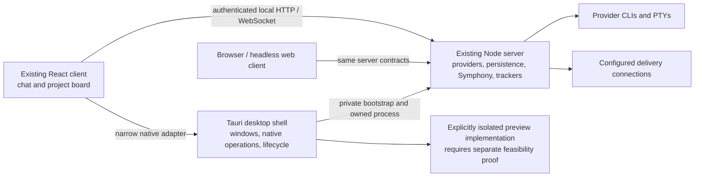

# Neokod critical review, competitors, Kanban and desktop direction

Research date: 4 October 2026. Initial source-review baseline: `80334a4c8a6badd9a0014bbc34af4bcb346c3cff`, plus the owner's existing uncommitted Symphony work. This report extends the earlier competitor research with a critical review of Neokod, licence/provenance assessment, cross-platform desktop migration and a focused comparison of Kanban and delivery integrations. The execution checklist is [plan.md](plan.md). Sections 11 and 12 add browser and runtime evidence; section 12 records the retry against branch fix/symphony-runner-and-config-wip at da7655bb2e3964c800eec882360e7d1d0eb4ca25. Earlier source-review and gate results are historical where that retry supersedes them.

## 1. Recommendation

Keep the existing server and web client while fixing the concrete acceptance, evidence and containment defects below. Measure the current renderer/server bottlenecks first. Tauri, GPUI and GPUIX remain future shell options, as recorded in plan.md, rather than prerequisites for fixing the app. Keep ordinary chat as the primary orchestration surface, with Symphony as an optional durable delivery workstream and project board. These decisions can be implemented incrementally without adopting T3's complete V2 engine.

A full independent rewrite remains a valid alternative if removal of retained T3 implementation is the actual objective, or if a bounded prototype demonstrates a materially simpler lifecycle and better measured behaviour. The current MIT licence permits a commercial modified fork subject to its notice requirement; replacing Electron alone would leave T3-derived server/client code and its attribution in the product. Treat licensing independence and desktop performance as different objectives.

The likely framework the owner remembers is Tauri. It uses a native desktop shell and operating-system WebViews, with web-rendered application content. It does not turn the React UI into native widgets, and faster total Neokod operation has not been measured. Electrobun is the relevant alternative if TypeScript shell reuse is especially valuable, but its current runtime, targets and signing limitations need their own proof. [Tauri overview](https://v2.tauri.app/start/), [Electrobun architecture](https://framework.blackboard.sh/electrobun/guides/architecture/overview/).

The best competitive direction is a reliable relationship between conversation, bounded task, canonical delivery item, exclusive workspace, execution attempt, review evidence and acknowledged result. A board makes those relationships visible; it should not manufacture them in browser state.

## 2. What was reviewed and what the evidence establishes

The earlier work captured 4,292 T3 PR records, including every closed/open PR in the selected inventory, and 965 labelled Synara PR records for the three-calendar-month scope. Sol independently accounted for all 100 prior PR findings and 17 broader Luna claims, correcting qualified/rejected conclusions. Sixteen B-and-above products from the supplied image plus separately requested Synara were covered. The open-issue inventory has 24,333 records across sixteen public trackers; 100 selected cases were assessed. Forty-nine additional source/document performance and product patterns were compared to local seams. These inventories are complete for their stated captures, not claims that every diff or reported issue was reproduced.

This extension used three GPT 6.1 Sol high investigation lanes: current server/ownership/recovery, desktop/licence, and the seventeen-product Kanban/delivery comparison. The main task traced frontend, board, client and terminal callers and integrated the decisions. Existing findings were reused rather than repeating the complete PR census. The earlier two bounded Claude Sonnet 5.5 critiques remain context-based advice, not independent source or runtime proof.

Neokod source was inspected with the dirty working tree intact. Frozen competitor source pins remain recorded in the existing manifests; new framework and missing Kanban sources have dated capture/status/hash manifests. Public implementation, official documents, beta gates, open proposals and unavailable private code are distinguished. A feature on frozen main is not necessarily in a stable binary. Issue counts are not quality rankings, and open issues may be unconfirmed, old-version, partially addressed or already fixed records.

During the initial source-only research in sections 2 to 10, no application source was changed and no competitor or Neokod runtime, provider/task, delivery mutation, commit, PR or deployment was exercised. Sections 11 and 12 describe the subsequent runtime audit separately. Source defects below describe demonstrated control/data flow; their user-visible consequences still require the focused regression/runtime gates. The installed/deployed version and current host performance were not established. Existing application checks were previously attempted and exited 127 because `vp` and its local dependency binary are absent; documentation checks cannot substitute for those passes.

| Detailed evidence                                                                                                                        | Purpose                                                                                              |
| ---------------------------------------------------------------------------------------------------------------------------------------- | ---------------------------------------------------------------------------------------------------- |
| [Earlier main comparison](docs/research/competitor-codebase-review-2026-10-04.md)                                                        | All seventeen apps, code, selected current issues, Synara and wider performance                      |
| [T3 inventory and nightly assessment](docs/research/upstream-nightly-review-2026-10-03.md)                                               | Local-first port filters, closed/open PR coverage and V2 migration scope                             |
| [Sol validation](docs/research/t3-sol-validation-2026-10-04.md), [corrected findings](docs/research/t3-corrected-findings-2026-10-04.md) | Every earlier substantive Luna finding accounted for; qualifications retained                        |
| [Seven-adapter intake review](docs/research/work-delivery-intake-review-2026-10-04.md)                                                   | Native identity, scope, read/write capability and chat handoff gaps                                  |
| [Frontend/board critical review](docs/research/neokod-frontend-critical-review-2026-10-04.md)                                            | F01–F09, caller paths, proof classes and focused gates                                               |
| [Desktop migration review](docs/research/desktop-migration-review-2026-10-04.md)                                                         | Current shell/server bridge, licences, primary framework references and finite feasibility gates     |
| [Interactive workflow concept](docs/research/chat-workstreams-concept-2026-10-04.html)                                                   | Independent design illustration inspired by the supplied workflow screenshot; not app implementation |

## 3. What the current codebase gets right

Neokod is not merely an Electron wrapper around an upstream application. Its existing server, contracts, client runtime and local-first carve-out already provide boundaries that a new shell can retain. The server owns provider sessions, event persistence/projections, workspaces, terminals, trackers and evidence. Symphony runs in the same server process but uses a separate runner/execution plane. The browser client uses typed HTTP/WebSocket operations and environment-scoped connection lifetimes. [Architecture](docs/architecture/overview.md), [Symphony architecture](docs/architecture/symphony.md).

The strongest parts to preserve are:

- Event-sourced Code commands/projections and existing runtime-item reconciliation. Unknown provider/process state must remain unknown; a rewrite must preserve this policy, not just replay text.
- Generation-fenced workspace ownership and durable Symphony work-item/attempt/approval/evidence records. These are the foundation for a single writer and reviewable delivery.
- Typed schema-only contracts and explicit shared-runtime subpaths. The design should keep native shell types out of domain policy.
- Client supervisors that own reconnect/retry, scoped projections and cache lifetime. Browser-mounted effects should not become another task scheduler or result-delivery authority.
- LegendList timeline virtualisation and structural row sharing; a settled-code cache bounded to 500 entries and 50 MiB; a diff pool bounded to 2–6 workers, 240 AST entries and 1,000-character tokenisation lines. These optimisations already exist and should be measured before adding replacements.
- A server-owned five-column Symphony board with explicit failed/cancelled/completed outcomes, revision-conditioned project settings and an adapter registry covering seven delivery applications.
- A desktop split into app, window, backend manager/pool/configuration, protocol, preview and WSL services. Electron can be replaced at these boundaries, but the process and browser semantics behind them still matter.

The maintenance concern is the number of overlapping execution and authority paths, not the mere presence of TypeScript, React or Effect. Code and Symphony have different launch/cancellation paths and capability vocabularies. A common request/admission/result boundary can reduce duplicated policy while retaining the attempts that already own truth. Replacing them all at once would also require provider parity, history migration, rollback and native distribution, none of which is proved by a cleaner initial repository.

## 4. Critical local findings

Priorities below are review priorities: P1 affects authority, evidence integrity, destructive actions or reliable completion; P2 is a bounded resource/recovery or user-flow concern; P3 is a candidate to measure before changing. No exploit, live data loss or measured slowdown is asserted without runtime evidence.

### 4.1 Board, frontend and retained data

| ID  | Priority / evidence                | Current code path                                                                                                                                                                                              | Critical conclusion and next gate                                                                                                                                                                                                                           |
| --- | ---------------------------------- | -------------------------------------------------------------------------------------------------------------------------------------------------------------------------------------------------------------- | ----------------------------------------------------------------------------------------------------------------------------------------------------------------------------------------------------------------------------------------------------------- |
| F01 | P1, source defect                  | [Board read](apps/server/src/symphony/Orchestrator/Layers/SymphonyOrchestratorLive.ts:1210) → [subscription](apps/server/src/ws.ts:504) → [view](apps/web/src/components/symphony/SymphonyProjectView.tsx:290) | Project-read failure becomes null; work-item-read failure becomes `[]`. Failed reads can appear as missing/empty authoritative data. Return unavailable/error evidence and retain last known data. Prove failed read differs from a successful empty board. |
| F02 | P1, completeness gap               | Same board query limits all lifecycle rows to 1,000; [projection](apps/server/src/symphony/Orchestrator/ProjectBoard.ts:38) exposes returned cards/counts                                                      | No cursor/truncation evidence makes a larger project appear complete. Keep a bound but expose coverage/pages; a 1,001-item fixture must make omissions discoverable.                                                                                        |
| F03 | P2, source performance opportunity | [WS board stream](apps/server/src/ws.ts:504) repeats every two seconds and stamps a fresh generatedAt; client maps each board directly                                                                         | Repeated full projection per subscriber needs SQL/bytes/render measurement. Consider a shared revisioned projection or semantic change stream. Existing source-control TTL caching already reduces repeated Git reads.                                      |
| F04 | P2, local failure-handling gap     | [Board dispatch](apps/web/src/components/symphony/SymphonyProjectView.tsx:86) awaits a result union without inspecting Failure; settings save does inspect it                                                  | Rejected dispatch needs a card-local reason and explicit retry. Shared command reporting is not a successful dispatch acknowledgement. Preserve pause/claim/permission failures without changing the card.                                                  |
| F05 | P2, source performance opportunity | [Streaming fence](apps/web/src/components/ChatMarkdown.tsx:640) bypasses settled cache; full changing fence is highlighted and full text parsed                                                                | Repeated growing-prefix work is a plausible hot path. Compare deferred/plain streaming or incremental segments under identical deltas; preserve sanitisation, Unicode, incomplete fences and completed output. No gain measured.                            |
| F06 | P2, byte-bound gap                 | [Terminal history](apps/server/src/terminal/Manager.ts:855) caps newlines; full persisted history is read before capping                                                                                       | One enormous line bypasses the intended memory bound. Whole reads/splits create extra allocations. Prove UTF-8-safe byte/tail limits and parser correctness; renderer scrollback is a separate bound.                                                       |
| F07 | P3, source performance opportunity | [Hidden terminal](apps/web/src/components/ChatView.tsx:520) subscribes to the full thread; hidden mounted view and self-ticking elapsed label persist                                                          | Measure hidden subscriptions and presentation work. Narrow summary selectors/lifetimes without dropping live terminal data. The timer already avoids React commits; do not regress that.                                                                    |
| F08 | P3, source navigation opportunity  | [Palette groups](apps/web/src/components/CommandPaletteResults.tsx:42) use Base UI collections without explicit local viewport windowing                                                                       | Trace large catalogues before adding windowing/result bounds. Keep keyboard, focus and ARIA correct; dependency internals were not profiled.                                                                                                                |
| F09 | P3, source allocation opportunity  | [Storage codecs](apps/web/src/hooks/useLocalStorage.ts:52) are built for each encode/decode                                                                                                                    | Reuse a stable codec if measurements justify it. Preserve malformed-data/legacy-key behaviour and avoid an unbounded global schema cache.                                                                                                                   |

Diagnostics need a current measurement rather than a remembered incident. The present [server-config subscription](apps/server/src/ws.ts:2541) still requests a provider refresh for each subscription, and [trace reads](apps/server/src/diagnostics/TraceDiagnostics.ts:397) still retain whole loaded files for aggregation. Probe coalescing must be traced through the current registry before changing it. PortScanner already has one reference-counted layer-scoped poll. Historical incident sizes and reporter benchmarks are not measurements of today's checkout.

### 4.2 Server, provider and ownership findings

The bounded server review and its source manifest are integrated below before research acceptance. Implementation and fault injection remain separate work.

### 4.3 Architectural limits that should drive sequencing

Normal-chat delegation currently lacks the complete request/reference/result contract the product needs. [HandoffService](apps/server/src/symphony/HandoffService.ts:494) validates a source thread and workflow, then creates a random manual work item with a synthetic delegated ID. It does not resolve Jira/Linear/Projects references through a configured connection or durably tie the originating message to acknowledged outcome delivery. This is useful ownership scaffolding, not the desired cross-application flow.

Symphony implementation currently starts Codex app-server directly. Multiple available review providers do not establish multiple implementation providers. Its reviewer is a bounded model call, not a durable child session. Provider-native children and app-owned children need separate capability/governance evidence. Kiro's current supervised restrictions remain a deliberate policy; a new general scheduler must not silently bypass them.

Raw engine dispatch has multiple consumers. A wrapper around one MCP or chat route cannot establish global authority. Actor/source/parent/workspace/capability policy belongs at accepted-command admission, with immutable lineage and mutation permissions. Connection authentication and command admission solve different problems. Worktree separation is useful concurrency isolation, not an operating-system sandbox.

## 5. Licence and the meaning of a rewrite

[The local licence](LICENSE) is MIT with T3 Tools Inc.'s copyright notice. The captured latest nightly `.2644`, frozen main `ee7b49d638e4`, and newly captured main `1302ccacbd6d` have identical licence bytes. The captured LICENSE-path history returned one licence commit with the same text. This bounded check found no current restrictive root-licence change; it does not establish the licences of every historic asset or dependency. [Pinned upstream licence](https://github.com/pingdotgg/t3code/blob/1302ccacbd6d3e957f2f95239556adb6eae79a48/LICENSE).

The MIT text permits modification, redistribution and sale, while requiring its copyright and permission notice for copies/substantial portions. It does not impose a general requirement to publish all modifications. The current evidence therefore supports retaining attribution while owning Neokod's development direction. This is a reading of the captured text, not legal certification.

| Intended objective                                   | What satisfies it                                                                                                                        | What remains                                                                                       |
| ---------------------------------------------------- | ---------------------------------------------------------------------------------------------------------------------------------------- | -------------------------------------------------------------------------------------------------- |
| Independent product/brand and release cadence        | Own requirements/UI/roadmap, selective intent ports and Neokod releases                                                                  | Retained inherited code still carries its required notice                                          |
| Lower desktop footprint / native OS integration      | Prove a replacement shell with current server/client and native platform facilities                                                      | T3-derived implementation remains; whole-app gains and platform parity need measurements           |
| Remove retained T3 implementation                    | Inventory provenance and independently replace affected server, contracts, client and shell components against a behaviour specification | Licence/dependency/assets review, history compatibility and provider/delivery/native parity        |
| Choose a new licence for independently authored work | Establish authorship/provenance and licence scope explicitly                                                                             | A new top-level label cannot erase third-party obligations or reclassify retained derived material |

Tauri's source uses permissive MIT or MIT/Apache-2.0 licensing as described in its pinned README; Electrobun and Wails carry MIT licences. Bundled runtimes, native modules, provider SDKs, assets and logos still require their actual notices/terms to be inventoried. [Tauri licence context](https://github.com/tauri-apps/tauri/blob/tauri-v2.12.1/README.md), [Electrobun licence](https://github.com/blackboardsh/electrobun/blob/main/LICENSE), [Wails licence](https://github.com/wailsapp/wails/blob/master/LICENSE).

Competitor source must also pass a licence filter. Superset is ELv2 source-available, CodexHost is LGPL-3.0, and public Traycer files do not expose its private execution Host. Use ideas and independently authored Neokod implementations; do not treat public visibility or a GitHub badge as permission to paste arbitrary code. The existing competitor appendices record the verified licences and private-source limits.

## 6. Electron replacement while preserving the server

### 6.1 Framework choice

| Option            | Rendering / application host                                                        | Fit                                                                       | Main gate                                                                                                      |
| ----------------- | ----------------------------------------------------------------------------------- | ------------------------------------------------------------------------- | -------------------------------------------------------------------------------------------------------------- |
| Existing Electron | Bundled Chromium and Electron's Node host                                           | Compatibility baseline; current preview/automation already targets it     | Measure actual shell/preview share of total cost rather than attributing all server/agent pressure to Electron |
| Tauri 2           | Rust shell; WKWebView on macOS, WebView2 on Windows, WebKitGTK on Linux             | First bounded candidate, retain React and separately packaged Node server | Native module/resource packaging, cross-engine UI and replacement preview/automation semantics                 |
| Electrobun 2      | TypeScript host using current Cottontail default/Bun option; native WebViews or CEF | Secondary candidate if TS shell reuse materially reduces maintenance      | Current target/signing/runtime limits; retained Node or CEF changes whole-app economics                        |
| Wails 3           | Go host and native OS WebView with web frontend                                     | Optional reference, adds another backend language alongside retained Node | Current beta/toolchain/Linux dependency floors and the same preview/storage gates                              |

The captured stable Tauri 2 release is [2.12.1, 30 September](https://github.com/tauri-apps/tauri/releases/tag/tauri-v2.12.1). Its generic latest endpoint returned a Tauri 3 alpha with misleading prerelease metadata; select the intended stable line explicitly. The [WebView reference](https://v2.tauri.app/reference/webview-versions/) and [prerequisites](https://v2.tauri.app/start/prerequisites/) establish the different platform engines/toolchains, not Neokod's tested minimum OS floor.

Current Electrobun documentation lists macOS arm64, Windows x64 with ARM emulation, and Linux x64/arm64. Its main process now defaults to Cottontail with Bun optional; older Bun-only descriptions are stale for this 2.x capture. Windows signing is outside Hutch's packaging pipeline, and its update-routing hash is explicitly not publisher authentication. These are meaningful gates for Neokod's existing macOS x64/arm64, Windows x64/arm64 and Linux x64 targets. [Compatibility](https://framework.blackboard.sh/electrobun/guides/compatability/), [main process](https://framework.blackboard.sh/electrobun/guides/native-main-process/), [signing](https://framework.blackboard.sh/electrobun/guides/code-signing/), [updates](https://framework.blackboard.sh/electrobun/guides/updates/).

Wails 3's current docs identify beta status and Go 1.25+; Linux defaults to GTK4/WebKitGTK 6.0, with a temporary older compatibility path. That is an extra constraint, not evidence it is unsuitable forever. A fully native-widget UI would be a separate frontend rewrite. [Wails FAQ](https://v3.wails.io/faq/), [installation](https://v3.wails.io/quick-start/installation/).

### 6.2 Actual Neokod migration seams

The target is a small shell that starts and supervises the existing server and supplies narrow native operations. Keep conversation, terminal, provider and tracker operations on the existing typed server RPC.

This is a proposed architecture, not an implemented Tauri application.

| Current seam                                                                                                                  | Why replacing Electron requires work                                                                                                                                                                                             |
| ----------------------------------------------------------------------------------------------------------------------------- | -------------------------------------------------------------------------------------------------------------------------------------------------------------------------------------------------------------------------------- |
| [Backend launch](apps/desktop/src/backend/DesktopBackendConfiguration.ts:320)                                                 | Uses Electron's executable as a Node host with `ELECTRON_RUN_AS_NODE=1`, bundled bin.mjs and private FD 3 bootstrap. A replacement needs a supported packaged Node binary and proved bootstrap handle/transport on every target. |
| [Backend manager](apps/desktop/src/backend/DesktopBackendManager.ts:475) and pool                                             | Readiness, restart, interruption, graceful/forced termination and WSL ownership are existing behaviour to preserve, not merely a spawn call.                                                                                     |
| [Preload bridge](apps/desktop/src/preload.ts:10) and [IPC contracts](packages/contracts/src/ipc.ts:872)                       | Synchronous initial topology/settings reads need a resolved startup snapshot before React when the new native API is asynchronous. Electron-oriented preview IDs need a deliberate replacement contract.                         |
| [Custom protocol](apps/desktop/src/electron/ElectronProtocol.ts:78)                                                           | Asset proxy/history fallback and CSP include actual local/WSL/worker endpoints. New scheme/origin affects browser storage and privilege policy.                                                                                  |
| [Desktop storage](apps/desktop/src/app/DesktopConnectionCatalogStore.ts:98)                                                   | Electron safeStorage encryption is not automatically readable by a new keyring. Origin-bound IndexedDB/localStorage/drafts need explicit migration or visible supported re-entry. Server DB identity should remain stable.       |
| [Artifact packaging](scripts/build-desktop-artifact.ts:1127)                                                                  | Server dependencies/native PTY/search/provider resources and nested signatures are staged today. Plain Node, external binaries and resource paths need a new target-specific package plan.                                       |
| [Embedded preview](apps/web/src/browser/ElectronBrowserHost.tsx:17) and [automation](apps/desktop/src/preview/Manager.ts:701) | Electron WebContents/debugger/CDP, screencast, partitions and Chromium Playwright injection do not map directly onto WKWebView/WebKitGTK. WebView2's Chromium ancestry does not prove Electron API compatibility.                |

The server's Node SQLite path uses built-in `node:sqlite`; its Bun path is separate. Native PTY/search dependencies and bundled provider runtime material still need OS/architecture/resource checks. A one-file JavaScript bundle or framework sidecar feature is not packaging proof. [Tauri external binaries](https://v2.tauri.app/develop/sidecar/).

Embedded preview is the decisive feature risk. A system-WebView implementation, separately owned Chromium preview worker, or explicitly limited prototype are different choices. A retained Chromium preview may still permit a useful smaller main shell, but its runtime/download/memory cost belongs in the comparison. Removing preview to win a benchmark without an accepted feature change would make the benchmark misleading.

### 6.3 Native privileges, updates and measurement

Tauri capability scopes can narrow plugin access by window/WebView, but custom invoke commands need explicit app-manifest treatment. They do not constrain Neokod's independent server RPC once the backend credential is available. Keep previews away from the privileged bridge/token, validate native callers and URL/navigation policy, and test exact CSP/origin/worker requirements. [Tauri capabilities](https://v2.tauri.app/security/capabilities/).

Tauri update artifacts require signatures; those signatures are separate from platform code signing, macOS notarisation and nested native/runtime signing. An existing Electron feed does not automatically upgrade an installed Electron app into a Tauri package. Prove a handoff installer/bridge release, data compatibility, interruption and rollback. [Updater](https://v2.tauri.app/plugin/updater/), [macOS signing](https://v2.tauri.app/distribute/sign/macos/), [Windows signing](https://v2.tauri.app/distribute/sign/windows/).

Freeze an equivalent release workload before the spike: cold/warm startup, thirty-minute idle, fixed history/stream/terminal/diff workload, preview off/on, and headless/server recovery. Measure shell, server, providers, preview browser and shared GPU/service costs with platform-appropriate metrics. Keep installer/installed bytes, readiness/visible/interactive timestamps, median/p95, whole-tree CPU/memory and failure outcomes distinct. A suggested decision budget is at least twenty percent lower total steady-state memory or installed bytes on the primary target, no more than ten percent median startup-to-interactive regression, and no material loss of responsiveness, reliability, features or advertised targets. These are proposed experiment thresholds, not measured results or framework promises.

Stop after one bounded candidate passes or meets a decisive blocker. Evaluate Electrobun next only if the failed gate or maintenance evidence warrants it. The plan does not require building three production shells to choose one.

## 7. Which competitors have Kanban and delivery integrations

The focused seventeen-app matrix and concrete implementation walkthroughs are integrated below before research acceptance. Native execution boards, external issue boards, provider task lists and plugin examples are different features and must not be conflated.

## 8. How Neokod should implement the delivery/workstream model

Neokod already has a board. [ProjectBoard.ts](apps/server/src/symphony/Orchestrator/ProjectBoard.ts:12) maps local lifecycle to Not Started, In Progress, Testing, PR / Human Review and Done. Failed and cancelled items share Done but retain explicit outcomes. The current BoardTab displays cards/dispatch/links, without a drag/drop state mutation in the reviewed path. This is an execution board; moving a local card is not evidence an external Jira issue or GitHub Project item changed status.

The seven registered source adapters are not a host-owned generic delivery-write API. The current tracker contract supplies validation, candidate listing, refresh/native lookup, health/probe, credential-environment exclusion and profile information. Profiles do not guarantee agent write tools. Read authentication, repository PR operations, task comments and project-field/status mutations are separate capabilities. [Registry](apps/server/src/symphony/Trackers/Registry.ts), [adapter contract](apps/server/src/symphony/Trackers/Adapter.ts).

| Delivery app    | Canonical target                                                          | Current gap to close before reference-based intake                                                                                     |
| --------------- | ------------------------------------------------------------------------- | -------------------------------------------------------------------------------------------------------------------------------------- |
| Jira            | Configured connection/project plus numeric issue ID; display key retained | Direct bulk lookup does not explicitly verify returned project membership; state/dependency policy needs exact scope/freshness         |
| Linear          | Configured scope plus issue UUID; display key retained                    | Inverse relations are bounded to first 50 without complete/partial evidence; dependent policies must not infer complete absence        |
| GitHub Issues   | Configured host/repository plus issue number                              | Current CLI list is fixed at 100 and does not prove complete candidate coverage; dependency support is limited                         |
| GitHub Projects | Selected project plus project-item node ID                                | Global item lookup needs owning-project validation; issue-only content excludes draft/PR cards; selected status-field identity matters |
| Azure Boards    | Organisation/project plus work-item ID and revision                       | Direct batch fields omit explicit TeamProject membership; custom process/state mappings need declared support                          |
| GitLab          | Configured host/project plus project IID                                  | Opened/closed mapping and unsupported priority/branch/dependency evidence differ from Jira; no universal semantics                     |
| Asana           | Project membership plus task GID                                          | Missing section can omit a task; completed/section/dispatchability policy must be explicit and not guessed                             |

The immutable connection scope matters. Current work-item uniqueness uses project/tracker kind/native issue ID; configuration changes can reinterpret those IDs unless binding history is guarded or migrated deliberately. Display IDs and task URLs are references to resolve through the selected configured service, never arbitrary credentialed fetch destinations. The full [adapter assessment](docs/research/work-delivery-intake-review-2026-10-04.md) records each path and gate.

The smallest useful implementation is:

1. Resolve a human task reference against a selected server-owned connection and Symphony project. Return canonical identity, checked scope, fresh issue/status/revision, dependency coverage and declared capability outcomes. Preserve ambiguous, unavailable, out-of-scope and unsupported states.
2. Persist a bounded delegation request with source chat/message, semantic request identity/fingerprint, selected scope and target. Link it to the existing work item, workspace/attempt, validation/evidence and PR; do not create another run lifecycle.
3. Admit through scheduler/workflow/pause/concurrency/capability policy and one exclusive claim. A polling race or second chat targeting the same task receives the existing work link or explicit already-running state.
4. Use a separate worktree or current fenced ownership transfer. Stop/cancel/detach have distinct meanings. Keep external state and local execution lifecycle independently visible.
5. Deliver an attributed outcome back to the originating chat durably, with acknowledgement and recoverable unknown delivery. No open browser tab or presentation watcher should own this work.
6. Add external comments/status transitions only when the adapter declares and proves them. Require server-side authority/state/revision checks, conflict handling and visible pending/failure; do not infer a mutation from a successful read.

The screenshot's useful idea is a visible parent/child workflow in the conversation, with incoming attributed messages, progress and review evidence. Neokod can adopt that product pattern independently: a chat workstream summary and links to child/attempt/delivery records, plus the project board for wider oversight. Its styling and competitor UI are references for deliberate Neokod design, not upstream UI cherry-picks.

## 9. What is worth implementing, and what to defer

Start with evidence/containment/acceptance defects, then measured frontend/server resource bounds. A shell prototype can run beside these, using the current server as a fixed comparator. Durable chat request/result linkage should precede Kanban manipulation or general recursive fleets. Delivery identity/scope/completeness comes before broad write-back claims.

Retain and improve the existing timeline/cache/diff/index/storage/ownership mechanisms rather than creating parallel versions. Compare the smaller SQL append change before adopting Synara chunk storage; use credential-scoped read budgets where measurements show duplicate polls/probes. Watcher/index/terminal work needs real workload and native-platform checks, not copied competitor numbers. Open PR intent and source opportunities stay conditional until local callers and failure behaviour are proved.

Defer arbitrary provider auto-failover, a plugin marketplace, a second universal task/attempt database, whole-engine V2 adoption, speculative fleet configuration and simultaneous shell/server/UI rewrite. Reject hosted/remote/mobile/control-plane imports that violate the fork policy. Native/manual work remains usable without a delivery connection.

If full independence is selected, build one narrow independent workbench prototype against behaviour fixtures and copied history, compare the same lifecycle/resource gates, and expand only after migration/rollback/provenance and provider parity are credible. A new framework or language is not sufficient evidence of an independent implementation or a better product.

## 10. Completion and remaining evidence

[plan.md](plan.md) translates this report into ordered phases, dependencies, model/ownership rules and finite exit criteria. It carries forward all outstanding port/performance/reconnect/queue/delegation/delivery/live-proof work; Plan 20 retains the architecture rationale instead of operating another status ledger.

Research acceptance requires bounded independent validation and artifact/link/hash/ownership checks. Implementation completion requires relevant regression checks plus `vp check` and `vp run typecheck`. A replacement shell additionally needs packaged native target, preview, signing/update, storage migration and whole-application performance proof. Delivery support additionally needs controlled canonical task→attempt/worktree→review/PR→chat-result evidence for every advertised live capability. None of those implementation/native/live/release states is established by this source review.

## 11. Live browser review, 4 October 2026

### 11.1 Scope and evidence boundary

I drove the running application at `http://localhost:5733/` in the connected Chrome session on 4 October 2026. This was a browser-level smoke and workflow review of the reachable Code and Symphony surfaces. I used the existing local `arbitrage` project and thread, sent only deterministic no-tool prompts, ran harmless terminal commands, refreshed the page, and inspected menus and empty states. I did not create a Symphony project, enable a tracker, dispatch an agent, write to Jira/Linear/GitHub/Azure DevOps, open a pull request, or change an external system. The results below are observations from this run, not claims about paths that were not reachable without configured tracker data.

### 11.2 Core Code mode results

| ID               | Surface                    | Result      | Evidence and implication                                                                                                                                                                                                                                                                                                                                                                                                                                                          | Priority              |
| ---------------- | -------------------------- | ----------- | --------------------------------------------------------------------------------------------------------------------------------------------------------------------------------------------------------------------------------------------------------------------------------------------------------------------------------------------------------------------------------------------------------------------------------------------------------------------------------- | --------------------- |
| BROWSER-CORE-001 | Prompt execution           | Pass        | A no-tool prompt returned `SMOKE_TEST_ACK`. After a full browser reload and reconnect, a second no-tool prompt returned `RELOAD_ACK`. Thread history and the saved goal survived the reload.                                                                                                                                                                                                                                                                                      | Closed by observation |
| BROWSER-CORE-002 | Terminal drawer            | Pass        | The terminal opened, accepted input, and rendered `SMOKE_TERMINAL` when the command included a newline. The same drawer also exposed the project path and the expected non-Git error.                                                                                                                                                                                                                                                                                             | Closed by observation |
| BROWSER-CORE-003 | Goal persistence           | Pass        | `Smoke test goal` was saved, appeared in the thread header, and remained present after reload and navigation through Home.                                                                                                                                                                                                                                                                                                                                                        | Closed by observation |
| BROWSER-CORE-004 | Model and runtime controls | Pass        | The model picker exposed the configured model set, and Runtime mode exposed Supervised, Auto-accept edits, Auto, and Full access with the selected state visible.                                                                                                                                                                                                                                                                                                                 | Closed by observation |
| BROWSER-CORE-005 | Home, Recent, All threads  | Pass        | Home showed the recent thread and empty Running, Needs attention and Plan ready sections. Recent and All threads opened the same thread and preserved its goal and messages.                                                                                                                                                                                                                                                                                                      | Closed by observation |
| BROWSER-CORE-006 | Diff capability discovery  | Issue       | The thread exposes Open diff for a project that is not a Git repository. The panel then shows `Turn diffs are unavailable because this project is not a git repository`, while Git-specific scope/base controls remain visible. The capability should be gated by project metadata or the unavailable state should explain the next action and suppress controls that cannot work.                                                                                                | P3                    |
| BROWSER-CORE-007 | React list identity        | Issue       | Chrome logged `Encountered two children with the same key, %s` during the core workspace flow. Duplicate keys can cause rows to be omitted or duplicated as the list updates. The exact component/key still needs source mapping and a focused regression check.                                                                                                                                                                                                                  | P2                    |
| BROWSER-CORE-008 | Virtual list configuration | Issue       | Chrome logged `[legend-list] recycleItems was not provided`, which means the list is relying on an implicit remount policy. Set the option explicitly after confirming the desired row lifecycle, then measure the affected list under the existing performance fixtures.                                                                                                                                                                                                         | P3                    |
| BROWSER-CORE-009 | Command palette search     | Issue       | The palette initially listed `Open terminal`. Searching for `terminal` found it, but searching for the exact phrase `open terminal` and the single word `open` returned no matches. This is surprising for a command search and suggests tokenisation or matching inconsistency. Reproduce with other multi-word actions before changing the matcher.                                                                                                                             | P2                    |
| BROWSER-CORE-010 | Reload reconnect UX        | Observation | Reload briefly showed `Connecting...`, a disabled composer and `Reconnect this environment before sending messages or running actions`; the environment recovered and the post-reload prompt completed. This is a successful recovery path with a visible latency window, so it is a reliability/UX improvement rather than a failed execution. Capture reconnect duration in an automated browser check and ensure the disabled state always has a progress or retry affordance. | P3                    |
| BROWSER-CORE-011 | Settings navigation        | Pass        | General, Appearance, Keybindings, Providers, Source Control, Tracking, Analytics, Connections and Archive all loaded through the settings navigation. Provider and tracking pages exposed their configured controls; Archive showed the expected empty state.                                                                                                                                                                                                                     | Closed by observation |

### 11.3 Symphony results

| ID                   | Surface                       | Result                         | Evidence and implication                                                                                                                                                                                                                                                                                                                                                                  | Priority              |
| -------------------- | ----------------------------- | ------------------------------ | ----------------------------------------------------------------------------------------------------------------------------------------------------------------------------------------------------------------------------------------------------------------------------------------------------------------------------------------------------------------------------------------- | --------------------- |
| BROWSER-SYMPHONY-001 | Code → Symphony mode switch   | Issue                          | Switching from the Code thread opened `Project unavailable` for Symphony project UUID `92663fc1-f54f-4746-854f-677af7701dbe`. The route recovered only after selecting Back to projects. A stale or deleted selected project should fall back to the Symphony project list and clear the invalid selection instead of presenting a dead-end route.                                        | P2                    |
| BROWSER-SYMPHONY-002 | Symphony project list         | Pass with empty state          | Back to projects loaded a clear empty state: `Create your first Symphony project`, Refresh and Create project actions, and explanatory text. Active runs also showed `Nothing running right now`.                                                                                                                                                                                         | Closed by observation |
| BROWSER-SYMPHONY-003 | Tracker connections           | Pass with prerequisite blocker | Tracker connections clearly reported `No trackers connected` and linked to Manage connections. No tracker writes were attempted. This is a correct empty state, but it prevents deeper board/run testing until a test connection or fixture exists.                                                                                                                                       | Environment blocker   |
| BROWSER-SYMPHONY-004 | Delivery integration coverage | Pass                           | The creation form offered GitHub Issues, Jira, Linear, GitLab Issues, Asana, Azure Boards and GitHub Projects. This matches the delivery-neutral direction in the plan and confirms that the product surface is not Jira-only.                                                                                                                                                            | Closed by observation |
| BROWSER-SYMPHONY-005 | Tracker-specific form         | Pass with usability gap        | Selecting Jira changed the scope field to `Jira project key`; the form also showed an explicit tracker scope field for the selected provider. This is the right shape for adapters, but the form does not expose connection health or authentication state beside the selected tracker.                                                                                                   | P3                    |
| BROWSER-SYMPHONY-006 | Project creation validation   | Issue                          | The existing Code project `arbitrage` was selectable, but the form reported `No Git remote detected for this Code project` and the Create paused project button stayed disabled. The form did not identify which required field or capability kept the button disabled. Add field-level validation and a concise disabled-reason summary, especially for local projects without a remote. | P2                    |
| BROWSER-SYMPHONY-007 | Symphony settings naming      | Observation                    | The sidebar action labelled Symphony settings returned to the Symphony projects list rather than a separate settings view. Project-scoped configuration may be intentional, but the label suggests a dedicated settings surface and should be renamed or implemented consistently.                                                                                                        | P3                    |

### 11.4 Browser diagnostics captured

The browser diagnostics contained two warning classes during the review:

- React duplicate-key error, timestamped `2026-10-04T10:07:46.224Z` from the Vite React runtime.
- Legend list warning that `recycleItems` was not provided, observed at `2026-10-04T10:07:46.224Z` and again at `2026-10-04T10:12:19.827Z`.

No browser error was observed while the post-reload prompt was running. The diagnostics are evidence for the UI backlog above; they do not establish the exact source component until mapped to a stack or component test.

### 11.5 Immediate browser backlog

The highest-value fixes from this pass are:

1. Make the Symphony route selection-safe by falling back to the project list when the selected project is missing.
2. Map and remove the duplicate React key in the core workspace list, then add a regression test for update and reload paths.
3. Make command palette matching consistent for multi-word commands.
4. Explain or gate Diff for non-Git projects.
5. Add field-level Symphony project validation and surface connection health before a user attempts to start a project.
6. Set the virtual-list recycling policy explicitly and measure the resulting lifecycle/performance behaviour.
7. Add a browser acceptance check that covers reload, reconnect, prompt completion and persisted goal state.

These items are now part of [plan.md](plan.md). They should be handled before declaring the Code/Symphony workflow complete. The deeper Symphony board, run queue, review gate and delivery write-back paths remain untested until a safe fixture or configured tracker connection is available.

## 12. Expanded functional audit and retry, 4 October 2026

### 12.1 What this pass establishes

This is an expanded audit, with incomplete coverage explicitly recorded. It is not an all-functionality pass. The earlier connected-Chrome review is in section 11. The subsequent browser fixture pass retained 50 text snapshots, screenshots and console diagnostics under [full-audit-2026-10-04](output/playwright/full-audit-2026-10-04/). Those snapshots came from the prior controlled browser session; they must not be described as fresh observations made during this retry.

The retry used Computer Use to locate the owner's Chrome tabs. Selecting both existing Neokod tabs through the browser connection timed out in Emulation.setFocusEmulationEnabled. Native Chrome controls could read the browser window, but the attempted tab action was rejected because the user had changed its state and a fresh observation was required. No further browser interaction was successfully verified in this retry. This is an automation limitation, not a Neokod product defect.

The local Vite frontend remained on port 5733, but the backend on port 13773 had stopped. I restarted the same development backend with the same home directory, /Users/kamogelo/.neokod-review, and Node 24.21.0. The recovered server reported version 3.0.3 on macOS arm64. Both environment discovery and orchestration snapshot returned HTTP 200, and the snapshot contained the original arbitrage project, the audit fixture and three threads. This proves backend recovery and retained records; it does not prove that the owner's Chrome tab visually recovered.

The fixture is a separate temporary Git repository, neokod-functional-audit-uy22dh88. It contains README, a TypeScript file, notes, package.json and a deliberately untracked file. Browser actions created two fixture chats, a goal, a project script and one local fixture commit. The source checkout's existing changes were preserved. No external tracker work item, push, pull request, merge, deployment or authentication credential was changed.

The earlier backend exit was not captured with a conclusive process error. An audit artifact write briefly raised ENOSPC, then another write succeeded; storage pressure and backend loss occurred in the same period. That does not establish causation. The retry found free space and a recoverable database. Capture server stderr and disk/IO state in any future reproduction before assigning the backend exit to Neokod.

### 12.2 New confirmed defects

#### BROWSER-CORE-012: Diff silently reviews the wrong repository, P1

Reproduction:

1. Start the server from the Neokod source checkout.
2. Add a separate local Git project outside that checkout and the server's managed worktree directory.
3. Create a chat in that project. Open its file viewer and confirm that src/example.ts belongs to the selected project.
4. Open Diff and inspect Branch changes.

Observed: the fixture's file viewer displayed its own answer = 43 file, while Diff displayed Neokod's SymphonyOrchestratorLive.test.ts and the Neokod branch. The chat's checkout selector still displayed main. This makes the review look valid while it belongs to a different repository.

Evidence: [wrong-repository-diff.png](output/playwright/full-audit-2026-10-04/wrong-repository-diff.png), [git-diff-settled.txt](output/playwright/full-audit-2026-10-04/git-diff-settled.txt), [file-preview.png](output/playwright/full-audit-2026-10-04/file-preview.png).

Source trace: [DiffPanel.tsx](apps/web/src/components/DiffPanel.tsx) requests the selected project's cwd, then recognises a configured-workspace-root error and retries using serverConfig.cwd. [ReviewService.ts](apps/server/src/review/ReviewService.ts) admits only descendants of the server cwd or managed worktrees root. A registered project elsewhere is rejected, and the client substitutes another repository.

Required behaviour: resolve and validate the selected project's or thread's authoritative repository root. Never substitute a different repository after rejection. Show the failed scope explicitly. Cover two distinct repositories, external registered projects, worktrees and symlink canonicalisation. Retain containment checks; removing them wholesale would miss the ownership problem. The existing server containment tests pass but do not catch the client substituting a different cwd.

Impact boundary: wrong files and branch metadata were visibly displayed. I did not perform a destructive action through that incorrect review, and have no proof that commit or push targets the wrong repository. The fixture commit below correctly reached the fixture.

#### BROWSER-CORE-013: Disconnection becomes a convincing empty workspace, P2

Reproduction: while the frontend remains available, lose the local backend connection, then navigate to Home or reload.

Observed: Home displayed Running 0, Needs attention 0, Plan ready 0 and Recent 0; My Work displayed 0; the sidebar said No projects yet. The captured screen had no visible offline explanation. Symphony creation then asked for a Code project although saved projects already existed.

Evidence: [disconnected-false-empty.png](output/playwright/full-audit-2026-10-04/disconnected-false-empty.png), [reconnect-after-storage.txt](output/playwright/full-audit-2026-10-04/reconnect-after-storage.txt), [console-errors.json](output/playwright/full-audit-2026-10-04/console-errors.json). Connection-refused errors began at 10:39:56 UTC. The later [retry-environment.json](output/playwright/full-audit-2026-10-04/retry-environment.json) records both projects and three threads after backend recovery.

Source trace: [NoActiveThreadState.tsx](apps/web/src/components/NoActiveThreadState.tsx) builds the dashboard from project/thread collections and renders zero and Nothing here right now without representing environment freshness. The final recovery needs to cover the shell's connection state and the sidebar as well as Home.

Required behaviour: distinguish disconnected/unavailable, loading, known-empty and stale-last-known state. Keep a visible environment warning and reconnect action. Gate creation and execution on current evidence. Test connection loss with existing projects and an active attempt, then recovery without duplicates. This follows the existing [state-and-evidence.md](docs/architecture/state-and-evidence.md) requirement.

Impact boundary: the app hid saved records during disconnection. Recovery confirmed retained records, so this is not a demonstrated deletion bug.

#### BROWSER-CORE-014: Provider failure lacks an actionable first explanation, P3

Observed: the failed Codex chat displayed both a provider-status alert and an adapter failure; the accessible error body included a long internal stack and local dependency paths. The visible explanation was app-server exited with code 1. It did not identify the missing native CLI dependency that the direct probe established.

Evidence: [codex-start-failure.png](output/playwright/full-audit-2026-10-04/codex-start-failure.png), [provider-settings.txt](output/playwright/full-audit-2026-10-04/provider-settings.txt), [provider-cli-probes.json](output/playwright/full-audit-2026-10-04/provider-cli-probes.json).

Required behaviour: lead with a short actionable provider diagnosis, offer retry/settings, and put stack details behind a diagnostics disclosure. Keep enough diagnostic context to troubleshoot. The underlying installation failure is an environment blocker, described below; the product issue is how it is explained.

#### BROWSER-SYMPHONY-008: Codex prerequisite message misstates the actual gate, P3

Observed: Symphony creation said execution requires an enabled Codex provider. Codex was already enabled, but unavailable after its failed probe.

Source: availableSymphonyImplementationProviders in [SymphonyProjectConfigurationForm.tsx](apps/web/src/components/symphony/SymphonyProjectConfigurationForm.tsx) requires Codex to be enabled, installed and not unavailable. The creation text names only enabled.

Required behaviour: name the actual failed prerequisite and link to the relevant provider's settings/health details. A healthy Claude connection does not currently unlock Symphony implementation. Provider-neutral Symphony execution is a separate feature decision, not established by the shared model picker.

### 12.3 Environment blockers and observations that are not confirmed defects

| Item                                     | Evidence                                                                                                                                               | Interpretation and next proof                                                                                                                                                                                                                                                                             |
| ---------------------------------------- | ------------------------------------------------------------------------------------------------------------------------------------------------------ | --------------------------------------------------------------------------------------------------------------------------------------------------------------------------------------------------------------------------------------------------------------------------------------------------------- |
| Default Codex cannot start               | The globally installed codex --version exits 1 because @openai/codex-darwin-arm64 is missing.                                                          | Local installation blocker. Do not count this as a Symphony runner regression or claim an unavailable provider completed a turn.                                                                                                                                                                          |
| Bundled Codex is executable              | /Applications/ChatGPT.app/Contents/Resources/codex-cli/bin/codex reports codex-cli 0.160.0.                                                            | Version execution only. The app was not reconfigured to this path in the retry, and no Neokod Codex turn or Symphony attempt was proved with it.                                                                                                                                                          |
| Jira toggle followed by immediate reload | The earlier pass enabled Jira without entering credentials, then disabled it; an immediate reload still showed enabled before a later disable settled. | Not enough evidence for lost acknowledged settings. Current useSettings serialises mutations and validates authoritative acknowledgements; settings.tsx exposes Saving and Settings not saved. Repeat only after awaiting the visible acknowledgement, and separately cover reload during a pending save. |
| Claude stop and follow-up                | CLAUDE_AUDIT_ACK appeared. A follow-up requested QUEUE_AUDIT_ACK, then Stop was used; no second acknowledgement was observed.                          | Do not claim successful queue execution or a lost-message defect. The first completion overlapped the second send. A deliberately delayed fixture must prove queue, stop and subsequent resumption separately.                                                                                            |
| Goal completion                          | The goal saved; goal-done.txt captured Mark goal done disabled while a mutation was pending. The restored fixture record remains active.               | Saving a goal is proved. Successful done/reopen transitions are not. The artifact filename is not evidence that completion succeeded.                                                                                                                                                                     |
| Thread-detail HTTP 404                   | Console records a 404 while a new Claude thread was being established. The eventual Claude turn succeeded.                                             | Candidate creation/fetch race, not a confirmed broken chat. Correlate creation acknowledgement and first detail request before adding a product defect.                                                                                                                                                   |
| Source Control briefly appears empty     | A later snapshot displayed the provider statuses after the initial loading interval.                                                                   | Loading was observed; permanent loss was not. Do not turn a transient skeleton into a failing result.                                                                                                                                                                                                     |
| Backend loss and ENOSPC                  | A write failed transiently and the backend listener disappeared.                                                                                       | Cause unresolved. Backend recovery and retained database were proved.                                                                                                                                                                                                                                     |
| Hovered thread controls                  | One pin click was intercepted before the hover actions were revealed.                                                                                  | Automation/interaction ambiguity. Pin persistence was not proved; an intercepted synthetic click alone is not an application bug.                                                                                                                                                                         |
| Native Chrome control                    | Browser tab selection timed out twice.                                                                                                                 | Audit-tool blocker. Keep it separate from the app's WebSocket disconnection.                                                                                                                                                                                                                              |

### 12.4 Core functionality coverage

Pass applies only to the observed scenario. Partial means the surface loaded or an intermediate mutation happened, but the full outcome was not established. The snapshots linked below remain the browser evidence for this pass.

| Function                                          | Result                                       | Detail and evidence                                                                                                                                                                                                        |
| ------------------------------------------------- | -------------------------------------------- | -------------------------------------------------------------------------------------------------------------------------------------------------------------------------------------------------------------------------- |
| Home and recent-thread navigation                 | Pass while connected; fail during disconnect | Existing chat/history reachable in section 11. Offline false-empty state is CORE-013.                                                                                                                                      |
| Add an existing local project                     | Pass                                         | Fixture appears in sidebar, file tree and recovered server snapshot.                                                                                                                                                       |
| Clone a repository and choose destination         | Not exercised end to end                     | Existing owner changes adjust clone-destination handling. Focused CommandPalette logic tests pass; no clone or remote authentication was run.                                                                              |
| Create a brand-new repository                     | Not exercised                                | Needs a separate disposable destination and visible Git-initialisation result.                                                                                                                                             |
| Create Codex chat                                 | Failed due environment                       | User message persisted and failed state appeared. No assistant response.                                                                                                                                                   |
| Create Claude chat and execute a turn             | Pass                                         | Sonnet 5.5 returned CLAUDE_AUDIT_ACK in Supervised/Plan mode. [claude-stop.txt](output/playwright/full-audit-2026-10-04/claude-stop.txt).                                                                                  |
| Streaming/tool execution and real approvals       | Not exercised                                | No-tool acknowledgements do not establish tool events, approval answers or edits.                                                                                                                                          |
| Follow-up queue, Stop and resume                  | Partial                                      | Stop control was used and composer became idle. Second prompt execution and resumed session remain unproved.                                                                                                               |
| Switch provider/model/reasoning effort            | Partial                                      | Model lists and selected controls rendered. Claude High reached the observed turn. Mid-session provider migration was not tested.                                                                                          |
| Runtime and Plan/Build controls                   | Partial                                      | Options rendered and Claude used Supervised/Plan. Permission enforcement and accepted-plan execution remain untested.                                                                                                      |
| Draft persistence across navigation               | Observed in prior pass                       | Draft returned after Home/thread navigation and was cleared. Cross-reload and reconnect drafts need retained evidence.                                                                                                     |
| Rename a chat                                     | Pass                                         | Renamed Functional audit thread remained in the recovered database. [thread-rename.txt](output/playwright/full-audit-2026-10-04/thread-rename.txt).                                                                        |
| Save a goal                                       | Pass                                         | Audit lifecycle goal appears in header and persisted fixture record.                                                                                                                                                       |
| Mark goal done and reopen                         | Unverified                                   | Pending disabled control observed; final record active. No completion claim.                                                                                                                                               |
| Pin/unpin                                         | Unverified                                   | Controls inspected; stable persisted pinned state not proved.                                                                                                                                                              |
| Archive/restore                                   | Unverified mutation                          | Archive settings and empty state loaded in section 11. No successful archive/restore cycle was retained.                                                                                                                   |
| My Work: status grouping                          | Partial                                      | Working Claude and failed Codex appeared in distinct groups; duplicate-key warning still occurs. Dismiss/clear/recovery persistence need checks.                                                                           |
| Search and command palette                        | Partial with existing issue                  | Open subagents and Open plan worked. Multi-word command inconsistency from CORE-009 remains open.                                                                                                                          |
| Project files and preview                         | Pass for read                                | Fixture src/example.ts rendered correctly. [file-preview.png](output/playwright/full-audit-2026-10-04/file-preview.png). File editing/save and refresh conflicts not tested.                                               |
| File mention                                      | Pass for discovery                           | @example found src/example.ts after lookup. [mention-example.txt](output/playwright/full-audit-2026-10-04/mention-example.txt). Delivery of referenced content to a provider not inspected.                                |
| Skills and slash commands                         | Partial                                      | Skills showed none configured; Claude command menu loaded. No skill execution or slash-command effect was invoked.                                                                                                         |
| Image/file attachments                            | Not exercised                                | Upload, preview, remove, rejection and provider payload parity need a small non-sensitive fixture.                                                                                                                         |
| Terminal open and simple command                  | Pass in initial smoke                        | Section 11 observed SMOKE_TERMINAL. The later pwd/ACK input is not additional stdout proof because its canvas output was not retained.                                                                                     |
| Terminal splitting/grouping                       | Pass for layout                              | Horizontal/vertical split and a new group exposed four terminals across two groups. [terminal-groups.txt](output/playwright/full-audit-2026-10-04/terminal-groups.txt). Shell lifecycle/resize/reconnect still need proof. |
| Project script save/run                           | Partial                                      | Audit echo was saved and Run action exposed. Terminal output from the script was not retained, so command success is not proved.                                                                                           |
| Git status and local commit                       | Pass in fixture                              | Environment changed stats resolved; Commit showed Committed e312ddd; Git log confirmed Audit local commit in the temporary repository.                                                                                     |
| Working-tree/branch Diff                          | Fail                                         | Wrong-repository substitution is CORE-012. Turn/revert diffs remain untested.                                                                                                                                              |
| Push/PR without a remote                          | Pass for gating                              | After the fixture commit, environment Push/Create PR were disabled. No remote mutation happened. [commit-result.txt](output/playwright/full-audit-2026-10-04/commit-result.txt).                                           |
| Worktree create/remove and branch switching       | Not exercised                                | Need conflict, detached/dirty branch, safe cancellation and recovery cases.                                                                                                                                                |
| Commit-and-push, PR create/review/merge           | Not exercised                                | Requires a controlled remote repository. Buttons or authenticated CLI status do not establish delivery.                                                                                                                    |
| Subagents panel                                   | Pass for empty surface                       | Opened via palette; compact density selected. No real delegated task or parent-child lifecycle was launched.                                                                                                               |
| Plan panel                                        | Pass for empty surface                       | No active plan displayed. Generation, editing, saving and execution remain unproved.                                                                                                                                       |
| MCP panel                                         | Pass for unsupported explanation             | Claude thread explained the panel is for GitHub Copilot's MCP controls. Server connect/tool execution not tested.                                                                                                          |
| Settings routes                                   | Pass for navigation                          | General, Appearance, Keybindings, Providers, Source Control, Tracking, Analytics, Connections and Archive loaded.                                                                                                          |
| Theme change/restore                              | Observed in prior pass                       | Restored to System. Native theme/OS behaviour not tested.                                                                                                                                                                  |
| Keybindings                                       | Partial                                      | 43 bindings displayed; search filtered; edit opened and Escape cancelled. A saved custom shortcut and actual dispatch were not tested.                                                                                     |
| Provider health and refresh                       | Partial                                      | Claude, Copilot and OpenCode reported connected/authenticated; Codex unavailable. Only Claude's fixture turn has full app execution evidence.                                                                              |
| Source-control providers                          | Partial                                      | Git and authenticated GitHub/Azure CLIs detected; GitLab absent and Bitbucket unauthenticated. No provider API workflow was exercised.                                                                                     |
| Tracking settings                                 | Partial                                      | Seven delivery types exposed. Jira fields loaded with a temporary enable, then disabled. No credentials or tracker reads/writes entered.                                                                                   |
| Connections/additional servers                    | Partial navigation                           | Settings loaded. Another server's auth, cross-environment routing and offline handling not tested.                                                                                                                         |
| Analytics and notifications                       | Partial navigation                           | Settings/toast loaded. Consent, OS permission and delivery while hidden not tested.                                                                                                                                        |
| Responsive, keyboard-only and screen-reader flows | Not exercised as a complete pass             | Screenshots show desktop layout; no mobile viewport or assistive-technology acceptance claim.                                                                                                                              |
| Long transcript/performance                       | Not measured in this pass                    | Earlier controlled Markdown measurements remain separate. No browser frame, heap or long-session measurement was taken here.                                                                                               |

### 12.5 Symphony coverage and delivery-app boundaries

| Function                                                                    | Result                  | Detail                                                                                                                                                                                                                                                                                                           |
| --------------------------------------------------------------------------- | ----------------------- | ---------------------------------------------------------------------------------------------------------------------------------------------------------------------------------------------------------------------------------------------------------------------------------------------------------------- |
| Code → Symphony route                                                       | Existing failure        | Stale project selection from SYMPHONY-001 remains a browser finding. Fallback worked only when Back to projects was used.                                                                                                                                                                                        |
| Project list, active-runs empty state and refresh affordance                | Pass for empty surfaces | No persisted Symphony projects existed. This is not board/run execution evidence.                                                                                                                                                                                                                                |
| Add Code project link from creation                                         | Partial                 | Link exists. Disconnected false-empty state must be resolved before judging whether projects are absent.                                                                                                                                                                                                         |
| Tracker selection                                                           | Pass for choices        | GitHub Issues, GitHub Projects, Jira, Linear, Azure Boards, GitLab and Asana are represented. Their live adapter behaviours remain unproved.                                                                                                                                                                     |
| Tracker-specific fields                                                     | Partial                 | Jira project key and other scope fields rendered. No authenticated delivery read was performed.                                                                                                                                                                                                                  |
| Provider gate                                                               | Blocked                 | Configured Codex enabled but unavailable; healthy Claude did not meet the current implementation-provider filter.                                                                                                                                                                                                |
| Create paused Symphony project                                              | Blocked                 | No successful creation. Code-project presence during disconnect cannot be treated as an independent creation defect.                                                                                                                                                                                             |
| Local repo without a remote                                                 | Source-qualified        | Current form describes execute as remote-optional; deliver requires a remote. Its completeness function checks tracker fields/model/provider, not merely a remote. The earlier SYMPHONY-006 conclusion must not imply every local project requires a remote. Retain the missing-disabled-reason usability issue. |
| Kanban rows, column movement and work-item detail                           | Not exercised           | Empty project state offers no rows. The source findings in sections 4 and plan W4 remain source findings.                                                                                                                                                                                                        |
| Run now, pause/resume, concurrency and cancellation                         | Not exercised live      | Focused server tests pass, but no real tracker item was dispatched through the UI.                                                                                                                                                                                                                               |
| Retry, failed validation, crash/restart reconciliation                      | Not exercised live      | Needs a deterministic isolated runner/adapter fixture.                                                                                                                                                                                                                                                           |
| Review queue, attention/approval prompts and evidence                       | Not exercised live      | No attempt/evidence record from this audit.                                                                                                                                                                                                                                                                      |
| PR creation, merge gates and delivery write-back                            | Not exercised           | Requires a controlled remote and tracker. Do not infer support from settings registration.                                                                                                                                                                                                                       |
| Chat → send to Symphony by task ID                                          | Not exercised           | Existing plan W6 must preserve chat origin, any delivery provider's canonical identity, attempt/worktree ownership and result link.                                                                                                                                                                              |
| Jira, Linear, GitHub Projects, Azure Boards, GitLab, Asana interoperability | Not exercised live      | Each needs a separately scoped fixture for auth/read, pagination, dependencies, dispatch and any claimed write capability. Repository hosting and delivery apps stay independent.                                                                                                                                |

### 12.6 Corrections to earlier conclusions

The source branch now includes 5d89bd5f2, which replaces the Symphony Stream.map/drain handler pattern with Stream.runForEach, and da7655bb2, which fixes the earlier typecheck errors. N0 and the four type errors must not remain described as present at current HEAD. The relevant new handler tests were run separately; no live Symphony attempt was produced.

The fresh settings path already implements queued mutations, mutation IDs, expected revision and authoritative acknowledgements. The immediate-reload observation does not justify a claim that settings are currently fire-and-forget.

The full-audit console reproduces the duplicate-key diagnostic at 10:38:37 UTC and the Legend list policy warning at 10:31:36, 10:37:37 and 10:39:54 UTC. Exact component mapping for the duplicate key remains open. A warning does not establish measured performance regression or missing rows.

The report now distinguishes failure symptoms, environment setup, source findings and unavailable runtime evidence. Filename labels such as goal-done or claude-settled are not treated as successful results by themselves.

### 12.7 Completion sequence for the remaining audit

1. Finish a Computer Use pass in a stable Chrome session against the recovered backend. Verify connected project/history state visibly before any dependent test.
2. Restore a functioning Codex provider through its existing binary-path setting, retain the prior setting for restoration, wait for the health acknowledgement, and prove one bounded app turn.
3. Use an isolated local tracker/runner fixture, or a dedicated disposable tracker project and repository, to create a paused Symphony project. Keep live business queues out of the acceptance run.
4. Exercise Code goal completion, pin/archive/restore, draft reload, file save, attachments, worktrees, branch changes, script stdout, plan execution, approvals, queue/stop/resume and delegated children.
5. Exercise Symphony board identity, actual Run now result, pause/resume, failed validation, cancel/retry, approval, evidence and restart reconciliation before a remote PR path.
6. For each advertised delivery adapter, prove its read capability and canonical task identity; test its actual write operations only where the adapter implements them. Preserve pagination/dependency unknowns and task/project scope.
7. Capture keyboard/focus, narrow viewport, long-history streaming and connection-loss behaviour. Record measured durations and evidence before setting performance targets.
8. Mark each case passed, failed or blocked in this canonical research section and plan W9. Do not declare the Code/Symphony workflow finished on the basis of source tests or empty views.

Fresh verification logs and final gate status are recorded in plan.md. No application fix, commit or deployment was delivered by this audit.
